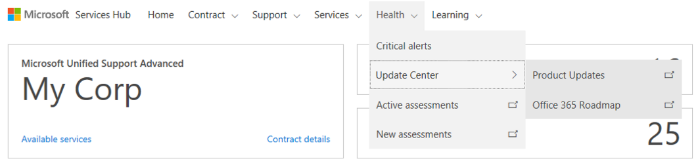

# Pembaruan Azure

Pusat Pembaruan memberikan informasi tentang produk baru dan yang diperbarui serta memungkinkan Anda mengikuti produk yang paling diminati. Di Pusat Pembaruan, Anda juga dapat mendaftar ke acara untuk mempelajari selengkapnya tentang produk dan siklus hidup produk monitor Microsoft.

Anda dapat mengakses Pusat Pembaruan dengan mengklik Kesehatan di bilah menu.

## Pembaruan Produk

Untuk memudahkan pelacakan pembaruan dan informasi siklus hidup produk, gunakan fitur Pembaruan Produk. Produk yang Anda tandai dalam profil akan muncul di sini.

## Peta Rencana Azure

Anda dapat mengakses Peta Rencana Azure dengan mengklik Kesehatan \> Pusat Pembaruan \> Peta Rencana Azure.  

Jangan lewatkan informasi penting tentang pelatihan terbaru untuk Azure. Anda dapat menemukan berbagai berita dan informasi tentang Azure di satu tempat dan mendapatkan pemberitahuan tentang hal-hal yang paling penting bagi Anda. 

1. Pilih Produk Anda
2. Pilih Jangka Waktu
3. Pilih Tipe
4. Klik ikuti pada item yang diinginkan untuk mendapatkan pemberitahuan.

Klik <a href="mailto:SHub_Feedback_RC@Microsoft.com?subject=Resource%20Center%20Feedback%3A%20%3CInsert%20feedback%20topic%3E%3E&amp;body=%3C%3Cplease%20submit%20your%20feedback%20with%20enough%20detail%20on%20the%20problem%2C%20reproduction%20steps%20and%20what%20you%20desire%20to%20happen%3E%3E" target="_blank">di sini</a> untuk memberikan umpan balik.
