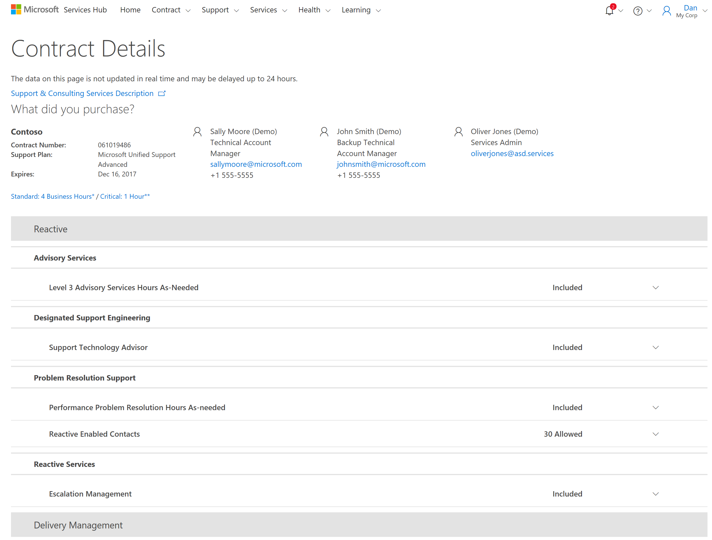

# Detail Kontrak

Halaman Detail Kontrak Hub Layanan menyediakan ringkasan tentang kontrak Microsoft Anda dan manfaat yang didapatkan, termasuk produk yang dibeli, kontak penting, serta informasi tentang pendidikan sesuai permintaan yang telah diselesaikan oleh Anda dan tim. Informasi ini dapat diakses dengan mengklik Kontrak di Hub Layanan. Informasi ini merupakan gambaran umum informasi yang ada di halaman Detail Kontrak Hub Layanan.

## Detail Kontrak

Halaman Detail Kontrak berisi nomor kontrak dan nomor jadwal, serta tautan ke Deskripsi Layanan Dukungan dan Konsultasi yang menjelaskan semua manfaat kontrak yang saat ini tersedia.

## Reaktif

Memuat detail tentang waktu tanggapan tiket layanan Microsoft Unified Support Anda.

### Apa yang telah Anda beli?

Bagian ini berisi informasi kontak Manajer Akun Teknis (TAM) dan Manajer Dukungan Pelanggan Anda. Kontrak Dukungan Inti mencantumkan Koordinator Akun Layanan yang merupakan kontak utama Anda.

## Layanan yang Tersedia

Ini adalah daftar layanan tersedia yang disertakan dalam kontrak layanan Anda. Ketika menggunakan Hub Layanan, mohon luangkan waktu sebentar dan navigasikan ke setiap bagian untuk membiasakan diri Anda dengan layanan yang disediakan.

Klik <a href="mailto:SHub_Feedback_RC@Microsoft.com?subject=Resource%20Center%20Feedback%3A%20%3CInsert%20feedback%20topic%3E%3E&amp;body=%3C%3Cplease%20submit%20your%20feedback%20with%20enough%20detail%20on%20the%20problem%2C%20reproduction%20steps%20and%20what%20you%20desire%20to%20happen%3E%3E" target="_blank">di sini</a> untuk memberikan umpan balik.
