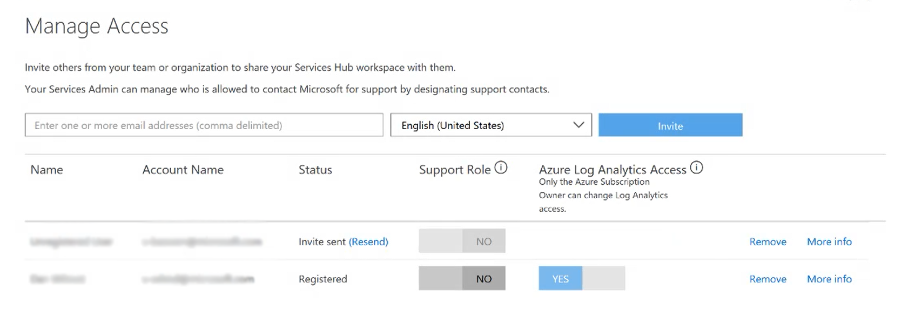

# Kelola Akses 

Bagian dari Hub Layanan ini menyediakan cara untuk mengundang orang lain dari organisasi Anda untuk menggunakan Hub Layanan dan kontak pendukung, yaitu kontak Microsoft yang akan membantu atau mengelola permintaan dukungan Anda. Anda juga dapat mengelola orang-orang yang dapat mengakses informasi penilaian sesuai permintaan Anda. 
 
*Catatan: Admin Layanan Anda dapat mengelola siapa saja yang diizinkan untuk menghubungi Microsoft guna mendapatkan dukungan dengan menentukan kontak dukungan.*

Klik <a href="mailto:SHub_Feedback_RC@Microsoft.com?subject=Resource%20Center%20Feedback%3A%20%3CInsert%20feedback%20topic%3E%3E&amp;body=%3C%3Cplease%20submit%20your%20feedback%20with%20enough%20detail%20on%20the%20problem%2C%20reproduction%20steps%20and%20what%20you%20desire%20to%20happen%3E%3E" target="_blank">di sini</a> untuk memberikan umpan balik.
