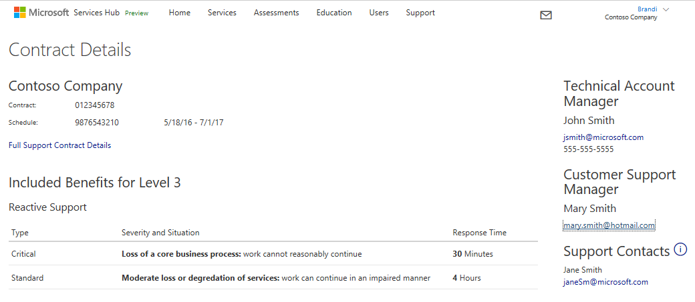
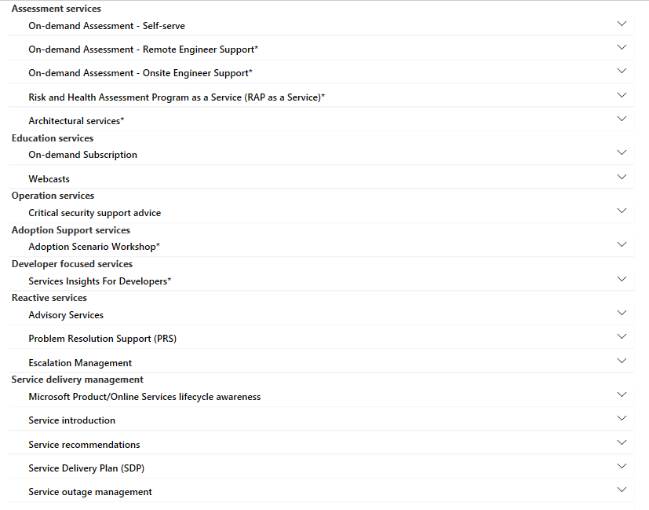

# Kontrak Hub Layanan

## Manfaat Kontrak 

Detail kontrak Hub Layanan berisi informasi tentang kontrak Anda beserta penjelasan mendetail tentang manfaat yang Anda dapatkan. 

## Detail Kontrak 

Di bawah Detail Kontrak, Anda akan menemukan Nomor kontrak dan Nomor jadwal Anda. Berikutnya, terdapat tautan yang akan menghubungkan Anda ke Kumpulan Dukungan lengkap. Kumpulan Dukungan menjelaskan tentang manfaat kontrak dari setiap tingkat yang ditawarkan. Anda dapat mengunduh dokumen ini untuk melihat perbandingan antara tingkat kontrak Anda dengan tingkat lain yang tersedia. 

## Manfaat yang Disertakan 

Dalam Dukungan Reaktif, Anda akan menemukan detail tentang waktu tanggapan tiket layanan Dukungan Premier Anda. Bagian ini menjelaskan permintaan dalam dua klasifikasi; Penting atau Standar, serta berdasarkan Keparahan dan Situasi dengan waktu tanggapan yang sesuai.    

## Informasi Akun 

Anda juga akan menemukan informasi kontak Manajer Akun Teknis dan Manajer Dukungan Pelanggan di sisi kanan halaman. Jika memiliki kontrak Tingkat 1, Anda memiliki Koordinator Akun Layanan yang akan menjadi kontak utama. Kontak Dukungan adalah orang-orang di organisasi yang dapat membuka "permintaan layanan" melalui Dukungan premier. Daftar kontak dukungan dapat dikelola oleh Manajer Dukungan Pelanggan di halaman Pengguna.  

## Layanan yang Tersedia  
Di sini, Anda akan menemukan daftar layanan yang disertakan dalam "kontrak layanan" Anda. Ketika menggunakan Hub Layanan, mohon luangkan waktu sebentar dan navigasikan ke setiap bagian untuk membiasakan diri Anda dengan layanan yang disediakan untuk Anda.  

Klik <a href="mailto:SHub_Feedback_RC@Microsoft.com?subject=Resource%20Center%20Feedback%3A%20%3CInsert%20feedback%20topic%3E%3E&amp;body=%3C%3Cplease%20submit%20your%20feedback%20with%20enough%20detail%20on%20the%20problem%2C%20reproduction%20steps%20and%20what%20you%20desire%20to%20happen%3E%3E" target="_blank">di sini</a> untuk memberikan umpan balik.
