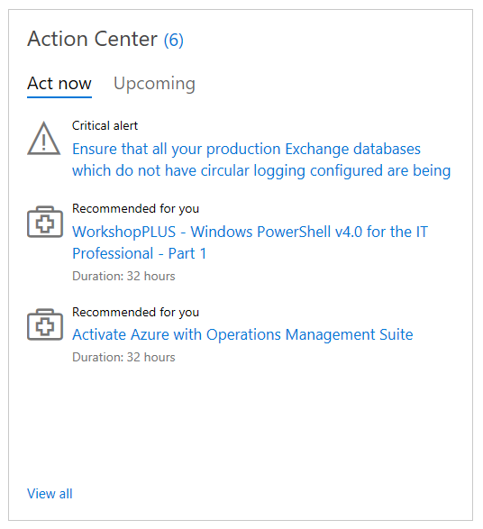

# Peringatan

## Peringatan dan Katalog Layanan

Pusat Tindakan dapat ditemukan di [Dasbor](/services-hub/dashboard), di sudut kiri bawah. Agar dapat selalu memantau masalah penting, Hub Layanan menyediakan peringatan di Pusat Tindakan. Fitur ini memungkinkan Anda mengikuti informasi tentang produk dan layanan Microsoft yang menarik bagi Anda. Jika terdapat masalah penting atau rekomendasi, Anda akan menerima peringatan.

### Pusat Tindakan

Pusat Tindakan memiliki dua tab: Tindak Lanjuti Sekarang dan Mendatang.

Tindak Lanjuti Sekarang memberikan informasi berikut:

- Peringatan penting: Berdasarkan penilaian sesuai permintaan Anda, peringatan ini memberitahukan tentang masalah yang membutuhkan tindakan cepat.
- Disarankan untuk Anda: Berdasarkan produk yang Anda kategorikan sebagai penting dalam profil, Pusat Tindakan akan menyarankan layanan yang sesuai dengan minat Anda.

Tab Mendatang menyediakan daftar layanan yang disarankan berdasarkan minat yang Anda pilih ketika menyiapkan profil.

*Catatan: Angka di samping judul "Pusat Tindakan" menunjukkan jumlah layanan yang disarankan dan tautan "Tampilkan semua" akan mengarahkan Anda ke layanan selengkapnya.*

Klik <a href="mailto:SHub_Feedback_RC@Microsoft.com?subject=Resource%20Center%20Feedback%3A%20%3CInsert%20feedback%20topic%3E%3E&amp;body=%3C%3Cplease%20submit%20your%20feedback%20with%20enough%20detail%20on%20the%20problem%2C%20reproduction%20steps%20and%20what%20you%20desire%20to%20happen%3E%3E" target="_blank">di sini</a> untuk memberikan umpan balik.

