# Dasbor

## Dasbor Services Hub

Dasbor Services Hub memungkinkan Anda mengamati persoalan sehingga Anda dapat menyelesaikannya dengan lebih cepat. Dengan menggabungkan titik data utama dan informasi dukungan di satu lokasi, dasbor menawarkan kepada Anda akses yang belum pernah ada sebelumnya ke semua layanan dan rincian dukungan Microsoft penting Anda.

### Gambaran umum Dasbor

  > Meninjau data kasus Anda dan melihat bagaimana Anda menggunakan layanan dan teknologi melalui tren dukungan.
  
  > Bertindak proaktif, mencegah masalah, dan melihat saran untuk membantu Anda meraih lebih banyak di Pusat Tindakan.
  
  > Mereferensikan kontak dukungan Anda dengancepat.
  
  > Menemukan layanan terdekat dengan kota Anda atau kode pos untuk melihat apa yang ada di dekat Anda.
  
  > Data penggunaan kontrak dan manfaat, kasus dukungan, dan data pembelian tersedia untuk peran tertentu.

*Catatan: Data kontrak hanya dapat dilihat oleh admin layanan, kontak dukungan, dan pemilik kasus.*

### Panduan Referensi Dasbor

 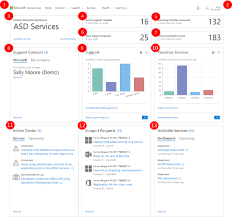

### Ringkasan Singkat

  - Dari bar menu utama di bagian atas, Anda dapat mengakses semua fitur Services Hub.
  - Akses Menu Bantuan, artikel basis pengetahuan, dan detail profil Anda dengan mengeklik nama pengguna Anda.
  - Akses cepat ke rincian kontak Anda.
  - Melacak permintaan dukungan aktif Anda.
  - Melihat jumlah kursus atas permintaan yang Anda jalani.
  - Meninjau jumlah total permintaan dukungan yang telah Anda masukkan.
  - Melihat jumlah layanan yang Anda gunakan.
  - Menghubungi kontak internal dan Microsoft Anda dengan cepat.
  - Menganalisis tren dukungan Anda.
  - Mengevaluasi tren layanan proaktif Anda.
  - Pusat Tindakan: Menerima pemberitahuan penting untuk membantu Anda tetap di depan tugas.
  - Daftar rincian permintaan dukungan Anda.
  - Pintasan ke layanan Anda yang tersedia.

## Rincian Ringkasan

Bar navigasi utama dasbor Services Hub menyediakan akses ke semua fitur Services Hub.

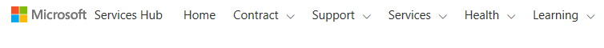

### Profil

Nama pengguna Anda menyediakan akses ke profil Anda, konten bantuan, dan informasi lainnya.

### Keluar

Selesai menggunakan Services Hub? Klik ini untuk keluar dengan aman.

### Tentang Services Hub

Ingin menonton video tentang fitur Services Hub? Kunjungi halaman "Tentang Services Hub".

### Sunting Profil

Ingin memperbarui profil Anda? Baik ingin memperbarui minat untuk mendapatkan lebih banyak rekomendasi preskriptif atau hanya perlu memperbarui jabatan Anda, semua kebutuhan untuk mengelola akun Anda ada di sini.

### Ruang kerja

Apakah Anda mengelola beberapa ruang kerja Azure Log Analytics? Beralih ruang kerja di sini.

### Gambaran umum/Sunting Tujuan

Perlu memperbarui tujuan pribadi/tim Anda? Buka di sini untuk mengakses semua tujuan Anda di satu tempat.

### Bagikan Gagasan Anda

Punya gagasan untuk membuat Services Hub lebih baik? Kirim di sini. Kami selalu mencari cara untuk membuat Services Hub lebih baik.

### Dokumentasi Bantuan

Ingin mempelajari lebih lanjut tentang Services Hub? Jelajahi atau artikel basis pengetahuan untuk mendapatkan hasil maksimal dari Services Hub.

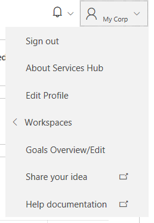

## Kontrak

Mengakses detail kontrak Anda atau memperoleh daftar layanan yang tersedia bagi Anda dari ubin kontrak.

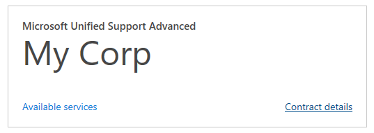

### Permintaan Dukungan Aktif

Memantau jumlah permintaan dukungan aktif yang Anda miliki dari ubin "Permintaan dukungan aktif" dengan mudah.

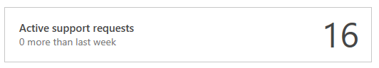

### Belajar Atas Permintaan yang Dijalani

Melacak jumlah pembelajaran atas permintaan yang telah Anda jalani dari ubin "Belajar atas permintaan yang dijalani".

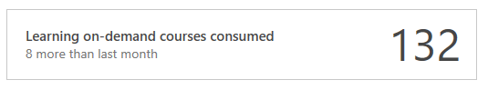

### Total Permintaan Dukungan

Melihat jumlah total permintaan dukungan yang tercatat dari ubin "Total permintaan dukungan".

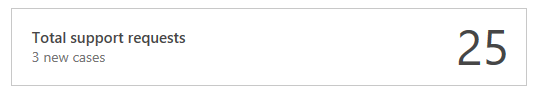
### Total Layanan yang Digunakan

Tinjau jumlah layanan yang Anda gunakan dari ubin "Total layanan yang digunakan".

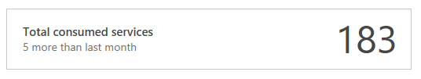

### Kontak Dukungan

Beralih antar kontak dukungan Anda dengan cepat, internal dan Microsoft, dari ubin "kontak Dukungan". "Lihat semua" menunjukkan daftar kontak lengkap dan menyediakan cara mengundang orang lain ke ruang kerja Services Hub khusus ini.

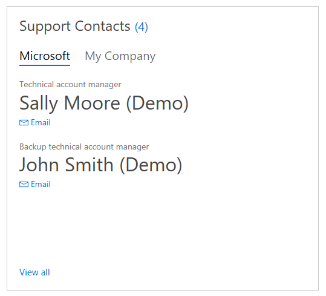

### Dukungan

Mengelola permintaan dukungan Anda dari ubin Dukungan. Anda dapat melihat semua permintaan Anda diurutkan berdasarkan produk dan menghubungi dukungan Microsoft dengan cepat.

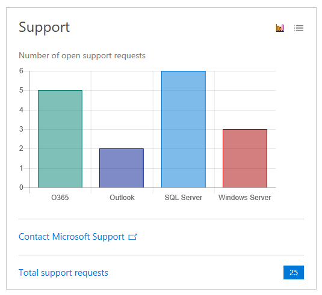

### Tren Layanan Proaktif

Melihat tren layanan proaktif Anda untuk mendapatkan rangkuman singkat dari layanan yang telah Anda gunakan, membeli layanan, dan menjelajahi layanan yang tersedia untuk Anda.

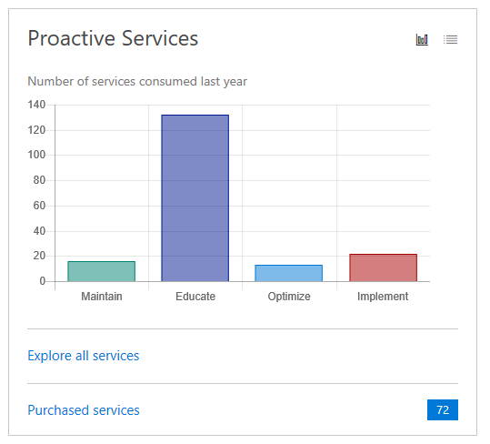

### Pusat Tindakan

Pusat Tindakan memiliki dua tab: Bertindak Sekarang dan Mendatang.

### Bertindak Sekarang menyediakan informasi berikut:

  - Peringatan penting: Berasal dari penilaian atas permintaan Anda, peringatan ini memberi tahu Anda perihal masalah yang perlu segera Anda perhatikan.
  - Direkomendasikan untuk Anda: Berdasarkan produk yang Anda indikasikan penting bagi Anda di profil, Pusat Tindakan akan menyarankan layanan yang relevan dengan minat Anda.

Mendatang: Memberi Anda daftar layanan yang direkomendasikan berdasarkan minat yang Anda pilih saat mengatur profil.

*Catatan: Angka di samping judul "Pusat Tindakan" mengacu pada jumlah layanan yang disarankan dan tautan "Lihat semua" membawa Anda ke layanan lengkap.*

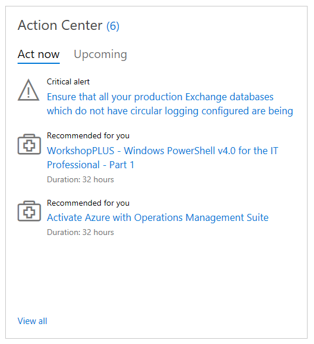

### Buka Permintaan Dukungan

Mendapatkan pandangan rinci tentang permintaan dukungan terbuka Anda saat ini.

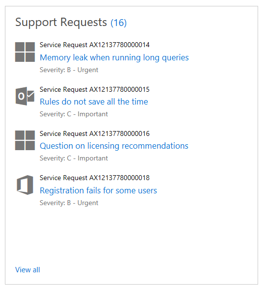

### Layanan Tersedia

Layanan yang Tersedia menyediakan dua tab: Atas Permintaan dan Mendatang.

  > Atas Permintaan: Menemukan hasil penilaian atas permintaan terbaru Anda di sini dengan cepat.
  > Mendatang: Menampilkan daftar layanan yang Anda daftar.

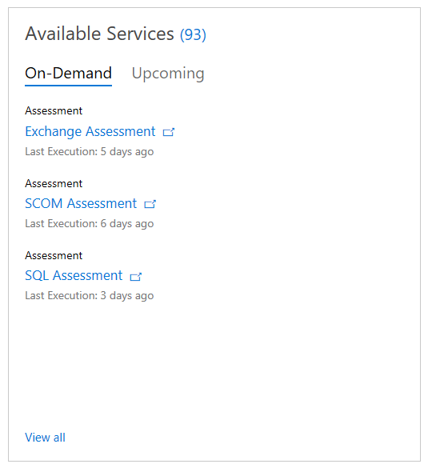

**Klik <a href="mailto:SHub_Feedback_RC@Microsoft.com?subject=Resource%20Center%20Feedback%3A%20%3CInsert%20feedback%20topic%3E%3E&amp;body=%3C%3Cplease%20submit%20your%20feedback%20with%20enough%20detail%20on%20the%20problem%2C%20reproduction%20steps%20and%20what%20you%20desire%20to%20happen%3E%3E" target="_blank">di sini</a> untuk memberikan umpan balik.**
