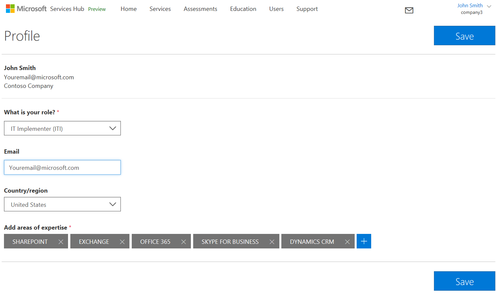
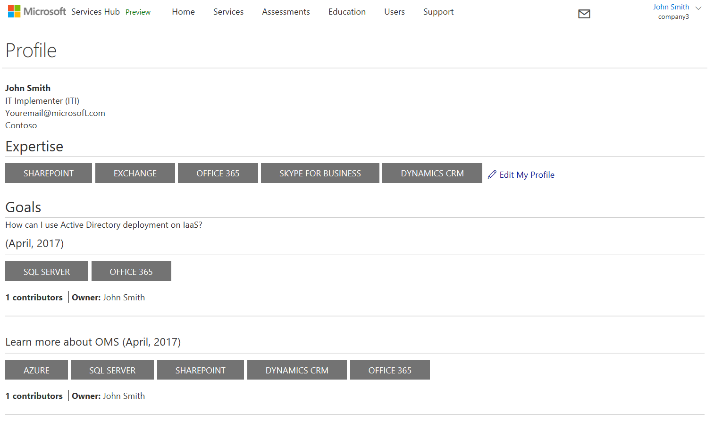

# MulaiMulai Menggunakan Profil Anda

Profil menyediakan informasi yang diperlukan oleh Hub Layanan untuk memberikan pengalaman yang disesuaikan, pelatihan yang dipersonalisasi, rekomendasi penilaian, dan banyak lagi.

1. Klik nama Anda di sudut kanan atas Hub Layanan untuk mengakses dan melengkapi profil dengan peran, negara/kawasan, bidang keahlian, dan topik yang menarik bagi Anda.

2. Setelah menyimpan informasi profil, Anda dapat menambahkan target untuk lebih menyesuaikan pengalaman Hub Layanan.

3. Contoh Target mungkin menyertakan:  "Pelajari selengkapnya tentang cadangan SQL Server" atau "Pelajari selengkapnya tentang risiko dan lingkungan AD saya".

Klik <a href="mailto:SHub_Feedback_RC@Microsoft.com?subject=Resource%20Center%20Feedback%3A%20%3CInsert%20feedback%20topic%3E%3E&amp;body=%3C%3Cplease%20submit%20your%20feedback%20with%20enough%20detail%20on%20the%20problem%2C%20reproduction%20steps%20and%20what%20you%20desire%20to%20happen%3E%3E" target="_blank">di sini</a> untuk memberikan umpan balik.

