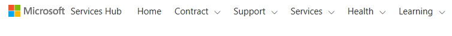

# Navigasi Utama

Bilah navigasi utama Services Hub menyediakan akses ke semua fitur Services Hub.

## Beranda

Tautan ini membawa Anda ke dasbor Services Hub.

Untuk detail fitur dasbor, lihat [Memulai dengan Dasbor Services Hub](/services-hub/dashboard/dashboard-kb-gettingstartedwithserviceshubdashboard)

## Kontrak

Halaman Detail Kontrak Services Hub memberikan sekilas gambaran kontrak dan manfaat Microsoft Anda termasuk apa yang telah Anda beli, kontak penting, dan meninjau pendidikan atas permintaan yang Anda dan tim Anda jalani. Informasi ini dapat diakses dengan mengeklik **Kontrak** di Services Hub. Ini merupakan gambaran umum dari informasi yang ditemukan di halaman Detail Kontrak Services Hub.

### Rincian Kontrak

Halaman Rincian Kontrak berisi rincian kontrak layanan Anda, termasuk manfaat kontrak terkini yang tersedia, jumlah yang Anda gunakan, dan informasi kontak perwakilan Microsoft Anda.

### Reaktif

Bagian ini memberikan rincian waktu respons untuk tiket layanan Microsoft Unified Support Anda.

**Apa yang Anda beli?**

Bagian ini berisi informasi kontak Manajer Akun Teknis (TAM) dan Manajer Dukungan Konsumen Anda. **Kontrak Dukungan Inti** mendaftarkan Koordinator Akun Layanan yang merupakan titik kontak Anda.

### Layanan Tersedia

Ini adalah daftar layanan tersedia yang ada dalam kontrak layanan Anda. Saat berada di Services Hub, luangkan waktu untuk mengarahkan ke setiap bagian untuk membiasakan diri dengan layanan yang tersedia.

### Mengelola Akses

Bagian Services Hub ini menyediakan cara untuk mengundang orang lain di organisasi Anda untuk menggunakan Services Hub dan cara untuk berbagi ruang kerja Anda dengan mereka.

*Catatan: Admin Layanan Anda dapat mengelola siapa yang diizinkan menghubungi Microsoft untuk mendapatkan dukungan dengan menunjuk kontak dukungan.*

### File Bersama

Ini adalah lokasi di mana perwakilan Microsoft Anda dapat berbagi file dengan Anda terkait dengan Kontrak Dukungan Anda.

## Dukungan

### Permintaan Dukungan

Bagian Services Hub ini memungkinkan Anda melacak kasus dukungan terbuka dan tertutup Anda.

### Dukungan Kontrak

Bagian Services Hub ini memberikan informasi kontak Manajer Akun Teknis untuk membantu menjawab pertanyaan tentang perjanjian dukungan Anda atau masalah nonkritis lainnya, serta cara untuk mengonfigurasi akun dukungan Anda, sebuah metode untuk menjangkau tim Services Hub, dan untuk mengakses dokumentasi bantuan.

## Layanan

Layanan menyediakan lokasi sentral di Services Hub untuk banyak manfaat dan sumber daya khusus yang disediakan melalui kontrak dukungan Anda.

Tab layanan menampilkan empat jenis layanan: Direkomendasikan, Termasuk, Sejarah, dan Katalog.

  - Direkomendasikan: Layanan pribadi berdasarkan kontrak dukungan Anda.
  - Termasuk: Semua layanan termasuk dalam kontrak Anda.
  - Sejarah: Layanan yang Anda gunakan, secara historis.
  - Katalog: Semua layanan tersedia melalui Services Hub, termasuk layanan yang termasuk dalam kontrak Anda dan yang dapat Anda beli.

## Kesehatan

Tab kesehatan menyediakan akses ke peringatan penting Anda, Pusat Pembaruan, penilaian aktif Anda, dan untuk memulai penilaian baru.

### Peringatan penting

Yang ditampilkan di halaman ini adalah daftar peringatan penting yang harus Anda lacak.

### Pusat Pembaruan

Pusat Pembaruan menyediakan informasi produk baru dan diperbarui dan memungkinkan Anda untuk mengikuti produk yang paling Anda minati. Di Pusat Pembaruan juga dapat mendaftar untuk mengikuti acara untuk mempelajari lebih lanjut tentang produk Microsoft dan memantau siklus hidup produk.

Untuk informasi lebih lanjut, lihat [Memulai dengan Pusat Pembaruan](/services-hub/health/health-kb-updatecenter)

### Penilaian

Ini adalah titik masuk ke penilaian atas permintaan yang Anda jalankan.

Penilaian membantu Anda mengoptimalkan ketersediaan, keamanan, dan kinerja investasi teknologi Microsoft Anda. Penilaian ini menggunakan Microsoft (Azure Log Analytics, yang dirancang untuk memberi Anda manajemen TI dan keamanan yang disederhanakan di lingkungan Anda.

> Untuk informasi lebih lanjut, lihat [Memulai dengan atas permintaan assessments](/services-hub/health/health-kb-gettingstarted).

## Pembelajaran

Bagian pembelajaran dari Services Hub adalah titik masuk ke berbagai peluang belajar produk dan layanan pembelajaran Microsoft yang tersedia untuk Anda. Mengikuti teknologi pilihan Anda dengan pengalaman belajar yang unik.

  - Mempelajari kapan saja, di mana saja, di perangkat apa saja.
  - Mengikuti dan meningkatkan pengetahuan staf TI Anda.
  - Pengetahuan praktis dan praktik terbaik yang berasal dari para pakar lapangan dan pendukung.
  - Pengalaman belajar mencakup presentasi video instruktur, webcast, dan laboratorium interaktif virtual.
  - Akses tanpa batas ke konten untuk semua pengguna termasuk praktik langsung.
  - Kuis kuliah mendorong retensi dan pemahaman.
  - Pengalaman semacam kelas tetapi tersedia atas permintaan.

### Belajar atas permintaan

Mengikuti lokakarya, lab, dan menonton webcast dan video kapan pun dan di mana pun Anda inginkan.

### Lokakarya

Halaman ini berisi daftar lokakarya yang dipimpin instruktur yang tersedia bagi Anda.

### Direkomendasikan

Halaman ini berisi daftar peluang pembelajaran yang direkomendasikan oleh Services Hub kepada Anda berdasarkan informasi yang Anda berikan dalam profil Anda.

### Webcast

Halaman ini berisi daftar webcast yang tersedia, apa yang sudah Anda daftarkan, dan webcast yang akan segera hadir.

## Profil

Nama pengguna Anda menyediakan akses profil Anda, konten bantuan, dan info penting lainnya yang digunakan oleh Services Hub untuk membantu menyesuaikan pengalaman Anda.

### Keluar

Selesai menggunakan Services Hub? Klik ini untuk keluar dengan aman.

### Tentang Services Hub

Ingin menonton video tentang fitur Services Hub? Kunjungi halaman "Tentang Services Hub".

### Sunting Profil

Ingin memperbarui profil Anda? Baik ingin memperbarui minat untuk mendapatkan lebih banyak rekomendasi preskriptif atau hanya perlu memperbarui jabatan Anda, semua kebutuhan untuk mengelola akun Anda ada di sini.

### Ruang kerja

Apakah Anda mengelola beberapa ruang kerja Azure Log Analytics? Beralih ruang kerja di sini.

### Gambaran umum/Sunting Tujuan

Perlu memperbarui tujuan pribadi/tim Anda? Buka di sini untuk mengakses semua tujuan Anda di satu tempat.

## Bagikan gagasan Anda

Punya gagasan tentang cara meningkatkan Services Hub? Beri tahu kami.

## Dokumentasi bantuan

Ingin mempelajari lebih lanjut tentang Services Hub? Jelajahi atau artikel basis pengetahuan untuk mendapatkan hasil maksimal dari Services Hub.

Klik<a href="mailto:SHub_Feedback_RC@Microsoft.com?subject=Resource%20Center%20Feedback%3A%20%3CInsert%20feedback%20topic%3E%3E&amp;body=%3C%3Cplease%20submit%20your%20feedback%20with%20enough%20detail%20on%20the%20problem%2C%20reproduction%20steps%20and%20what%20you%20desire%20to%20happen%3E%3E" target="_blank">di sini</a> untuk memberikan umpan balik.

