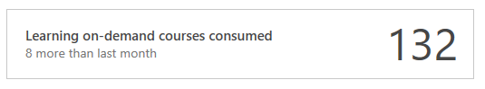
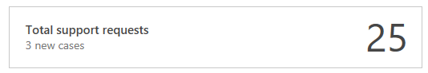
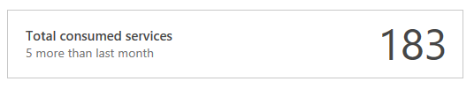
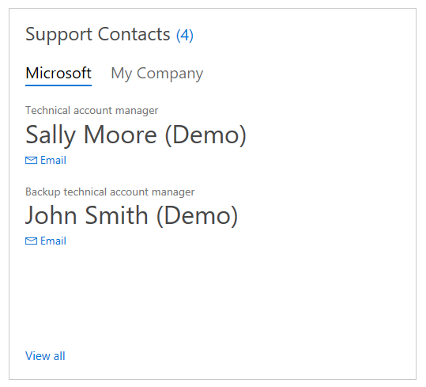
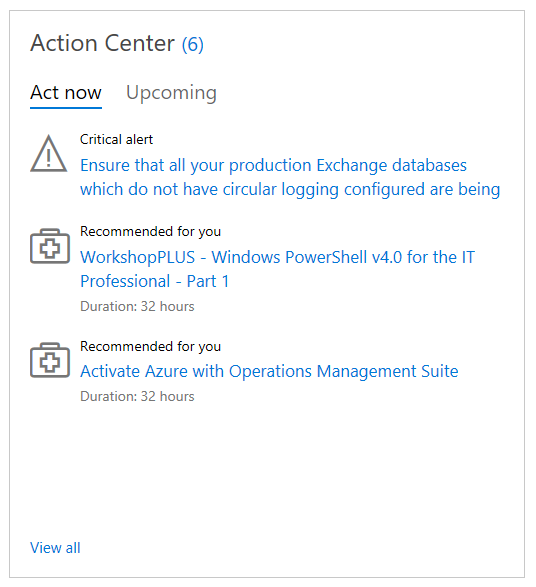
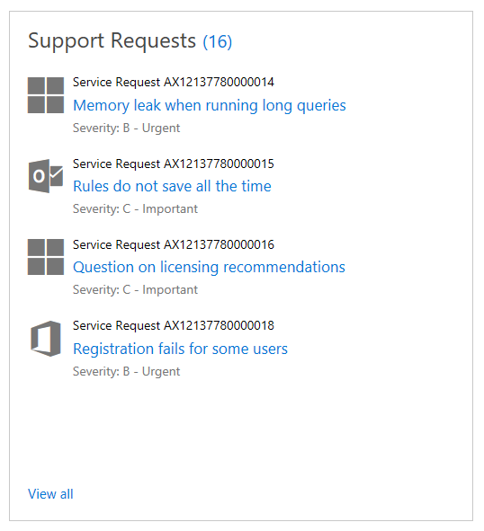

# Dasbor

## Dasbor Hub Layanan

Dasbor Hub Layanan memungkinkan Anda memantau munculnya masalah sehingga dapat diatasi lebih cepat. Dengan menggabungkan titik data utama dan informasi dukungan di satu lokasi, dasbor menyediakan akses yang menyeluruh ke semua detail dukungan dan layanan penting Microsoft Anda.

### Gambaran Umum Dasbor

  > Tampilkan data kasus lalu lihat penggunaan layanan dan teknologi Anda melalui tren dukungan.
  
  > Jadilah lebih proaktif, cegah masalah, dan lihat saran untuk membantu Anda meraih lebih banyak hal di Pusat Tindakan.
  
  > Rujuk kontak dukungan dengan cepat.
  
  > Temukan layanan terdekat di kota Anda untuk mengetahui apa saja yang tersedia di kawasan Anda.
  
  > Data kontrak dan penggunaan manfaat, kasus dukungan, dan data pembelian tersedia bagi peran tertentu.

*Catatan: Data kontrak hanya dapat dilihat oleh admin layanan, kontak dukungan, dan pemilik kasus.*

### Panduan referensi dasbor

 

### Ringkasan Singkat

1.  Dari bilah menu utama di bagian atas, Anda dapat mengakses semua fitur Hub Layanan.
2.  Akses menu bantuan, artikel basis pengetahuan, dan detail profil dengan mengklik Nama Pengguna Anda.
3.  Akses cepat ke detail kontak Anda.
4.  Lacak permintaan dukungan aktif Anda.
5.  Lihat jumlah kursus sesuai permintaan yang telah Anda ikuti.
6.  Tinjau jumlah total permintaan dukungan yang telah dicatat.
7.  Tampilkan jumlah layanan yang telah Anda gunakan.
8.  Hubungi kontak internal dan Microsoft Anda dengan cepat.
9.  Analisis tren dukungan.
10. Evaluasi tren layanan proaktif Anda.
11. Pusat Tindakan: Terima peringatan penting untuk terus memantau tugas.
12. Daftar mendetail untuk permintaan dukungan Anda.
13. Pintasan ke layanan yang tersedia.

## Ringkasan mendetail

Bilah navigasi utama dasbor Hub Layanan menyediakan akses ke semua fitur Hub Layanan.

### Profil

Nama Pengguna Anda menyediakan akses ke profil, konten bantuan, dan info lainnya:

### Keluar

Selesai menggunakan Hub Layanan? Klik di sini untuk keluar dengan aman.

### Tentang Hub Layanan

Ingin menonton video tentang fitur Hub Layanan? Kunjungi halaman "Tentang Hub Layanan".

### Edit profil

Ingin memperbarui profil? Baik mengubah minat untuk mendapatkan rekomendasi yang lebih tepat maupun hanya ingin memperbarui jabatan pekerjaan, semua yang diperlukan untuk mengelola akun Anda tersedia di sini.

### Ruang Kerja

Apakah Anda mengelola beberapa ruang kerja Analitik Log Azure? Atur semuanya di sini.

### Gambaran Umum/Edit Target

Ingin memperbarui target pribadi/tim? Masuk ke sini untuk mengakses semua target Anda di satu tempat.

### Bagikan ide Anda

Memiliki ide untuk menyempurnakan Hub Layanan? Kirimkan ke sini.  Kami selalu mencari cara untuk menyempurnakan Hub Layanan.

### Dokumentasi bantuan

Ingin mempelajari selengkapnya tentang Hub Layanan? Jelajahi artikel basis pengetahuan kami untuk memanfaatkan Hub Layanan sepenuhnya.

## Kontrak

Akses detail kontrak atau lihat daftar layanan yang tersedia untuk Anda dari ubin kontrak.

### Permintaan dukungan aktif

Pantau jumlah permintaan dukungan aktif Anda dengan mudah dari ubin "Permintaan dukungan aktif".

### Kursus pembelajaran sesuai permintaan yang diikuti

Lacak jumlah kursus pembelajaran sesuai permintaan yang telah Anda ikuti dari ubin "Kursus pembelajaran sesuai permintaan yang diikuti".

### Total permintaan dukungan

Lihat total permintaan dukungan yang tercatat dari ubin Total permintaan dukungan

### Total layanan yang digunakan

Tinjau jumlah layanan yang Anda gunakan dari ubin Total layanan yang digunakan.

### Kontak dukungan

Lihat kontak dukungan, internal, dan Microsoft Anda dengan cepat dari ubin "Kontak dukungan." Opsi Tampilkan semua akan memperlihatkan daftar kontak lengkap dan memberikan cara untuk mengundang orang lain ke ruang kerja Hub Layanan tertentu.

### Dukungan

Kelola permintaan dukungan Anda dari ubin Dukungan. Anda dapat melihat semua permintaan yang diurutkan menurut produk dan dapat langsung menghubungi dukungan Microsoft.

### Tren layanan proaktif

Lihat tren layanan proaktif Anda untuk mendapatkan ringkasan singkat tentang layanan yang telah digunakan, layanan yang dibeli, serta menjelajahi layanan yang tersedia.

### Pusat Tindakan

Pusat Tindakan memiliki dua tab, Tindak Lanjuti Sekarang dan Mendatang.

### Tindak Lanjuti Sekarang memberikan informasi berikut:

  - Peringatan penting: Berdasarkan penilaian sesuai permintaan Anda, peringatan ini memberitahukan tentang masalah yang membutuhkan tindakan cepat.
  - Disarankan untuk Anda: Berdasarkan produk yang Anda kategorikan sebagai penting dalam profil, Pusat Tindakan akan menyarankan layanan yang sesuai dengan minat Anda.
  - Mendatang: Menyediakan daftar layanan yang disarankan berdasarkan minat yang Anda pilih ketika menyiapkan profil.

*Catatan: Angka di samping judul "Pusat Tindakan" menunjukkan jumlah layanan yang disarankan dan tautan "Tampilkan semua" akan mengarahkan Anda ke layanan selengkapnya.*

### Permintaan dukungan yang berlangsung

Lihat detail permintaan dukungan Anda yang saat ini masih berlangsung.

### Layanan yang Tersedia

Layanan yang Tersedia memiliki dua tab: Sesuai Permintaan dan Mendatang.

  > Sesuai Permintaan: Temukan hasil penilaian sesuai permintaan terbaru Anda di sini.
  > Mendatang: Tab ini menampilkan daftar layanan tempat Anda telah mendaftar.

Klik <a href="mailto:SHub_Feedback_RC@Microsoft.com?subject=Resource%20Center%20Feedback%3A%20%3CInsert%20feedback%20topic%3E%3E&amp;body=%3C%3Cplease%20submit%20your%20feedback%20with%20enough%20detail%20on%20the%20problem%2C%20reproduction%20steps%20and%20what%20you%20desire%20to%20happen%3E%3E" target="_blank">di sini</a> untuk memberikan umpan balik.
