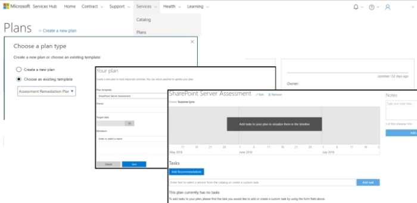

<H1>Rencana Remediasi Penilaian Sesuai Permintaan</H1>

<h2>Prasyarat:</h2>
    <ul>
      <li>Anda harus memiliki akses ke Analitik Log Azure. Jika Anda harus menambahkan pengguna ke Analitik Log Azure: <a href="adding_users_azure_log_analytics.md" target="_blank">Tambahkan Pengguna ke Analitik Log Azure</a>.</li>
      <li>Anda harus menjalankan setidaknya satu Penilaian. Jika Anda belum menjalankan Penilaian Sesuai Permintaan: <a href="getting_started_with_on_demand_assessments.md" target="_blank">Memulai Penilaian Sesuai Permintaan</a>.</li>
    </ul>

<h2>Instruksi: </h2>

1. Temukan Rencana Remediasi Penilaian Sesuai Permintaan di <b>Rencana &gt; Layanan</b>. 
2. Klik Buat rencana baru. 
3. Pilih template yang ada: Rencana Remediasi Penilaian. 
4. Tambahkan orang ke rencana. 
5. Klik Simpan. 
6. Klik tombol “Tambahkan Rekomendasi” dan tindakan ini akan mengimpor semua rekomendasi prioritas tinggi/rendah dari penilaian yang berjalan di Analitik Log Azure.
7. Gunakan rencana untuk mulai menyelesaikan rekomendasi dan meningkatkan kesehatan lingkungan.
 
<h2>Hal yang perlu diketahui:</h2>
  <ul>
      <li>Rekomendasi akan menjadi tugas.</li>
      <li>Dengan membuka tugas, semua informasi metadata kaya yang Anda perlukan untuk menyelesaikan tugas akan terbuka.</li>
      <li>Objek Terpengaruh tidak akan muncul dalam metadata kaya dari tugas. Semua Objek Terpengaruh akan terletak di &nbsp;<a href="download_recommendations_excel.md" target="_blank">File Rekomendasi Excel Penilaian Sesuai Permintaan</a>. Hal ini karena persyaratan keamanan untuk PII (Informasi Identifikasi Pribadi).</li>
    </ul>
    

    
  
       
      

    

    
 
    

    
Klik <a href="mailto:SHub_Feedback_RC@Microsoft.com?subject=Resource%20Center%20Feedback%3A%20%3CInsert%20feedback%20topic%3E%3E&amp;body=%3C%3Cplease%20submit%20your%20feedback%20with%20enough%20detail%20on%20the%20problem%2C%20reproduction%20steps%20and%20what%20you%20desire%20to%20happen%3E%3E" >di sini</a> untuk memberikan umpan balik. 

    
 
    

