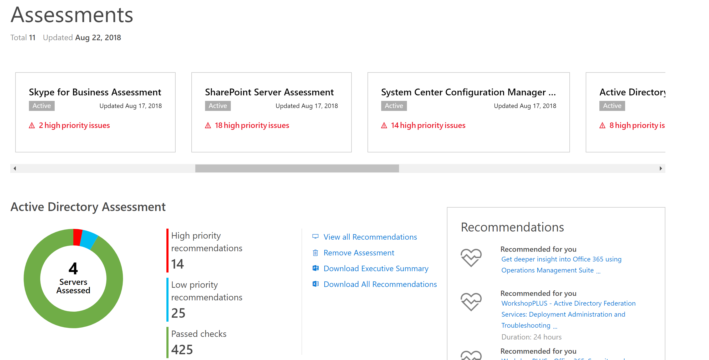
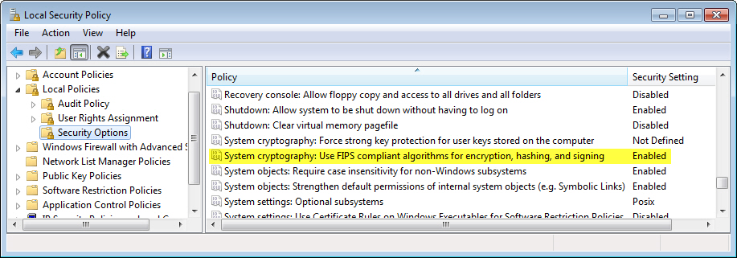
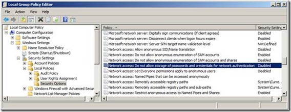
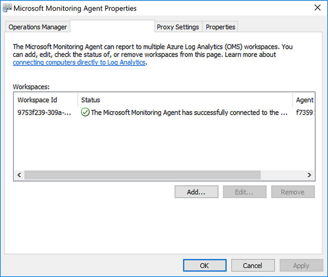
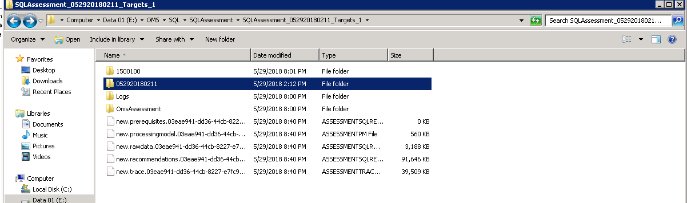
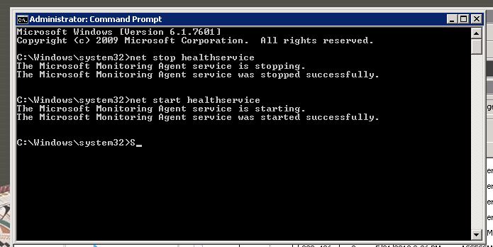
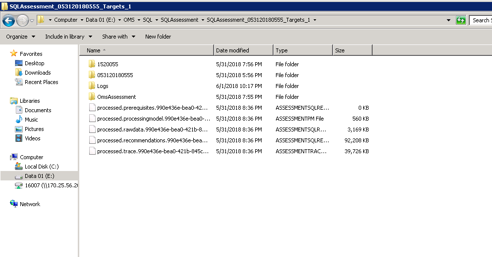

# Pemecahan Masalah Penilaian Sesuai Permintaan #

Langkah-langkah di bawah ini akan memandu Anda mulai dari awal hingga akhir dan memastikan Anda memverifikasi kebenaran setiap persyaratan yang harus dipenuhi dalam menjalankan Penilaian Sesuai Permintaan:

Masalah paling umum yang para pengguna hadapi: (Panduan mengenai cara menyelesaikannya disebutkan di bawah di dalam artikel ini)
   1. Akun pengguna bukan bagian dari grup Administrator Lokal di mesin pengumpulan data tempat penilaian berjalan.
   2. Jika Anda menjalankan penilaian tidak melihat data di Analitik Log -> Mulai Ulang healthservice jika file data merupakan pengodean tertunda.
   3. Pesan kesalahan: "Anda tidak memiliki akses ke Analitik Log Azure" di Services Hub -> Kesehatan -> Penilaian.
   
## Penautan dan Izin ##

   1. <a href="https://video.serviceshub.microsoft.com/PublicPage/video/5581.aspx" target="_blank">Tonton video</a> untuk melakukan prakonfigurasi penilaian sesuai permintaan.
   2. <a href="https://docs.microsoft.com/en-us/services-hub/health/health-kb-adduserazure" target="_blank">Pastikan Anda memiliki peran Pemilik Langganan Azure di Azure Subscription</a> di id email yang sama yang Anda gunakan untuk masuk ke Services Hub.
   3. Anda akan melihat halaman di bawah ini di Services Hub -> Kesehatan -> Penilaian setelah berhasil menautkan.
   4. Pastikan ruang kerja Analitik Log yang aksesnya Anda miliki adalah yang tertaut di Services Hub. Jika tidak, minta mereka menautkan ulang dengan mengeklik profil di kanan atas -> Edit Ruang Kerja Analitik Log dan tautkan ruang kerja yang diinginkan.
   5. Pastikan Anda telah menambahkan penilaian yang diinginkan dari katalog.

## Memeriksa Kebijakan Grup akun pengguna ##

### Hak Administrator Lokal ###

Untuk memulai,
   1. Akun pengguna yang menyiapkan penilaian harus Administrator Lokal.
   2. Buka menu Mulai (sudut kiri bawah di desktop Windows).
   3. Pilih Pengaturan, lalu Panel Kontrol (tergantung pada versi Windows yang Anda miliki).
   4. Buka Akun Pengguna.
   5. Pilih tab Pengguna.
   
Jika Administrator ditampilkan di kolom Grup atau untuk nama pengguna Anda, hal ini berarti Anda memiliki hak istimewa administratif. Jika Anda tidak memiliki akses administrator, minta administrator jaringan untuk memberikan hak istimewa administrator, atau minta administrator jaringan untuk masuk ke sistem Anda sebagai administrator.

### Masuk sebagai Izin Kelompok Pekerjaan ###

Harap Diperhatikan: Kadang-kadang penilaian mungkin tidak dipicu dari penjadwal tugas. Hal ini dapat terjadi jika pengguna tidak memiliki izin menjalankan kelompok pekerjaan. Jika itu yang terjadi, izin ini harus diberikan secara eksplisit dengan masuk ke sini dari gpedit.msc

Konfigurasi Komputer\Pengaturan Windows\Pengaturan Keamanan\Kebijakan Lokal\Penugasan Hak Pengguna

   1. Klik kanan di "Masuk sebagai kelompok pekerjaan" dan pilih Properti.
   2. Klik "Tambahkan Pengguna atau Grup", dan masukkan pengguna relevan.
   
### Jangan membongkar registri pengguna secara paksa pada log keluar pengguna ###

Di mesin pengumpulan data, ubah pengaturan berikut ini dalam editor kebijakan grup (gpedit.msc) dari "tidak dikonfigurasi" menjadi "aktif": Konfigurasi Komputer->Template Administratif->Sistem->Profil Pengguna 
 
'Jangan membongkar registri pengguna secara paksa pada log keluar pengguna'

### Menonaktifkan Kebijakan FIPS ###

   1. Di Panel Kontrol, klik Alat Administratif, lalu klik dua kali Kebijakan Keamanan Lokal.
   2. Di Pengaturan Keamanan, buka Kebijakan Lokal, lalu klik Pilihan Keamanan.

   3. Di Kebijakan di panel kanan, klik dua kali kriptografi Sistem: Menggunakan algoritma FIPS kompatibel untuk enkripsi, hash, dan penandatanganan, lalu klik Nonaktif
   
### Akses Jaringan: Jangan izinkan penyimpanan kata sandi dan kredensial ###
   
   1. Kesalahan ini terjadi dengan pesan "Sesi masuk yang ditentukan tidak ada. Sesi ini mungkin sudah dihentikan"
   2. Untuk menyelesaikan masalah ini, buka: SECPOL.MSC | Pengaturan Keamanan | Kebijakan Lokal | Pilihan Keamanan
   3. Akses jaringan: Jangan izinkan penyimpanan kata sandi dan kredensial untuk autentikasi jaringan 
   4. Mengatur kebijakan menjadi nonaktif
   
## Tidak Aktif/Tidak Ditemukan Data di Analitik Log Azure ##

### Memeriksa konektivitas Agen Analitik Log ###

Untuk memastikan agen dapat berkomunikasi dengan OMS, buka: Panel Kontrol, Keamanan & Pengaturan, Agen Pemantauan Microsoft. Di tab Analitik Log Azure (OMS), cari tanda centang hijau. 

Ikon tanda centang hijau memastikan bahwa agen dapat berkomunikasi dengan layanan Azure.

Ikon peringatan kuning berarti agen mengalami masalah komunikasi dengan Analitik Log. 

Satu penyebab umum yaitu layanan Agen Pemantauan Microsoft telah berhenti. Gunakan manajer kontrol layanan untuk memulai ulang layanan.

Jika ada pembatasan firewall di tempat, pastikan port di bawah ini terbuka.
* mms.microsoft.com, portal Analitik Log
* workspaceId.ods.opinsights.azure.com, <a href="https://docs.microsoft.com/en-us/azure/log-analytics/log-analytics-data-collector-api" target="_blank">Pengumpul Data API</a>
* *.ods.opinsights.azure.com, komunikasi Agen - mengonfigurasi <a href="https://docs.microsoft.com/en-us/azure/log-analytics/log-analytics-agent-windows" target="_blank">pengaturan firewall</a>
* *.oms.opinsights.azure.com, komunikasi Agent - mengonfigurasi <a href="https://docs.microsoft.com/en-us/azure/log-analytics/log-analytics-agent-windows" target="_blank">pengaturan firewall</a>
* *.blob.core.windows.net, komunikasi Agen - mengonfigurasi <a href="https://docs.microsoft.com/en-us/azure/log-analytics/log-analytics-agent-windows" target="_blank">pengaturan firewall</a>

### Memulai ulang healthservice jika file data adalah penyerapan yang tertunda ###

Harap tutup semua jendela powershell yang aktif di mesin. Sekarang, jika Anda memeriksa direktori kerja dari Penilaian dan temukan file dengan nama new.recommendations.*** (lihat cuplikan layar di bawah ini):

Buka Prompt Perintah dalam mode Administrator dan ketikkan: net stop healthservice net start healthservice

Setelah menjalankan perintah di bawah ini, file akan berubah untuk diproses seperti pada gambar di bawah ini yang berarti file tersebut berhasil diserap dan data akan terlihat di Analitik Log sekitar 30 mnt lagi.

### Memeriksa jika ada proses omsassessment.exe yang bertentangan berjalan ###

Buka Manajer Tugas dan cari proses bernama omsassessment.exe. Jika proses itu ada, berarti penilaian masih berjalan. 

Jika proses sudah berjalan cukup lama (misalnya, jika Anda menemukan proses ini telah berjalan selama lebih dari sehari), kemungkinan agen penilaian tidak dapat memproses data. Jadi harap lanjutkan ke langkah pemecahan masalah di bawah ini.

### Memeriksa kesalahan apa pun dalam file prasyarat ###

Buka direktori kerja penilaian dan lihat file prasyarat (processed.prerequisites) untuk menemukan kesalahan apa pun sebagai target penilaian. 

Jika terdapat kesalahan, misalnya masalah konektivitas WMI, nama target dan kesalahan akan disebutkan dalam file ini. Harap selesaikan masalah ini, lalu picu penilaian dari Penjadwal Tugas

Penjadwal Tugas -> Microsoft -> Manajemen Operasi Suite -> AOI***** -> Penilaian dan klik dua kali dan tekan jalankan di tugas terjadwal penilaian yang diinginkan

### Memeriksa kesalahan dalam file log penemuan ###

Buka direktori kerja penilaian dan masuk ke folder bernomor 6-8 digit dalam direktori. Lihat folder yang disebut sebagai Log tempat Anda akan menemukan file bernama DiscoveryTrace***

Lihat kesalahan atau pengecualian apa pun file ini dan selesaikan masalah itu karena akan berkaitan dengan masalah kredensial/izin, kegagalan WMI, masalah jaringan, dll.

### Penyerapan file besar ###

Jika ukuran file di bawah ini processed.recommendations.*** lebih dari 250 MB, file ini mungkin akan sulit diproses oleh Agen Analitik Log. Jika Anda menghadapi skenario dan tidak akan dapat melihat data dalam Analitik Log, harap hubungi serviceshubteam@ppas.uservoice.com dan beri tahu kami mengenai masalah Anda.

### Mencoba mengurangi jumlah target per jadwal penilaian ###

Jika Anda menjalankan Penilaian Windows Server, Windows Client, atau SQL dan menambahkan lebih dari 5 target di satu tugas terjadwal, terkadang mungkin agen penilaian tidak akan dapat memproses begitu banyak target sekaligus. Jika Anda menghadapi skenario ini, harap gunakan cmdlet di bawah ini untuk menghapus konfigurasi yang ada:

Remove-WindowsClientAssessmentTask Remove-WindowsServerAssessmentTask Remove-SQLAssessmentTask

Sekarang jalankan Add-AssessmentTasks lagi dengan target lebih sedikit. Anda dapat menambahkan beberapa tugas seperti itu dan membuat kelompok tugas dengan 3-5 target per tugas yang akan menghasilkan evaluasi lebih cepat di seluruh lingkungan.

