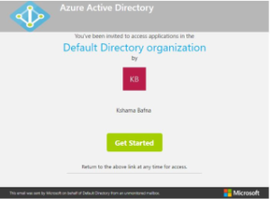
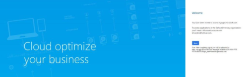
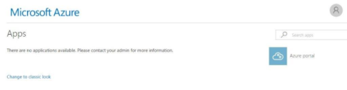

# Mengautentikasi Pemegang Akun Layanan Terkelola di Azure 

Jika pemegang Akun Layanan Terkelola (MSA) telah ditambahkan ke Azure, mereka akan menerima email dengan tautan untuk memulai. 

Contoh Email Undangan:

1.  Klik **Mulai** untuk memulai proses. Setelah itu, Anda akan diarahkan ke halaman sambutan Cloud mengoptimalkan bisnis Anda. Klik **Berikutnya**. 

2. Berikutnya, Anda akan diarahkan ke halaman Azure App; tidak ada yang perlu dilakukan di sini dan Anda dapat menutup jendela ini. 

3.  Selanjutnya, navigasikan ke <a href="https://serviceshub.microsoft.com/" target="_blank">Services Hub</a> dan klik tab Penilaian untuk membuka dasbor Analitik Log Azure.  

*Catatan: Dasbor Analitik Log Azure hanya akan terbuka jika sebelumnya telah ditautkan ke Hub Layanan* 

Klik <a href="mailto:SHub_Feedback_RC@Microsoft.com?subject=Resource%20Center%20Feedback%3A%20%3CInsert%20feedback%20topic%3E%3E&amp;body=%3C%3Cplease%20submit%20your%20feedback%20with%20enough%20detail%20on%20the%20problem%2C%20reproduction%20steps%20and%20what%20you%20desire%20to%20happen%3E%3E" target="_blank">di sini</a> untuk memberikan umpan balik.
