# Mengonfigurasi Penilaian Direktori Aktif

## Mulai menggunakan Penilaian Direktori Aktif di Lingkungan Mesin Pengumpulan Data Saja

1.   Klik **ikon roda gigi** di bagian atas halaman. Sekarang, klik **Sumber Terhubung**. Di sini Anda dapat mengunduh penginstal Agen Pengawasan Microsoft untuk mesin pengumpulan data.

*Catatan: Untuk skenario yang melibatkan Gateway Analitik Log Azure, Anda juga dapat mengunduh penginstal Gateway Analitik Log Azure di lokasi yang sama.*

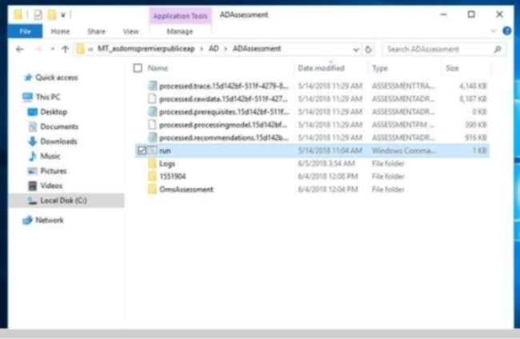

2. Setelah diinstal, Agen Pengawasan Microsoft dapat diakses dari aplet panel kontrol.

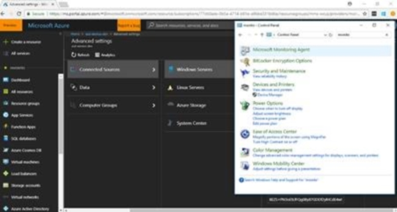

3.   Terdapat beberapa tab untuk konfigurasi di Agen Pengawasan Microsoft. Untuk lingkungan khusus mesin pengumpulan data, server proksi tidak diaktifkan. 

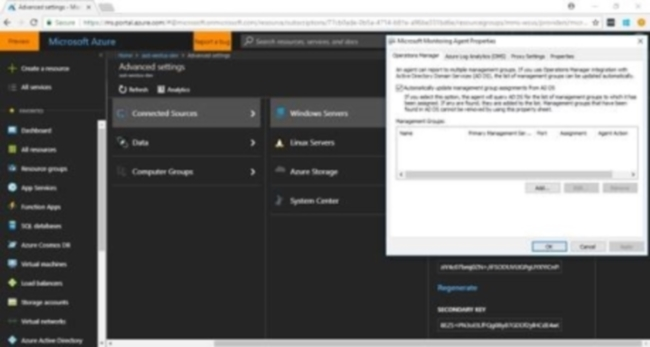

4.   Sekarang, tambahkan ruang kerja Analitik Log Azure Anda ke konfigurasi dan klik **Tambahkan**.

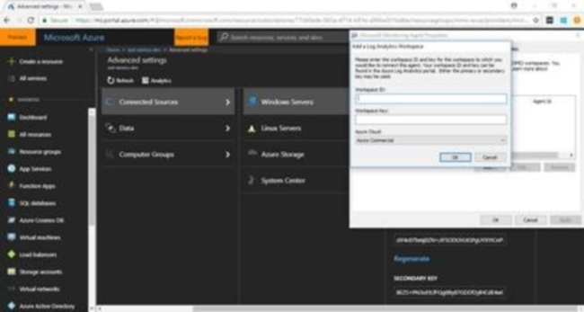

5.   Kemudian, salin ID Ruang Kerja dari halaman pengaturan Analitik Log Azure dan tempelkan ke kotak ID Ruang Kerja.

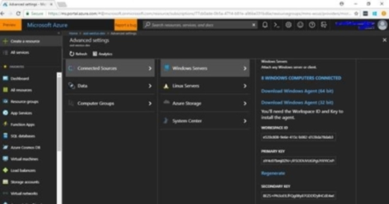

6.   Berikutnya, salin kunci utama atau sekunder dan tempelkan ke kotak teks Kunci Ruang Kerja, lalu klik **OK**.

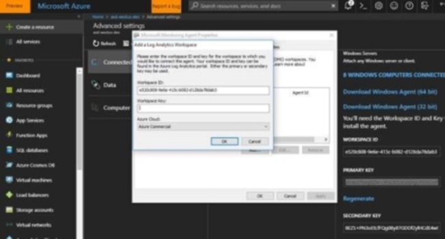

7.   Klik tombol **Terapkan** untuk menerapkan perubahan ini. Tindakan ini akan memulai ulang layanan Agen Pengawasan. Indikator status akan menunjukkan bahwa koneksi berhasil. Sekarang, setelah Agen Pengawasan Microsoft siap, kita dapat mengonfigurasi penilaian.

*Catatan: Tindakan ini tidak perlu dilakukan setiap kali Anda mengonfigurasi penilaian, cukup pada kali pertama, kecuali Anda mengubah ruang kerja Analitik Log Azure.*

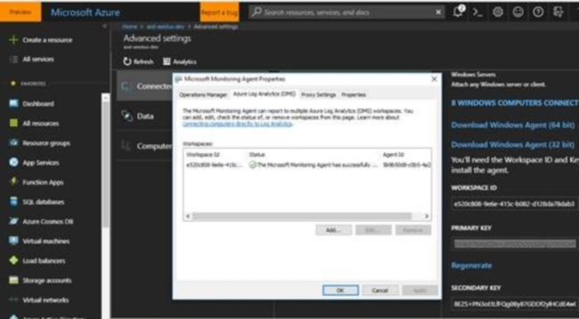

8.   Untuk melanjutkan, Anda perlu memulai prompt perintah PowerShell administratif.

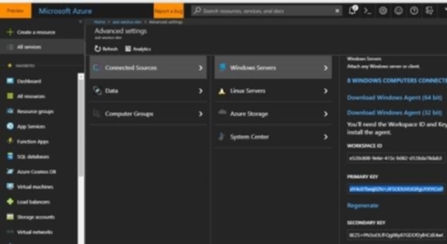

9.  Berikutnya, dalam prompt perintah, ketikkan Set-ADAssessment dan berikan direktori kerja untuk menyimpan alat dan data penilaian. 

10. Kemudian, berikan nama pengguna akun domain yang memiliki akses admin ke setiap pengontrol domain di hutan. 

11. Berikutnya, masukkan kata sandi untuk akun domain tersebut. Pada saat ini, perintah akan membuat tugas terjadwal untuk penilaian. 

*Catatan: Anda dapat meninjau detail log penilaian di lokasi yang sama.*

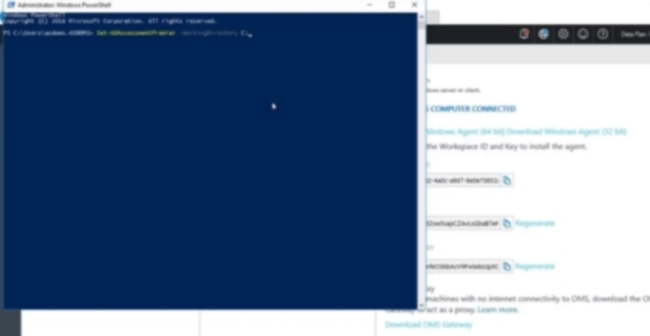

12. Setelah penilaian dikonfigurasi, buka dan tinjau tugas terjadwal yang baru Anda buat dalam Penjadwal Tugas. 

13. Di bawah Pustaka Penjadwal Tugas, perluas Microsoft, lalu Analitik Log Azure. Di sana, Anda akan melihat folder dengan prefiks AOI dan ID ruang kerja Anda. Perluas folder di bawahnya; Anda akan melihat “ADAssessment”.

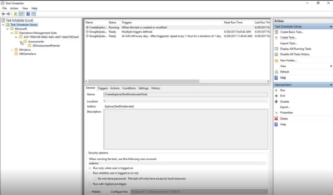

14. Klik pada **ADAssessment**, dan Anda akan dapat melihat tugas yang dijadwalkan untuk penilaian. Secara default, penilaian (tugas) akan dimulai sekitar satu jam dan berulang setiap 7 hari.

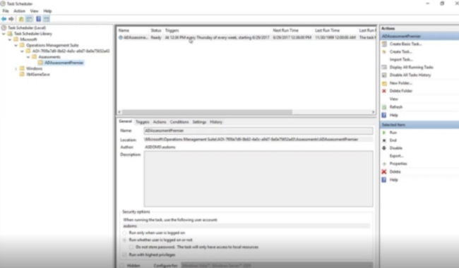

15. Klik tab **Tindakan** dan Anda akan melihat bahwa tugas memulai perintah di bawah direktori kerja.

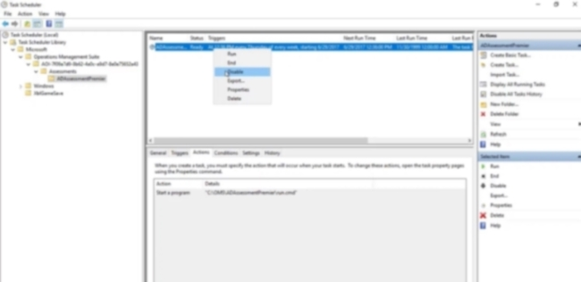

16. Berikutnya, jika jadwal tugas sudah sesuai, Anda dapat membiarkannya dan penilaian pun akan berjalan sesuai jadwal. Anda juga dapat mengubah jadwal sesuai kebutuhan, tetapi biarkan setidaknya 24 jam di antara setiap pengaktifan.

Klik <a href="mailto:SHub_Feedback_RC@Microsoft.com?subject=Resource%20Center%20Feedback%3A%20%3CInsert%20feedback%20topic%3E%3E&amp;body=%3C%3Cplease%20submit%20your%20feedback%20with%20enough%20detail%20on%20the%20problem%2C%20reproduction%20steps%20and%20what%20you%20desire%20to%20happen%3E%3E" target="_blank">di sini</a> untuk memberikan umpan balik.
