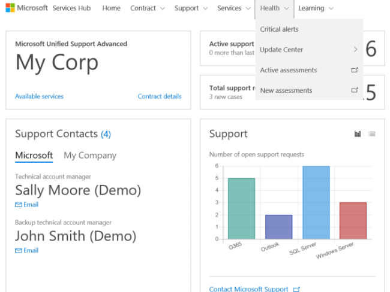
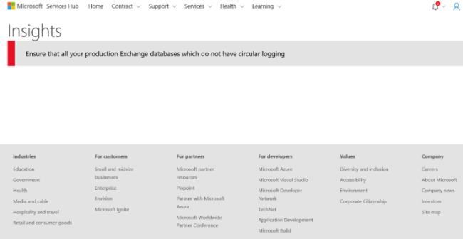

# Peringatan Kesehatan Penting

Peringatan Penting dihasilkan oleh penilaian yang telah dikonfigurasi dan dirancang untuk menarik perhatian pada potensi masalah di lingkungan Anda.   

Kemampuan untuk mengelola semua Peringatan Penting di satu tempat memungkinkan Anda melacak masalah sebelum terjadi untuk membantu memastikan kesehatan lingkungan TI Anda.  

 

1.  Untuk menemukan semua **Peringatan Penting**, buka Kesehatan, lalu Peringatan Penting. 

 

2.  Dari sini, Anda akan melihat peringatan penting yang ditampilkan. 

Klik <a href="mailto:SHub_Feedback_RC@Microsoft.com?subject=Resource%20Center%20Feedback%3A%20%3CInsert%20feedback%20topic%3E%3E&amp;body=%3C%3Cplease%20submit%20your%20feedback%20with%20enough%20detail%20on%20the%20problem%2C%20reproduction%20steps%20and%20what%20you%20desire%20to%20happen%3E%3E" target="_blank">di sini</a> untuk memberikan umpan balik.
