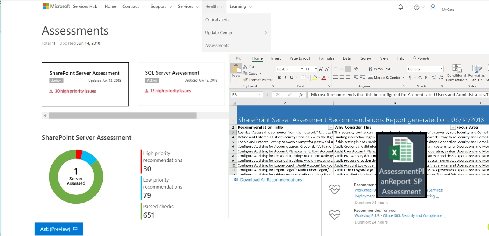

<h1>Mengunduh semua Rekomendasi Penilaian Sesuai Permintaan di Excel</h1>

<h2>Prasyarat:</h2>
<ul>
  <li>Anda harus memiliki akses ke Analitik Log Azure. Jika Anda harus menambahkan pengguna ke Analitik Log Azure: <a href="adding_users_azure_log_analytics.md" target="_blank">Menambahkan Pengguna ke Analitik Log Azure</a>.</li>
  <li>Anda harus menjalankan setidaknya satu Penilaian. Jika Anda belum menjalankan Penilaian Sesuai Permintaan: <a href="getting_started_with_on_demand_assessments.md" target="_blank">Memulai Penilaian Sesuai Permintaan</a>.&nbsp;&nbsp;</li>
</ul>

<h2>Instruksi: </h2>

1. Temukan Unduh Semua Rekomendasi Penilaian Sesuai Permintaan di <b>Penilaian &gt;Kesehatan</b>.
2. Klik di ubin Penilaian.
3. Klik Unduh semua Rekomendasi Penilaian Sesuai Permintaan.
4. Simpan file dan bagikan kepada kolega.
5. Tindakan ini akan memiliki semua rekomendasi, metadata kaya tentang cara menangani dan memasukkan Objek Terpengaruh.
6. Gunakan file Excel untuk mulai menangani rekomendasi dan meningkatkan kesehatan lingkungan.
    
 
    

    
 
    

    
 
    

    
 
    

    
Klik <a href="mailto:SHub_Feedback_RC@Microsoft.com?subject=Resource%20Center%20Feedback%3A%20%3CInsert%20feedback%20topic%3E%3E&amp;body=%3C%3Cplease%20submit%20your%20feedback%20with%20enough%20detail%20on%20the%20problem%2C%20reproduction%20steps%20and%20what%20you%20desire%20to%20happen%3E%3E" >di sini</a>&nbsp;untuk memberikan umpan balik.

    
 
    

