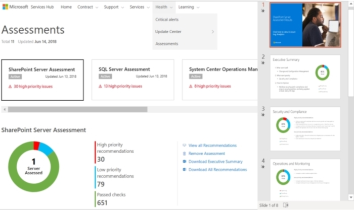

<H1>Ringkasan Eksekutif Penilaian Sesuai Permintaan</H1>

<h2>Prasyarat:</h2>

- Anda harus memiliki akses ke Analitik Log Azure. Jika Anda harus menambahkan pengguna ke Analitik Log Azure: <a href="adding_users_azure_log_analytics.md" target="_blank">Menambahkan Pengguna ke Analitik Log Azure</a>.
- Anda harus menjalankan setidaknya satu Penilaian. Jika Anda belum menjalankan Penilaian Sesuai Permintaan: <a href="getting_started_with_on_demand_assessments.md" target="_blank">Memulai Penilaian Sesuai Permintaan</a>. 
<h2>Instruksi: </h2>

1. Temukan Ringkasan Eksekutif Penilaian Sesuai Permintaan di <b>Penilaian &gt; Kesehatan</b>.
2. Klik di ubin Penilaian.
3. Klik Unduh Ringkasan Eksekuif Penilaian Sesuai Permintaan.
4. Terdapat tautan di halaman Sampul ke halaman web Gambaran Umum Analitik Log Azure.
5. Setiap slide adalah area fokus. Setiap area fokus akan mencantumkan rekomendasi prioritas tertinggi 4 teratas dan prioritas terendah 2 teratas.
      

      
 
      

      
 
      

      
 
      

      
 
      

      
Klik <a href="mailto:SHub_Feedback_RC@Microsoft.com?subject=Resource%20Center%20Feedback%3A%20%3CInsert%20feedback%20topic%3E%3E&amp;body=%3C%3Cplease%20submit%20your%20feedback%20with%20enough%20detail%20on%20the%20problem%2C%20reproduction%20steps%20and%20what%20you%20desire%20to%20happen%3E%3E" >di sini</a> untuk memberikan umpan balik. 

      
 
      

      
 
      

    

