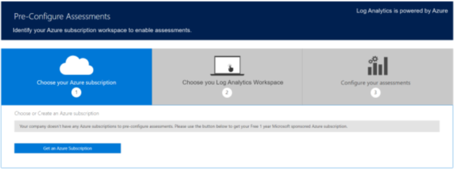

<h1>Langganan Azure </h1>
    
Langganan Microsoft Azure diperlukan untuk menjalankan Penilaian Hub Layanan. Jika perusahaan tidak memiliki langganan, Anda dapat membuatnya di Hub Layanan. Pertama, klik Kesehatan dan pilih Penilaian.
Kemudian, klik tombol Pra-Konfigurasi Penilaian dan klik Dapatkan Akun Azure (Jika tidak melihat tombol Dapatkan Akun Azure, artinya perusahaan Anda memiliki langganan Azure). Langkah ini akan membuat email berisi instruksi yang akan dikirimkan untuk memulai proses pembuatan akun bagi langganan bersponsor Azure. 

    <h2>Memilih Langganan Azure Anda</h2>
    
  

    
Langganan tanpa biaya ditujukan sebagai cara menguji dan menjelajahi Penilaian Hub Layanan. Akun sponsor tanpa biaya memiliki beberapa batasan sehingga kami menyarankan Anda untuk mendaftar Uji Coba Gratis Azure. Langganan Azure tanpa biaya memiliki batas $10 per tahun per permintaan pengguna. Biaya ini ditanggung oleh Hub Layanan. Anda tidak dikenakan biaya jika hanya menggunakan langganan ini untuk menjalankan penilaian pada Hub Layanan. 

   <i>Catatan: Langganan Azure ini dapat digunakan untuk tujuan lain, tetapi Anda mungkin melebihi batas $10 yang akan menonaktifkan langganan. Saat mendekati batas ini, pemilik langganan Azure akan mendapatkan pemberitahuan email. Setelah dinonaktifkan, langganan tidak dapat diaktifkan kembali. </i>
    
<b>Informasi Tambahan Penting:</b>

    <ul>
      <li>Penilaian Premier Hub Layanan tidak dikenakan biaya, tetapi Anda dapat dikenai biaya untuk layanan Azure lain yang digunakan.</li>
      <li>Anda akan diberi tahu tentang biaya tambahan jika harus dikenakan. </li>
      <li>Akun Azure tanpa biaya berlaku untuk 1 tahun sejak waktu aktivasi. </li>
      <li>Jika menggunakan layanan Azure lain, Anda akan diberi tahu tentang biaya penggunaan. </li>
      <li>Biaya tersebut tidak akan melebihi batas tahunan $10 USD. Untuk dukungan administrasi atau tagihan Azure, buka insiden dukungan di https://ms.portal.azure.com/#create/Microsoft.Support </li>
      <li>Tidak ada cara untuk mentransfer data dari langganan Azure tanpa biaya ke langganan Azure lain.</li>
      <li>Langganan akan kedaluwarsa ketika batas $10 dilampaui, atau setelah satu tahun, mana pun yang terjadi lebih dahulu. </li>
      <li>Setelah kedaluwarsa, akun akan dinonaktifkan secara permanen dan harus dialihkan ke langganan Azure EA. </li>
      <li>Hanya pelanggan tanpa akun Azure yang akan mendapatkan opsi untuk meminta langganan bersponsor Azure tanpa biaya dari Hub Layanan.
      </li>
      <li>Bahkan, meskipun langganan Azure gratis bersponsor Anda ditambahkan sebagai bagian dari Perjanjian Enterprise (EA), tidak ada biaya untuk menjalankan solusi Penilaian Sesuai Permintaan selama ruang kerja berada dalam tingkat gratis.</li>
      <li>Menjalankan solusi lain dapat dikenai biaya terkait. Lihat cuplikan layar di bawah ini untuk menemukan di mana Anda dapat memastikan bahwa ruang kerja berada dalam tingkat gratis (satu di Analitik Log Azure yang akan segera dihentikan dan yang lainnya di portal Azure). </li>
    </ul>
    <h2>Menemukan Pengaturan Paket Data Analitik Log Azure Di Portal Azure</h2>
    

     
    
      
    
Untuk harga tingkat gratis, terdapat batas pengunggahan data sebesar 500 MB per hari yang akan menghentikan pengunggahan data setelah batas tersebut dicapai. Data yang diunggah dalam tingkat gratis hanya akan disimpan selama 7 hari.  
      

       
    Klik <a href="https://serviceshub.uservoice.com/forums/382518-services-hub-ideas">di sini</a> untuk memberikan umpan balik. 
    

