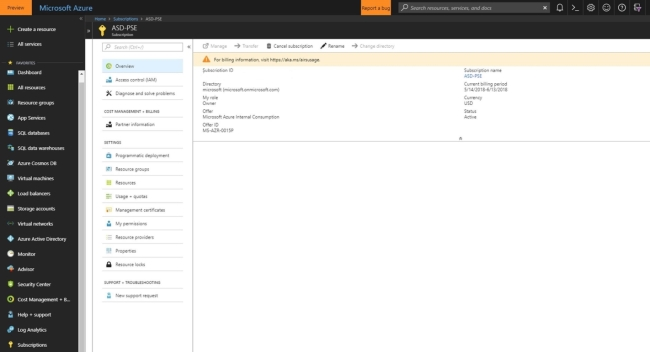

# Menambahkan Pengguna ke Analitik Log Azure melalui Portal Azure

Analitik Log Azure adalah sistem yang digunakan untuk menjalankan penilaian Hub Layanan sesuai permintaan. Saat ini, manajemen pengguna ditangani melalui Portal Azure (bukan fitur manajemen pengguna khusus Analitik Log Azure). Tindakan ini memungkinkan pengguna pelanggan untuk menambahkan/menghapus/mengonfigurasi penilaian serta menghubungkan. (Skenario 2 untuk akses Analitik Log Azure saja & orang-orang yang memiliki alamat email @microsoft disarankan menggunakan Skenario 2)

Untuk menambahkan pengguna baru ke langganan Azure, ikuti langkah-langkah berikut.

## Untuk Menambahkan Pengguna Baru ke Langganan Azure:

*Catatan: Hanya orang dengan penetapan ‘Pemilik’ yang dapat menambahkan pengguna ke langganan. Tinjau [aturan dan izin yang diperlukan di Azure](https://docs.microsoft.com/en-us/services-hub/health/health-kb-azure-roles) untuk mengelola penilaian*

## Skenario 1 

1.  Masuk ke [https://portal.azure.com](https://portal.azure.com/) dan navigasikan ke **Langganan** di bilah navigasi kiri. Jika tidak melihat **Langganan**, gulir ke bawah dan klik **Layanan Lainnya** untuk menemukannya. 

2. Setelah dipilih, Langganan akan menampilkan daftar Langganan Azure yang dikelola oleh organisasi Anda. 

3. Pilih langganan Azure yang terkait dengan ruang kerja Analitik Log Azure dan ditautkan ke akun Services Hub yang ingin ditambahkan penggunanya.

4. Klik Kontrol Akses, lalu Tambahkan.

5. Berikutnya, pilih Peran dan tambahkan alamat email orang yang ingin Anda tambahkan. Setelah selesai, klik Simpan.

*Catatan: Sebaiknya Anda [menambahkan pengguna](https://docs.microsoft.com/en-us/services-hub/health/health-kb-azure-roles) sebagai Pemilik atau Kontributor untuk memastikan mereka memiliki izin yang diperlukan dalam Analitik Log Azure untuk menambah, menghapus, dan mengonfigurasi penilaian.* 

6.  Jika Anda menambahkan orang menggunakan Akun Microsoft/Live ID miliknya, silakan tinjau artikel ini untuk mempelajari selengkapnya tentang [Mengautentikasi pemegang akun MSA untuk Azure](/services-hub/health/health-kb-authmsa).

## Skenario 2 

1. Masuk ke https://portal.azure.com dan navigasikan ke Analitik Log di bilah navigasi kiri. 

2. Setelah dipilih, Analitik Log akan menampilkan daftar ruang kerja Analitik Log Azure dalam pengelolaan organisasi Anda.

3. Pilih ruang kerja Analitik Log Azure yang ditautkan ke Services Hub yang ingin ditambahkan penggunanya.

4. Klik Kontrol Akses, lalu Tambahkan.

5. Berikutnya, pilih Peran (Pembaca Analitik Log) dan tambahkan alamat email orang yang ingin Anda tambahkan. Setelah selesai, klik Simpan.

6. Jika pengguna yang ingin Anda tambahkan bukan penyewa, pengguna itu akan menerima dan mengirim email untuk menyelesaikan proses dan memiliki akses ke ruang kerja Analitik Log Azure.

*Catatan: Sebaiknya Anda menambahkan pengguna sebagai "Pembaca Analitik Log Azure" untuk memberikan akses kepada pengguna @microsoft ke ruang kerja Analitik Log Azure untuk melihat penilaian Anda. Mereka tidak akan memiliki akses ke langganan Azure selain membaca akses di ruang kerja analitik log.*

Klik <a href="mailto:SHub_Feedback_RC@Microsoft.com?subject=Resource%20Center%20Feedback%3A%20%3CInsert%20feedback%20topic%3E%3E&amp;body=%3C%3Cplease%20submit%20your%20feedback%20with%20enough%20detail%20on%20the%20problem%2C%20reproduction%20steps%20and%20what%20you%20desire%20to%20happen%3E%3E" target="_blank">di sini</a> untuk memberikan umpan balik.
