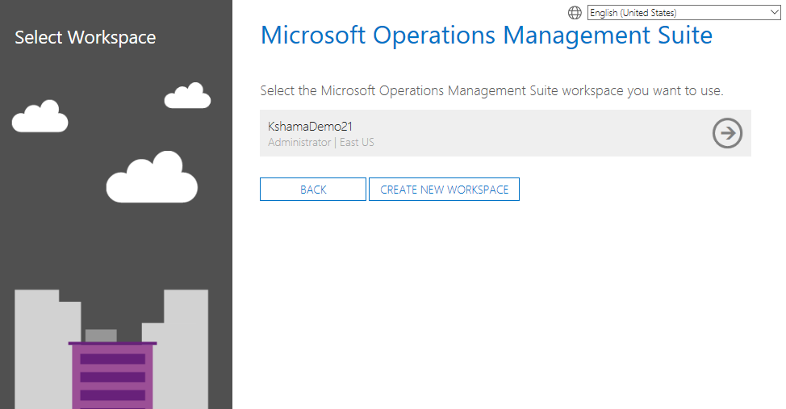

# Menambahkan Pengguna Dukungan Microsoft di Analitik Log Azure

## Analitik Log Azure

Untuk menambahkan pengguna dukungan Microsoft di Analitik Log MicrosoftAzure, masuk ke <https://www.mms.microsoft.com/> dan ikuti langkah-langkah berikut ini. 

*Catatan: Hanya orang dengan peran Pemilik atau Kontributor di ruang kerja Analitik Log Azure yang dapat melakukan langkah ini.*

1. Di Dasbor Analitik Log Azure Anda, klik ikon **Pengaturan** lalu klik **Akun**, **Kelola Pengguna**, kemudian Tambahkan **Pengguna**. 

2. Dalam **Pilih tipe akun**, pilih **Dukungan Microsoft**.

 

3. Dalam kotak teks, tambahkan alamat email pengguna dukungan Microsoft.  

*Catatan: Anda harus memformat alamat email menggunakan alias Microsoft pengguna dukungan Microsoft (alias\@microsoft.com).* 

4. Klik **Tambahkan** untuk mengirimkan alamat email. Setelah menambahkan pengguna dukungan Microsoft, mereka harus mengakses dasbor Analitik Log Azure melalui [https://www.mms.microsoft.com/](https://www.mms.microsoft.com/Account). Semua ruang kerja Analitik Log Azure yang dapat diakses oleh pengguna dukungan Microsoft akan ditampilkan dalam jendela. 

Klik [di sini ](https://serviceshub.uservoice.com/forums/382518-services-hub-ideas)untuk memberikan umpan balik.
