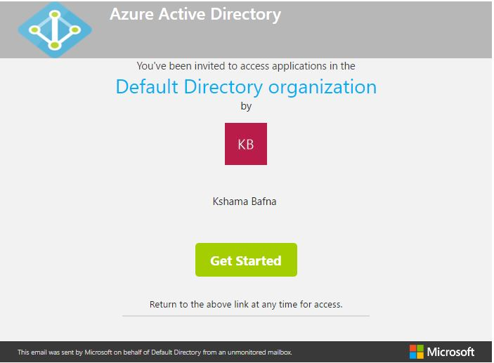
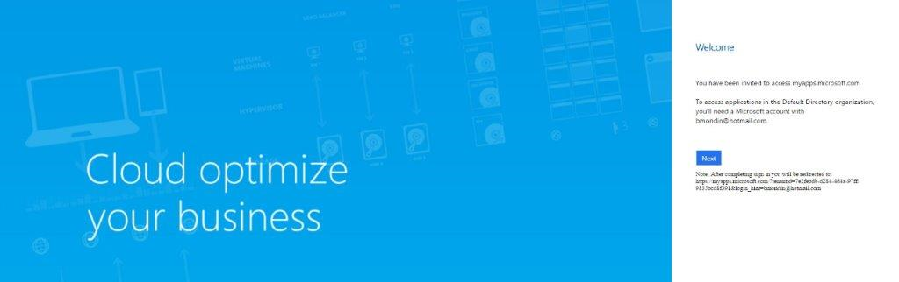
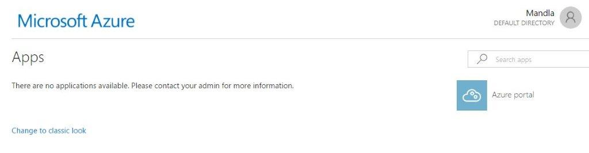

# Mengautentikasi Pemegang Akun Layanan Terkelola di Azure 

Jika pemegang Akun Layanan Terkelola (MSA) telah ditambahkan ke Azure, mereka akan menerima email dengan tautan untuk memulai. 

Contoh Email Undangan:

1.  Klik **Mulai** untuk memulai proses. Setelah itu, Anda akan diarahkan ke halaman sambutan Cloud mengoptimalkan bisnis Anda. Klik **Berikutnya**. 

2. Berikutnya, Anda akan diarahkan ke halaman Azure App; tidak ada yang perlu dilakukan di sini dan Anda dapat menutup jendela ini. 

3.  Selanjutnya, navigasikan ke [Hub Layanan](https://serviceshub.microsoft.com/)  dan klik tab Penilaian untuk membuka dasbor Analitik Log Azure.  

*Catatan: Dasbor Analitik Log Azure hanya akan terbuka jika sebelumnya telah ditautkan ke Hub Layanan* 

Klik <a href="https://serviceshub.uservoice.com/forums/382518-services-hub-ideas" target="_blank">di sini</a> untuk memberikan umpan balik.
