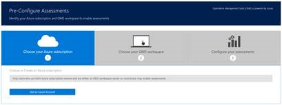
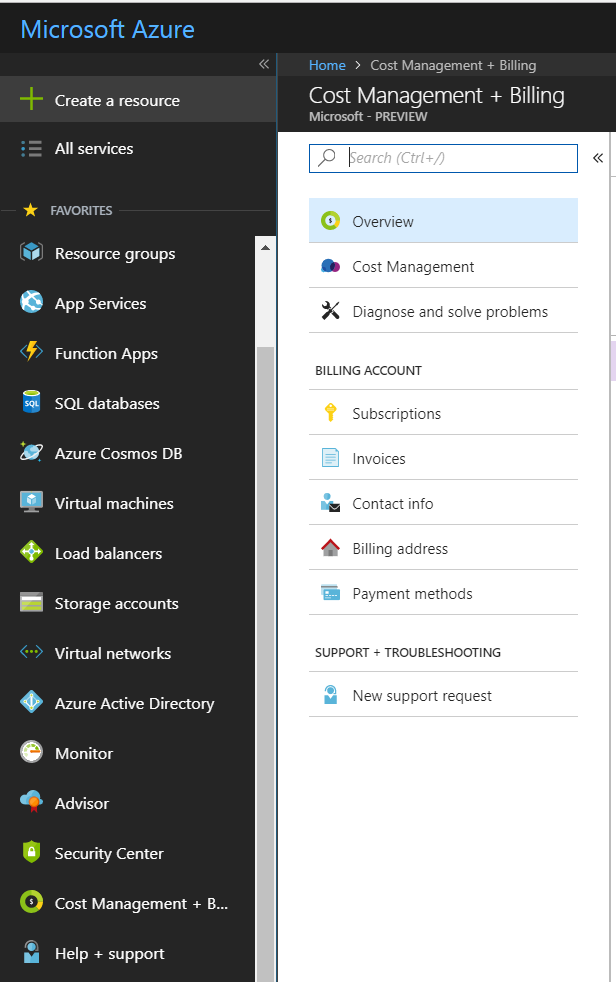
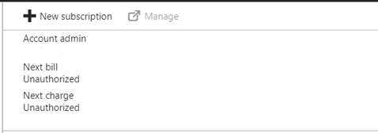
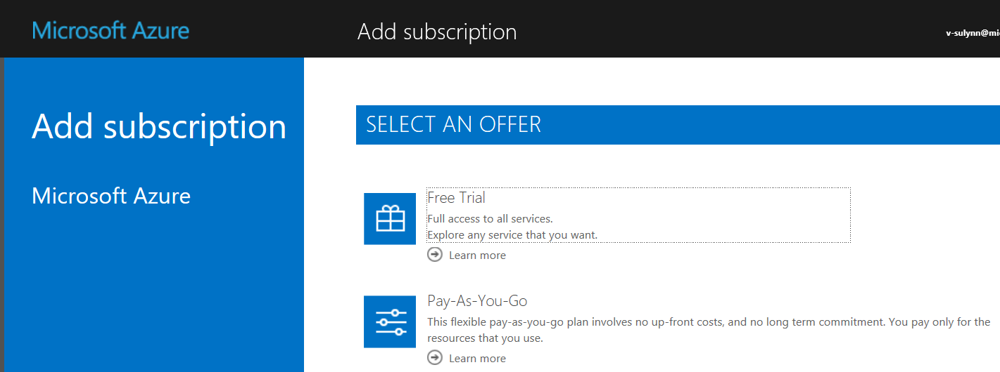

# Opsi Langganan Azure 

Langganan Microsoft Azure diperlukan untuk menjalankan Penilaian Hub Layanan.

 - Penilaian dapat ditemukan di menu: “Kesehatan” dan kemudian “Penilaian”. 

 - Berikutnya, klik “Pra-Konfigurasi Penilaian”, dan kemudian “Dapatkan Akun Azure”. 

 - Hal ini akan membuat, dan mengirim email berisi instruksi untuk memulai proses pembuatan akun. (Akun email digunakan untuk membuat akun Hub Layanan). 

*Catatan: Jika tidak melihat gambar di bawah ini, silakan tinjau bagian Memilih Langganan Azure dari Mulai Menggunakan Penilaian Sesuai Permintaan.* 

## Opsi 1:  Langganan Azure tanpa biaya, disponsori oleh Hub Layanan 

### Memilih Opsi Langganan Azure 

Penilaian utama, yang didapatkan Pelanggan terpadu sebagai bagian dari Kontrak Premier, kini tersedia bagi pengguna Hub Layanan secara gratis. Penilaian ini dijalankan dari Analitik Log Azure. Pelanggan dengan langganan Azure memiliki opsi dan kami ingin mengarahkan pelanggan ke opsi yang gratis atau prabayar untuk memulai. 

 - Langganan Tanpa Biaya dimaksudkan untuk digunakan sebagai cara menguji dan menjelajahi penilaian Hub Layanan. Karena batasan akun sponsor tanpa biaya, kami mendorong Anda untuk mendaftar langganan Azure reguler. Langganan Azure tanpa biaya memiliki $200 di kredit Azure. Biaya ini ditanggung oleh Hub Layanan. Anda tidak dikenakan biaya jika hanya menggunakan langganan ini untuk menjalankan penilaian dari Hub Layanan. ([Pelajari Selengkapnya](https://azure.microsoft.com/en-us/offers/ms-azr-0044p/)) 

 - Langganan Prabayar tidak akan mengenakan biaya jika Anda tidak melebihi penggunaan data maksimum harian. Anda akan diberi tahu tentang biaya tambahan jika harus dikenakan. ([Pelajari Selengkapnya](https://azure.microsoft.com/en-us/offers/ms-azr-0003p/)) 

## Opsi 2:  Membuat Langganan Azure Baru

1. Anda dapat menambahkan Langganan dengan membuka [Portal Microsoft Azure](https://ms.portal.azure.com/#create/Microsoft.Support). 
2. Pada sisi kiri, gulir ke bawah ke Manajemen Biaya dan pilih.

3.  Di bagian tengah layar di dekat bagian atas, Anda akan melihat + “Langganan baru”.

4.  Anda akan diminta untuk memilih opsi langganan.
5.  Setelah memilih opsi, Anda perlu melengkapi formulir yang memerlukan kartu kredit untuk melakukan verifikasi identitas.

*Catatan: Langganan Azure ini dapat digunakan untuk tujuan lain, tetapi melakukannya akan menonaktifkan langganan jika digunakan secara berlebihan dari batas nilai tunai, atau 1 tahun, satu diantara keduanya. Saat mendekati batas ini, pemilik langganan Azure akan mendapatkan pemberitahuan email. Setelah langganan dinonaktifkan, langganan tidak dapat diaktifkan kembali.*

## Informasi Tambahan

-   Penilaian Premier Hub Layanan tidak dikenakan biaya, tetapi Anda dapat dikenai biaya untuk layanan Azure lain yang digunakan. Anda akan diberi tahu tentang biaya tambahan jika harus dikenakan.
-   Akun Azure tanpa biaya berlaku untuk 1 tahun sejak waktu aktivasi.
-   Jika menggunakan layanan Azure lain, Anda akan diberi tahu tentang biaya penggunaan.
-   Untuk dukungan administrasi atau tagihan Azure, buka insiden dukungan pada https://ms.portal.azure.com/#create/Microsoft.Support.
-   Tidak ada cara untuk mentransfer data dari langganan Azure tanpa biaya ke langganan Azure lain.
-   Langganan kedaluwarsa setelah batas dilampaui atau setelah satu tahun, mana yang terjadi lebih dahulu. Setelah kedaluwarsa, akun akan dinonaktifkan secara permanen.
-   Hanya pelanggan tanpa akun Azure yang akan mendapatkan opsi untuk meminta langganan tanpa biaya dari Hub Layanan.

Klik <a href="mailto:SHub_Feedback_RC@Microsoft.com?subject=Resource%20Center%20Feedback%3A%20%3CInsert%20feedback%20topic%3E%3E&amp;body=%3C%3Cplease%20submit%20your%20feedback%20with%20enough%20detail%20on%20the%20problem%2C%20reproduction%20steps%20and%20what%20you%20desire%20to%20happen%3E%3E" target="_blank">di sini</a> untuk memberikan umpan balik.

