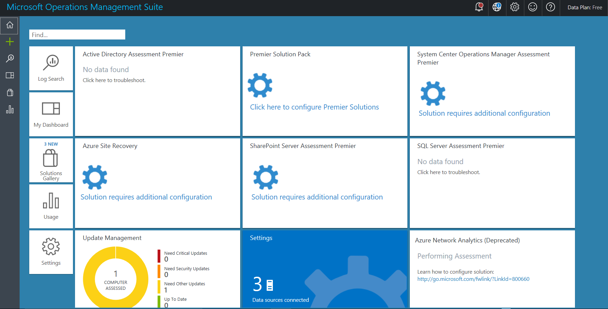
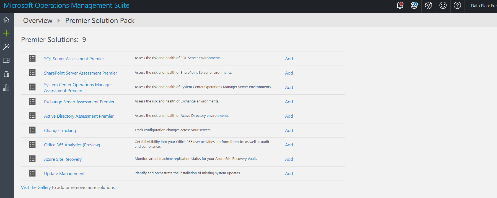
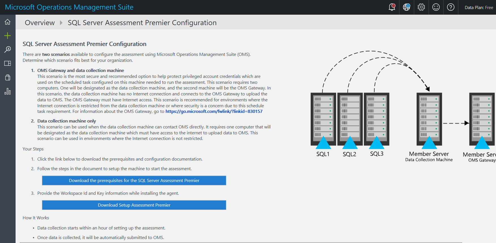

# Mengonfigurasi Penilaian di Analitik Log Azure

*Catatan: Hanya pengguna yang telah diberi akses Analitik Log Azure melalui portal Azure yang dapat melihat dasbor ini.*

Setelah menautkan Hub Layanan ke ruang kerja Analitik Log Azure, Anda dapat mulai mengonfigurasi Penilaian sesuai permintaan. Ikuti langkah-langkah di bawah ini untuk memulai.

1.  Klik **Paket Solusi Dukungan Terpadu Microsoft**. Di sini Anda akan melihat daftar solusi yang tersedia.

*Catatan: Penilaian ini bersifat khusus bagi pengguna Hub Layanan dan akan memberikan wawasan mendetail serta memungkinkan Anda memecahkan masalah rekomendasi prioritas dan menangani masalah secara proaktif.*

2. Klik **Tambahkan** untuk penilaian apa pun dalam Paket Solusi Dukungan Terpadu Microsoft.

3.  Setelah mengklik **Tambahkan**, Anda akan melihat halaman konfigurasi dengan instruksi untuk menyiapkan dan mengonfigurasi penilaian.

## Menyiapkan Penilaian

3.  Unduh kedua dokumen dari halaman konfigurasi (Prasyarat Penilaian Teknologi dan Penilaian Penyiapan). Dokumen ini secara mendetail akan membahas tentang persyaratan sistem beserta cara menginstal Agen Manajemen Microsoft dan Gateway Analitik Log Azure.

*Catatan: Halaman konfigurasi dan dokumen ini hanya tersedia dalam tipe solusi penilaian. Tidak semua solusi dalam daftar memiliki halaman konfigurasi yang tersedia.*

4.  Terdapat dua skenario yang tersedia untuk mengonfigurasi penilaian. Pertama, tentukan opsi yang terbaik untuk organisasi Anda.

    a.  **Gateway Analitik Log Azure dan mesin pengumpulan data**

      Skenario ini adalah opsi yang paling aman dan disarankan untuk membantu melindungi kredensial akun istimewa yang digunakan pada tugas terjadwal yang dikonfigurasi pada mesin pengumpulan data. Skenario ini memerlukan dua komputer. Satu komputer akan ditetapkan sebagai mesin pengumpulan data dan yang lainnya menjadi Gateway Analitik Log Azure. Dalam skenario ini, mesin pengumpulan data tidak memiliki koneksi Internet dan menghubungkan ke Gateway Analitik Log Azure untuk mengunggah data ke Analitik Log Azure. Gateway Analitik Log Azure harus memiliki akses Internet. Skenario ini direkomendasikan untuk lingkungan di mana koneksi Internet dari mesin pengumpulan data dilarang atau untuk lingkungan dengan permasalahan keamanan karena konfigurasi tugas terjadwal

    b.  **Hanya mesin pengumpulan data**

      Skenario ini dapat digunakan ketika mesin pengumpulan data dapat menghubungi Analitik Log Azure secara langsung. Diperlukan satu komputer yang akan ditetapkan sebagai mesin pengumpulan data yang memerlukan akses internet untuk mengunggah data ke Analitik Log Azure. Mesin pengumpulan data harus menjadi anggota domain atau hutan dari lingkungan yang diperiksa. Mesin ini akan mengumpulkan data dari semua server di lingkungan tempat Anda ingin menjalankan penilaian. Setelah data dikumpulkan, mesin pengumpulan data akan menganalisis informasi dan mengunggah data ke Analitik Log Azure secara langsung; tindakan ini memerlukan konektivitas HTTPS ke ruang kerja langganan Analitik Log Azure Anda.

## **Informasi tambahan tentang Analitik Log Azure**

Area Fokus Situs Analitik Log Azure: Wawasan dan Analitik: Dapatkan wawasan cepat tentang beban kerja

-   [Video Gambaran Umum](https://www.microsoft.com/en-us/cloud-platform/insight-and-analytics)

-   [Mendapatkan wawasan dengan Analitik Log Microsoft Azure](https://oms.cloudguides.com/en-US/guides/Managing%20security%20and%20compliance%20with%20Microsoft%20Operations%20Management%20Suite)

Area Fokus Situs Analitik Log Azure: Keamanan dan Kepatuhan: Merespons ancaman keamanan secara lebih cepat

-   [Video Gambaran Umum ](https://www.microsoft.com/en-us/cloud-platform/security-and-compliance)

-   [Mengelola keamanan dan kepatuhan dengan Analitik Log Microsoft Azure](https://oms.cloudguides.com/en-US/guides/Managing%20security%20and%20compliance%20with%20Microsoft%20Operations%20Management%20Suite)

Area Fokus Situs Analitik Log Azure: Automasi dan Kontrol: Memungkinkan kontrol dan kepatuhan yang konsisten

-   [Video Gambaran Umum ](https://www.microsoft.com/en-us/cloud-platform/automation-and-control)

-   [Panduan Demo](https://oms.cloudguides.com/en-US/Guides/Automation%20and%20configuration%20in%20Microsoft%20Operations%20Management%20Suite)

Area Fokus Situs Analitik Log Azure: Perlindungan & Pemulihan: Memastikan ketersediaan aplikasi dan data

-   [Video Gambaran Umum](https://www.microsoft.com/en-us/cloud-platform/protection-and-recovery)

Klik <a href="https://serviceshub.uservoice.com/forums/382518-services-hub-ideas" target="_blank">di sini</a> untuk memberikan umpan balik.
