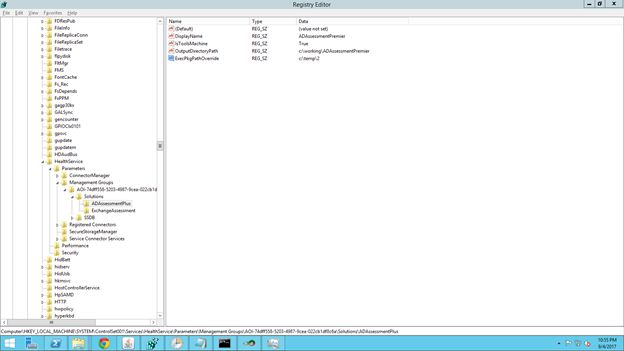

# Menggunakan ExecPkg yang Disediakan oleh Personel Microsoft
 
> ** JANGAN MENGUBAH REGISTRI KECUALI DIMINTA OLEH PERSONEL RESMI MICROSOFT. PERUBAHAN INI HANYA DITUJUKAN BAGI KEADAAN KHUSUS YANG HANYA DIKETAHUI OLEH PERSONEL RESMI MICROSOFT.** 

> Perubahan yang tidak tepat pada registri dapat menyebabkan kerusakan yang tidak dapat diperbaiki bagi komputer Anda.

## Alasan untuk menimpa

Kekayaan intelektual dalam sebuah penilaian terdapat dalam file bernama *.execPkg dan diunduh dari cloud Analitik Log Azure. Namun, untuk tujuan pengujian dan evaluasi, personel Microsoft yang terlatih dapat meminta agar versi yang diunduh ditimpa dengan versi yang diberikan.

## Menambahkan timpaan untuk membaca execPkg dari lokasi yang berbeda

Jika ingin menimpa versi Exchange execPkg yang diunduh dengan versi yang diberikan oleh personel Dukungan Microsoft, Anda harus 

1. Masuk ke HKEY_LOCAL_MACHINE\SYSTEM\CurrentControlSet\Services\HealthService\Parameters\Management Groups\AOI-<YourOMSWorkspaceId>\Solutions\ExchangeAssessment

2. Kemudian, tambahkan kunci registri bernama ExecPkgPathOverride dengan nilai yang mengarah ke direktori tempat personel dukungan memberikan file execPkg.

Misalnya, jika file execPkg yang diberikan berada di c:\temp, Nilai ExecPkgPathOverride seharusnya adalah c:\temp (BUKAN c:\temp\ExchangeAssessmentPlus.execPkg, nama file tidak boleh disebutkan dan akan disimpulkan) Pastikan bahwa nama file execpkg sesuai dengan yang diberikan kepada Anda dan file tidak diganti namanya. Contoh. JANGAN mengubah nama ExchangeAssessmentPlus.execpkg menjadi ExchangeOverride.execpkg

3. Mulai ulang HealthService dengan menjalankan perintah berikut ini dari prompt perintah Administrator

> net stop healthservice

> net start healthservice

4. Mulai jalankan Penilaian dari tugas dalam PenjadwalTugas.

## Menghapus timpaan registri

Setelah validasi dan pengujian selesai, pada instruksi dari Personel Microsoft (mereka harus memastikan bahwa Anda sudah mengunduh versi yang tepat dari cloud Analitik Log Azure ketika timpaan registri dihapus), hapus kunci registri ExecPkgPathOverride dan mulai ulang Layanan Kesehatan. Tindakan ini akan mengatur OMSAssessment.exe untuk menggunakan versi *.execPkg yang diunduh dari Layanan Analitik Log (Atau Analitik Log) Azure (bukan *.execPkg yang diberikan oleh personel dukungan).

Klik <a href="mailto:SHub_Feedback_RC@Microsoft.com?subject=Resource%20Center%20Feedback%3A%20%3CInsert%20feedback%20topic%3E%3E&amp;body=%3C%3Cplease%20submit%20your%20feedback%20with%20enough%20detail%20on%20the%20problem%2C%20reproduction%20steps%20and%20what%20you%20desire%20to%20happen%3E%3E" target="_blank">di sini</a> untuk memberikan umpan balik.
