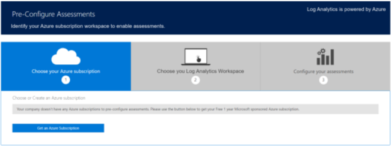

# Memulai dengan Penilaian Atas Permintaan

Penilaian tersedia melalui Services Hub untuk membantu Anda mengoptimalkan ketersediaan, keamanan, dan kinerja investasi teknologi Microsoft Anda. Penilaian ini menggunakan Azure Log Analytics Microsoft, yang dirancang untuk memberi Anda manajemen TI dan keamanan yang disederhanakan di lingkungan Anda.

## Memulai Penilaian

### Prasyarat

Agar dapat memanfaatkan sepenuhnya Penilaian Atas Permintaan yang tersedia melalui Services Hub, Anda harus:

1.  Berlangganan Azure. Anda dapat menggunakan pembayaran saat menggunakan akun gratis. Untuk informasi lebih lanjut, lihat: [*Opsi Langganan Azure*](mailto:serviceshubteam@ppas.uservoice.com?subject=Free%20Azure%20Subscription%20Offer&body=Please%20send%20me%20information%20regarding%20the%20Free%20Azure%20Subscription%20Offer%20available%20through%20the%20Services%20Hub.).

2.  Mampu menautkan Services Hub Anda, dan Akun Langganan Azure.

*Catatan: Rata-rata, dibutuhkan dua jam untuk mengonfigurasi awal lingkungan Anda untuk menjalankan penilaian atas permintaan. Setelah menjalankan penilaian, Anda dapat meninjau data di Azure Log Analytics. Ini akan memberi Anda daftar rekomendasi prioritas, yang dikategorikan di enam area fokus. Memungkinkan Anda dan tim untuk cepat memahami tingkat risiko, kesehatan lingkungan Anda, bertindak untuk mengurangi risiko, dan meningkatkan kesehatan TI Anda secara keseluruhan.*

#### Menautkan Services Hub ke Ruang Kerja Azure Log Analytics Anda

*Catatan: Hanya pemilik langganan Azure dan ruang kerja Azure Log Analytics Anda yang dapat menautkan Services Layanan ke Azure Log Analytics.*

1.  Masuk ke Services Hub.

2.  Navigasikan ke Tab Penilaian lalu klik Penilaian.

3.  Klik tombol Penilaian Prakonfigurasi.

#### Memilih Langganan Azure Anda

Ada tiga skenario alur kerja terhubung yang memungkinkan. Setiap skenario ditentukan oleh langganan Azure perusahaan Anda dan peran yang Anda tetapkan dalam langganan Azure.

### Skenario 1

#### Pemilik Langganan Azure untuk Organisasi Anda akan melihat:

### Skenario 2

Organisasi yang memiliki langganan Azure tetapi bukan pemilik langganan Azure akan melihat:

Mengurus dengan Admin Layanan perusahaan Anda, TAM, atau Koordinator Akun Dukungan untuk mengupayakan pemilik langganan Azure melakukan prakonfigurasi penilaian Anda.

### Skenario 3

Organisasi tanpa langganan Azure, pengunjung akan melihat:

Klik **Dapatkan Langganan Azure** untuk mendapatkan langganan yang disponsori Microsoft.

Untuk mempelajari lebih lanjut tentang privasi Azure, kunjungi [Pusat Kepercayaan Microsoft](https://www.microsoft.com/en-us/trustcenter).

## Menghubungkan Akun Azure dengan Azure Log Analytics

Memilih ruang kerja [Azure Log Analytics organisasi Anda](https://mms.microsoft.com/Account?returnUrl=%2F) dari menu daftar menurun.  Jika tidak memiliki ruang kerja, klik **Buat Baru** untuk membuatnya dan selesaikan tahap-tahap berikut:

1.  Beri nama ruang kerja Azure Log Analytics Anda - nama harus unik.

2.  Pilih grup Sumber Daya Azure. Jika tidak punya, Anda dapat membuatnya.

3.  Pilih wilayah yang paling sesuai dengan lokasi Anda dan setelah Anda meninjau perjanjian berlangganan, rincian penawaran, dan pernyataan privasi Anda dapat mencentang kotak untuk menyetujui. Setelah pilihan Anda dibuat, klik Kirim.

*Catatan: Setelah memilih ruang kerja, Anda dapat membuat perubahan kapan saja dengan menavigasi ke Sunting Ruang Kerja Azure Log Analytics di bawah nama Anda di Services Hub.*

4.  Setelah mengeklik Kirim, Anda akan melihat halaman konfirmasi.

5.  Klik bilah biru berlabel **Klik di sini** to navigate to your assessments untuk menavigasi ke dasbor Azure Log Analytics lalu memulai konfigurasi penilaian Anda.

## Mengonfigurasi Penilaian di Azure Log Analytics

Setelah menautkan Services Hub Anda ke [Ruang Kerja Azure Log Analytics](https://asd-westus-public.portal.mms.microsoft.com/#Workspace/overview/), Anda dapat mulai mengonfigurasi penilaian atas permintaan Anda.

*Catatan: Hanya pengguna yang telah mendapatkan akses Azure Log Analytics melalui portal Azure yang dapat melihat dasbor ini.*

*Catatan: Penilaian ini unik bagi pengguna Services Hub dan akan memberi Anda wawasan lengkap serta memungkinkan Anda untuk segera memecahkan masalah rekomendasi prioritas juga secara proaktif memulihkan masalah.*

1.  Klik **Kesehatan -> Penilaian** dan gulir ke bawah untuk melihat daftar penilaian yang tersedia.

2.  Klik **Tambahkan Penilaian** untuk penilaian apa pun di katalog.

3.  Tonton video konfigurasi atau klik konfigurasi sekarang untuk melihat halaman konfigurasi dengan instruksi untuk menyiapkan dan mengonfigurasi penilaian.

## Menyiapkan Penilaian

1.  [Unduh](https://www.microsoft.com/en-us/download/details.aspx?id=54778) dokumen dari halaman konfigurasi (Prasyarat untuk Penilaian dan Penilaian Penyiapan). Dokumen-dokumen ini menjelaskan persyaratan sistem dan cara menginstal Microsoft Management Agent dan Gateway Azure Log Analytics.

2.  Atau, Anda dapat melihat [artikel ini](https://gallery.technet.microsoft.com/On-Demand-Assessments-in-97bf978d) untuk memperoleh panduan tentang cara menyiapkan penilaian.

*Catatan: Halaman dan dokumen konfigurasi ini hanya tersedia dalam jenis solusi Penilaian. Tidak semua Solusi dalam daftar memiliki halaman konfigurasi yang tersedia.*

3.  Ada dua skenario yang tersedia untuk mengonfigurasi penilaian. Menentukan terlebih dahulu mana yang terbaik untuk organisasi Anda:

    A. Gateway Azure Log Analytics dan Mesin Pengumpulan Data: Skenario ini memerlukan dua komputer dan merupakan opsi yang paling aman dan pilihan yang direkomendasikan untuk membantu melindungi kredensial akun istimewa yang digunakan pada tugas terjadwal yang terkonfigurasi pada mesin pengumpulan data. Satu komputer ditunjuk sebagai mesin pengumpulan data, dan komputer kedua adalah Gateway Azure Log Analytics. Dalam skenario ini, mesin pengumpulan data tidak memiliki koneksi Internet dan terhubung ke Gateway Azure Log Analytics untuk mengunggah data ke Azure Log Analytics. Azure Log Analytics Gateway harus memiliki akses Internet. Skenario ini direkomendasikan untuk lingkungan di mana koneksi Internet dibatasi dari mesin pengumpulan data atau di mana keamanan menjadi perhatian karena konfigurasi tugas terjadwal.
    
    
    B. Khusus Mesin Pengumpulan Data: Skenario ini dapat digunakan saat mesin pengumpulan data dapat langsung menghubungi Azure Log Analytics. Diperlukan satu komputer yang akan ditetapkan sebagai mesin pengumpulan data dan membutuhkan akses Internet untuk mengunggah data ke Azure Log Analytics. Mesin pengumpulan data harus menjadi anggota domain atau hutan lingkungan yang sedang dinilai dan akan mengumpulkan data dari semua server pilihan Anda di lingkungan tersebut untuk menjalankan penilaian. Setelah data terkumpul, mesin pengumpulan data akan menganalisis informasi lalu mengunggah data ke Azure Log Analytics secara langsung; hal ini memerlukan sambungan HTTPS ke ruang kerja langganan Azure Log Analytics Anda.

## Halaman Penilaian Services Hub

Setelah menautkan Services Hub Anda ke ruang kerja Azure Log Analytics, dan mengonfigurasikan penilaian, Anda dapat melihat semua informasi penilaian Anda dari Services Hub. Untuk melihat halaman penilaian pribadi Anda, pilih Kesehatan dari navigasi utama, lalu klik Penilaian. Di sini Anda akan menemukan semua penilaian terkonfigurasi dengan data tingkat teratas yang diambil dari Azure Log Analytics.

<i>Catatan: Hanya pengguna dengan [akses Analitik Log Azure](https://docs.microsoft.com/en-us/services-hub/health/health-kb-adduserazure) yang akan dapat melihat data penilaian saat menjalankan aturan keamanan yang berlaku untuk Analitik Log Azure. Untuk akses, hubungi pemilik Azure di organisasi Anda. Penilaian yang tersedia dalam contoh di atas memiliki bilah gulir di bawahnya; gunakan untuk melihat Penilaian Tambahan yang tidak ditampilkan.</i>

1.  Klik pada setiap Penilaian untuk melihat hasil.

2.  Klik **Lihat di Azure Log Analytics** di sebelah kanan rekomendasi untuk meninjau rincian lengkap rekomendasi.

## Informasi Azure Log Analytics Tambahan

Area Fokus Situs Azure Log Analytics: Gambaran dan Analitis: Mendapatkan gambaran langsung mengenai beban kerja

-   [Video Gambaran Umum](https://www.microsoft.com/en-us/cloud-platform/insight-and-analytics)

-   [Mendapatkan gambaran dengan Azure Log Analytics Microsoft](https://oms.cloudguides.com/en-US/guides/Gaining%20insights%20with%20Microsoft%20Operations%20Management%20Suite)

Area Fokus Situs Azure Log Analytics: Keamanan dan Kepatuhan: Menanggapi ancaman keamanan lebih cepat

-   [Video Gambaran Umum](https://www.microsoft.com/en-us/cloud-platform/security-and-compliance)

-   [Mengelola keamanan dan kepatuhan dengan Azure Log Analytics Microsoft](https://oms.cloudguides.com/en-US/guides/Managing%20security%20and%20compliance%20with%20Microsoft%20Operations%20Management%20Suite)

Area Fokus Situs Azure Log Analytics: Automasi dan Kontrol: Mengktifkan kontrol dan kepatuhan yang konsisten

-   [Video Gambaran Umum](https://www.microsoft.com/en-us/cloud-platform/automation-and-control)

-   [Panduan demo](https://oms.cloudguides.com/en-US/Guides/Automation%20and%20configuration%20in%20Microsoft%20Operations%20Management%20Suite)

Area Fokus Situs Azure Log Analytics: Perlindungan dan Pemulihan: Memastikan ketersediaan app dan data

-   [Video Gambaran Umum](https://www.microsoft.com/en-us/cloud-platform/protection-and-recovery)

 

Klik [di sini](https://serviceshub.uservoice.com/forums/382518-services-hub-ideas) untuk memberikan umpan balik.
