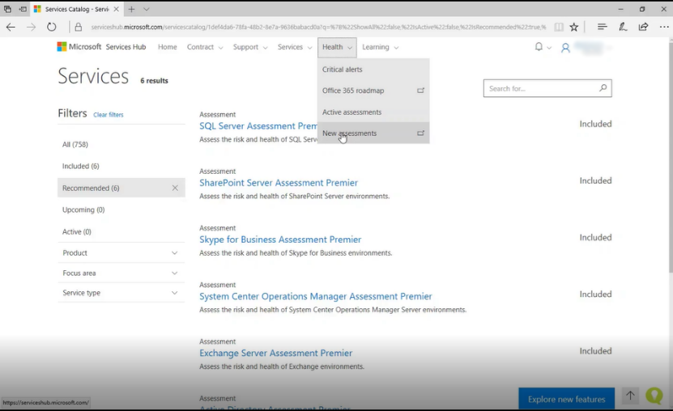
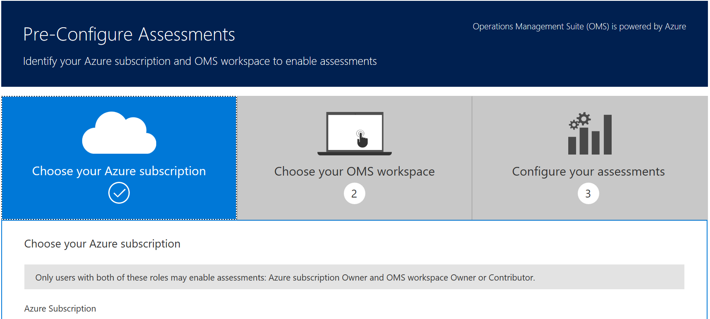
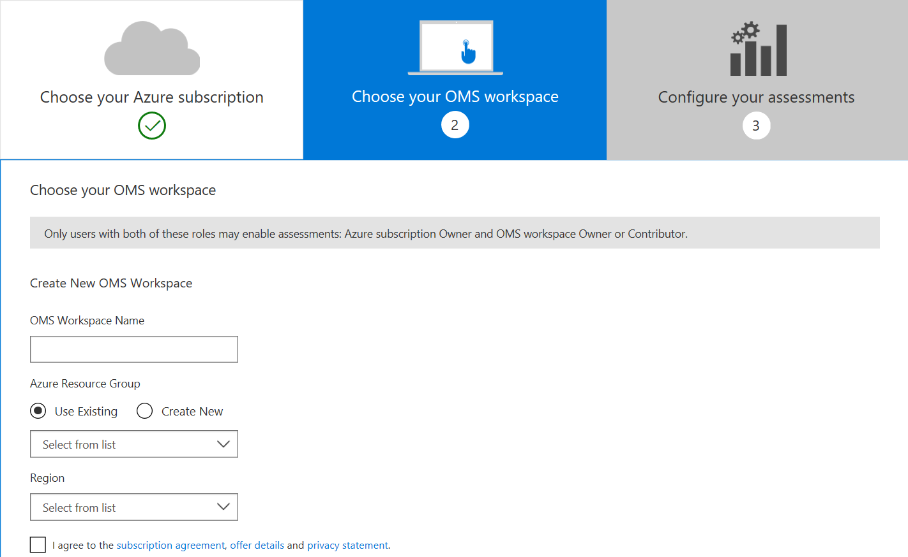
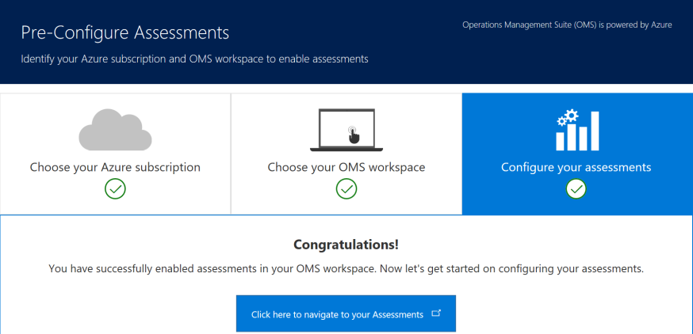

# Menautkan Hub Layanan ke ruang kerja Analitik Log Azure

*Catatan: Hanya pemilik langganan Azure dan ruang kerja Analitik Log Azure yang dapat menautkan Hub Layanan ke Analitik Log Azure.*

1.  Masuk ke [Hub Layanan](https://serviceshub.microsoft.com).

2.  Navigasikan ke tab **Kesehatan** lalu pilih **Penilaian**.  Gulir ke bawah dan klik "Prakonfigurasi Penilaian".

3.  Pilih langganan Azure organisasi Anda dari menu menurun. Menggunakan Azure akan meningkatkan kemampuan dan skalabilitas cloud, memungkinkan data dan wawasan reaktif yang lebih cepat tentang kesehatan lingkungan Anda. Untuk informasi tentang privasi Azure, kunjungi [Pusat Kepercayaan Microsoft](https://www.microsoft.com/en-us/TrustCenter/Privacy/default.aspx).

*Catatan: Anda dapat memilih langganan Azure organisasi Anda atau membuat yang baru. Akun Azure gratis berlaku selama satu tahun dan data yang dikumpulkan di dalamnya tidak akan dapat dipindahkan ke akun lain.*

4.  Berikutnya, pilih ruang kerja Analitik Log Azure organisasi Anda dari menu menurun. Jika tidak memiliki ruang kerja, Anda dapat [Membuat ruang kerja tanpa biaya](https://www.microsoft.com/en-us/cloud-platform/operations-management-suite) dengan memilih **Buat Baru**. Jika membuat ruang kerja baru, ikuti langkah-langkah berikut:

> 1.  Beri nama yang unik untuk ruang kerja Analitik Log Azure Anda.
> 
> 2.  Pilih [grup Sumber Daya Azure](https://docs.microsoft.com/en-us/azure/azure-resource-manager/resource-group-overview). Anda dapat membuat yang baru jika perlu.
> 
> 3.  Pilih kawasan yang paling sesuai dengan lokasi Anda, dan setelah meninjau perjanjian langganan, detail penawaran, dan pernyataan privasi, centang kotak setuju dan klik Kirim.

*Catatan: Setelah memilih ruang kerja, Anda dapat melakukan perubahan kapan saja dengan menavigasi ke Edit Ruang Kerja Analitik Log Azure di bawah nama Anda di Hub Layanan.*

5.  Setelah mengklik **Kirim**, Anda akan melihat halaman konfirmasi. Klik bilah biru untuk menavigasi ke penilaian Anda di dasbor Analitik Log Azure dan memulai konfigurasi penilaian.

 

Klik <a href="mailto:SHub_Feedback_RC@Microsoft.com?subject=Resource%20Center%20Feedback%3A%20%3CInsert%20feedback%20topic%3E%3E&amp;body=%3C%3Cplease%20submit%20your%20feedback%20with%20enough%20detail%20on%20the%20problem%2C%20reproduction%20steps%20and%20what%20you%20desire%20to%20happen%3E%3E" target="_blank">di sini</a> untuk memberikan umpan balik.
