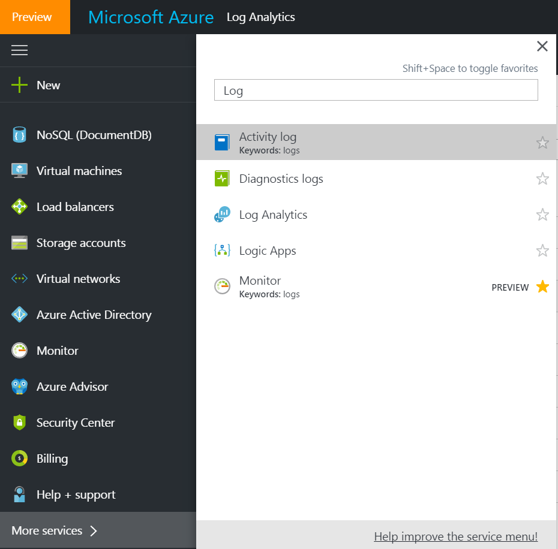
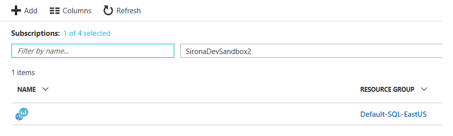
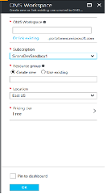

# Cara Membuat Ruang Kerja Analitik Log Azure Baru dari Azure

1.  Masuk ke [https://portal.azure.com](https://portal.azure.com/) dan navigasikan ke Analitik Log Azure di bilah navigasi. Jika tidak melihatnya di sana, gulir ke bawah dan klik **Layanan Lainnya** untuk membuka bilah pencarian dan ketikkan Analitik Log.

> Tips: Akun Azure yang digunakan untuk membuat Analitik Log harus memiliki Izin Pemilik.

 

2.  Klik **Tambahkan** untuk membuat Ruang Kerja Analitik Log Azure baru.

3.  Isi semua bidang yang wajib diisi dan klik **OK**. 

 

Klik <a href="mailto:SHub_Feedback_RC@Microsoft.com?subject=Resource%20Center%20Feedback%3A%20%3CInsert%20feedback%20topic%3E%3E&amp;body=%3C%3Cplease%20submit%20your%20feedback%20with%20enough%20detail%20on%20the%20problem%2C%20reproduction%20steps%20and%20what%20you%20desire%20to%20happen%3E%3E" target="_blank">di sini</a> untuk memberikan umpan balik.
