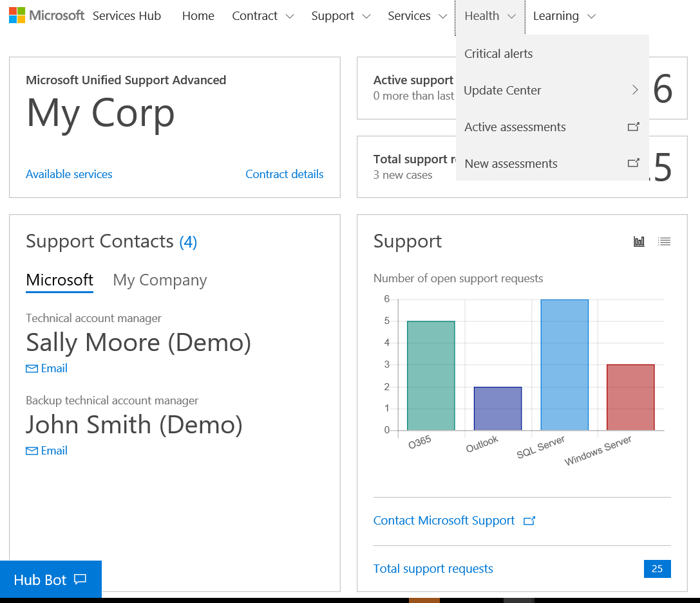
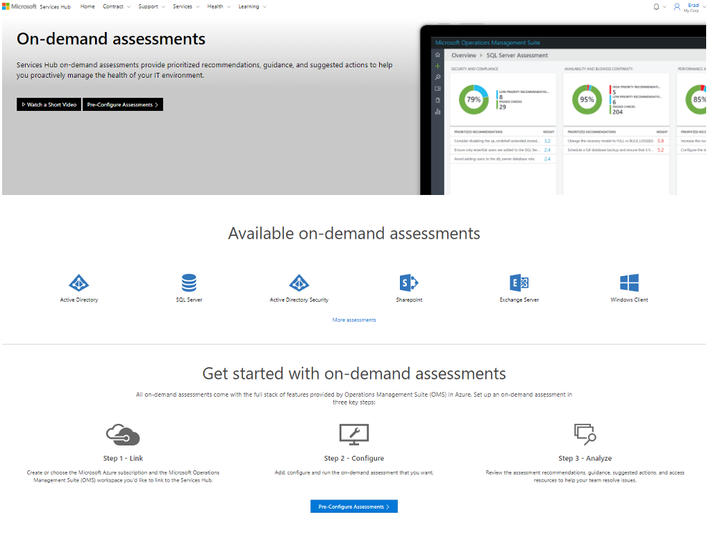
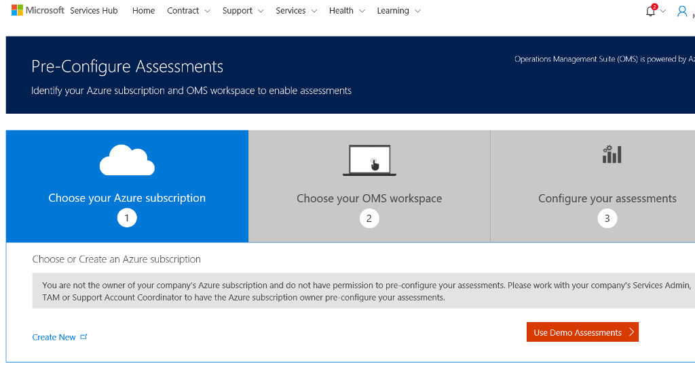

# Penilaian Sesuai Permintaan 

## Kelola kesehatan lingkungan TI secara proaktif dengan penilaian sesuai permintaan sehingga Anda dapat melakukan penyesuaian untuk kebutuhan spesifik lingkungan Anda.  

-   Memperkirakan dan menentukan langkah penting berikutnya untuk meningkatkan lingkungan Anda. 

-   Memberikan peringatan secara proaktif tentang masalah yang sangat mendesak sebelum berdampak negatif. 

-   Memberikan rekomendasi prioritas yang diurutkan menurut pengaruh bisnis, kemungkinan, dan lingkup kerja yang tercakup. 

-   Selalu tersedia untuk membantu Anda tetap aman dan optimal. 

-   Berjalan menurut jadwal yang Anda tentukan. 

-   Untuk informasi selengkapnya, baca [artikel basis pengetahuan kami tentang penilaian](https://serviceshub.uservoice.com/knowledgebase/topics/135193-health). 

 
## Siapkan Penilaian Baru di ruang kerja Anda saat ini dengan mengikut langkah-langkah berikut. 

1.  Navigasikan ke Kesehatan, lalu Penilaian Baru. 
 

2.  Ikuti perintah di layar dan lihat [artikel Basis Pengetahuan](https://serviceshub.uservoice.com/knowledgebase/topics/135193-health) kami sesuai kebutuhan. 

 

Langkah penyiapan penilaian sesuai permintaan berikutnya adalah memilih langganan Azure, memilih ruang kerja Analitik Log Azure, dan mengonfigurasi penilaian. Langkah ini hanya dapat dilakukan oleh administrator Azure. Jika tidak yakin siapa administrator Azure Anda, hubungi perwakilan Microsoft. 

 

Untuk panduan lengkap tentang menyiapkan penilaian sesuai permintaan, lihat [artikel basis pengetahuan Kesehatan](https://serviceshub.uservoice.com/knowledgebase/topics/135193-health). 

 

Klik <a href="mailto:SHub_Feedback_RC@Microsoft.com?subject=Resource%20Center%20Feedback%3A%20%3CInsert%20feedback%20topic%3E%3E&amp;body=%3C%3Cplease%20submit%20your%20feedback%20with%20enough%20detail%20on%20the%20problem%2C%20reproduction%20steps%20and%20what%20you%20desire%20to%20happen%3E%3E" target="_blank">di sini</a> untuk memberikan umpan balik.
