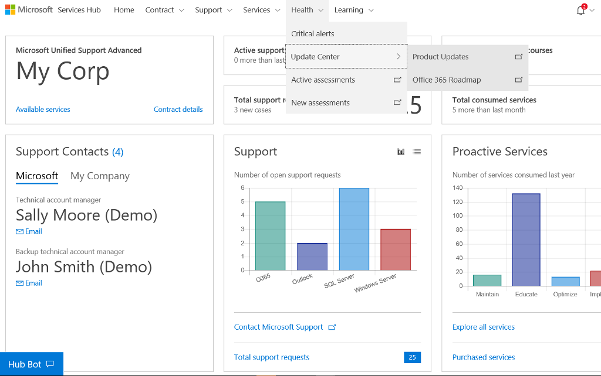
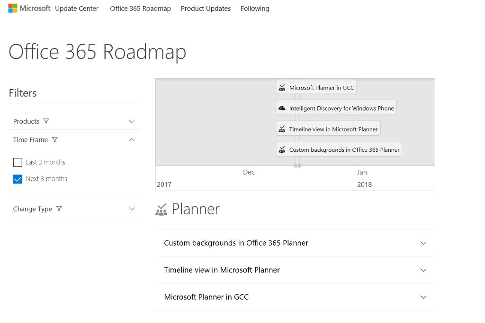
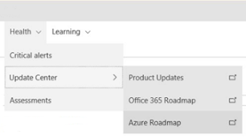
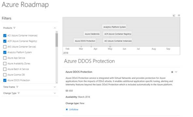

# Pusat Pembaruan Kesehatan: Peta Rencana Akhir Masa Berlaku

## Peta Rencana Office 365 

Halaman Peta Rencana Office 365 di Pusat Pembaruan menyediakan tempat yang terpusat untuk melacak pembaruan O365 yang lalu dan yang akan datang menurut produk.   

Wawasan ini membantu Anda mengelola Langganan Office 365 dan mempelajari tentang fitur yang akan hadir untuk memastikan bahwa investasi Anda telah dimaksimalkan. 

1.  Untuk menemukan Peta Rencana O365, masuk ke Kesehatan, Pusat Pembaruan, dan Peta Rencana Office 365. 

2.  Kini Anda akan dapat melihat halaman Peta Rencana Office 365. 

## Peta Rencana Azure 

Halaman Peta Rencana Azure di Pusat Pembaruan menyediakan tempat yang terpusat untuk melacak pembaruan Azure yang lalu dan yang akan datang menurut produk.   

Wawasan ini membantu Anda mengelola Langganan Azure dan mempelajari tentang fitur yang akan hadir untuk memastikan bahwa investasi Anda telah dimaksimalkan. 

Anda dapat mengakses Peta Rencana Azure dengan mengklik Kesehatan, Pusat Pembaruan, dan Peta Rencana Azure.   

Jangan lewatkan informasi penting tentang pelatihan terbaru untuk Azure.  Anda dapat menemukan berbagai berita dan informasi tentang Azure di satu tempat dan mendapatkan pemberitahuan tentang hal-hal yang paling penting bagi Anda.   

1.  Pilih Produk Anda 

2.  Pilih Jangka Waktu 

3.  Pilih Tipe 

4.  Klik ikuti pada item yang diinginkan untuk mendapatkan pemberitahuan. 

Klik <a href="mailto:SHub_Feedback_RC@Microsoft.com?subject=Resource%20Center%20Feedback%3A%20%3CInsert%20feedback%20topic%3E%3E&amp;body=%3C%3Cplease%20submit%20your%20feedback%20with%20enough%20detail%20on%20the%20problem%2C%20reproduction%20steps%20and%20what%20you%20desire%20to%20happen%3E%3E" target="_blank">di sini</a> untuk memberikan umpan balik.
