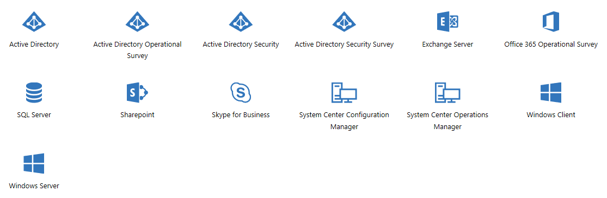

# Gambaran Umum Penilaian Sesuai Permintaan Services Hub

Hub Layanan Microsoft menyediakan satu lokasi terpusat bagi pelanggan Dukungan Terpadu Microsoft untuk mengakses saran dan bantuan khusus perusahaan mereka dengan mudah, kapan pun dan di mana pun.

## Penilaian Sesuai Permintaan

Penilaian Services Hub Sesuai Permintaan memberikan analisis yang berkelanjutan tentang beban kerja penting Anda, serta memperkirakan dan menentukan langkah berikutnya untuk meningkatkan dan mengoptimalkan kesehatan lingkungan TI Microsoft Anda. Dokumen ini menyediakan detail tentang manfaat dan fitur utama penilaian sesuai permintaan di Hub Layanan.  Penilaian Sesuai Permintaan yang saat ini tersedia di Services Hub ditampilkan di bawah ini.

## Mudah 

### Memudahkan saya mencegah masalah secara proaktif dan mengoptimalkan TI. Memungkinkan saya menggunakan layanan tanpa mengkhawatirkan biaya. 

-   Penggunaan tanpa batas di lingkungan pengembangan, pengujian, dan produksi pada berapa pun server yang diinginkan.  

-   Setelah siap, layanan ini akan langsung berjalan dan terus merekomendasikan cara agar tetap aman dan optimal. 

-   Teknisi Microsoft tidak diperlukan, tetapi tersedia sebagai tambahan jika diinginkan. 

-   Rekomendasinya mudah dipahami dan memberikan panduan spesifik tentang hal yang perlu dilakukan. 

## Komprehensif 

### Dapat digunakan di lingkungan hibrid dan membantu saya memastikan bahwa masalah yang terpenting telah dinilai. 

-   Menganalisis lingkungan publik, pribadi, dan hibrid tanpa memerlukan intervensi manual. 

-   Memberikan pengetahuan ahli Microsoft ke dalam manajemen TI sehari-hari Anda dengan mengodekan pengetahuan dari ribuan ahli Microsoft. 

-   Kategorisasi rekomendasi berbasis hasil memudahkan Anda memprioritaskan area untuk memfokuskan waktu. 

-   Memberikan peringatan secara proaktif tentang masalah yang sangat mendesak sebelum berdampak negatif. 

## Dapat Diperluas 

### Memungkinkan saya mengotomatiskan dan melakukan integrasi dengan alat Manajemen TI yang ada. 

-   Integrasi Analitik Log Azure dapat memperluas penilaian ke dalam manajemen TI otomatis. 

-   Gunakan solusi Analitik Log Azure standar seperti Pelacakan Perubahan dan Pembaruan Sistem. 

-   Analisis rekomendasi tentang berbagai teknologi dan ekspor data ke Power BI untuk visualisasi dan pelaporan tambahan. 

-   Bagikan hasil penilaian dengan Teknisi Dukungan Microsoft untuk menerima resolusi masalah yang paling aman dan efisien dengan lebih cepat. 

## Sumber Daya Kesiapan 

-   [Mulai Menggunakan Penilaian](getting_started_with_on_demand_assessments.md)

-   [Cara Membuat Ruang Kerja Analitik Log Azure baru dari Azure](log_analytics_workspace.md)

-   [Menambahkan Pengguna ke Analitik Log Azure melalui Portal Azure](adding_users_azure_log_analytics.md)

-   [Mengautentikasi Pemegang Akun MSA ke Azure](authenticating_managed_services_account.md)

-   [FAQ Penilaian](assessments_faq.md)

## Menautkan Hub Layanan ke Analitik Log Azure 

Anda harus memiliki Langganan Azure (harus ditetapkan sebagai pemilik) dan ruang kerja Analitik Log Microsoft Azure (harus memiliki penetapan peran sebagai pemilik atau kontributor). Jika tidak memiliki langganan Azure, silakan daftar sekarang. Jika belum membuat ruang kerja Analitik Log Azure, baca “Cara Membuat Ruang Kerja Analitik Log Azure Baru di Azure” terlebih dahulu lalu buat ruang kerja di sini. Berikutnya, baca “Mulai Menggunakan Penilaian” untuk mempelajari selengkapnya tentang cara kerja penilaian dan cara menyiapkannya. 

Setelah menautkan Hub Layanan ke ruang kerja Analitik Log Azure Anda, mengklik tab “Penilaian” akan memperlihatkan statistik penilaian berdasarkan Penilaian yang dipilih. Anda juga dapat menavigasi ke ruang kerja Analitik Log Azure untuk mengonfigurasi serta melihat Penilaian dan detail Penilaian. 

## Mengonfigurasi Penilaian 

Untuk mengonfigurasi penilaian, buka Services Hub -> Kesehatan -> Penilaian. Periksa katalog penilaian dengan cepat dan klik Tambahkan Penilaian untuk menambahkan penilaian yang paling sesuai dengan kebutuhan organisasi Anda. Kemudian, ikuti langkah-langkah yang ditunjukkan pada halaman konfigurasi penilaian dan dokumen pendukung. 

## Menampilkan Hasil 

Anda dapat meninjau hasil Penilaian di dasbor.

Klik <a href="mailto:SHub_Feedback_RC@Microsoft.com?subject=Resource%20Center%20Feedback%3A%20%3CInsert%20feedback%20topic%3E%3E&amp;body=%3C%3Cplease%20submit%20your%20feedback%20with%20enough%20detail%20on%20the%20problem%2C%20reproduction%20steps%20and%20what%20you%20desire%20to%20happen%3E%3E" target="_blank">di sini</a> untuk memberikan umpan balik.
