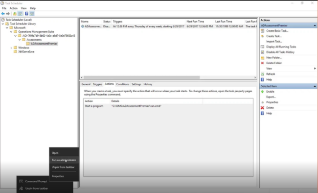

# Menjalankan Penilaian secara Manual

1.  Pertama, mulai prompt perintah administratif.

2.  Kemudian, navigasikan ke folder di bawah direktori kerja tempat perintah eksekusi "ADAssessment" disimpan. Dari sana, jalankan perintah operasi tersebut.

 3.  Perintah operasi akan memulai OmsAssessment.exe, yaitu file yang dapat dijalankan sebenarnya yang mengumpulkan dan menganalisis data dari pengontrol domain Anda.

4.   Di Manajer Tugas, Anda akan melihat OmsAssessment.exe berjalan. 

*Catatan: Untuk lingkungan kecil, proses ini dapat selesai dalam waktu kurang dari 30 menit. Untuk lingkungan yang lebih besar, proses ini mungkin memerlukan waktu hingga beberapa jam.*

5.  Sekarang, setelah penilaian dijalankan, lihat direktori kerja secara lebih cermat. Dalam direktori kerja, terdapat folder bernomor yang menyimpan data yang dikumpulkan. 

*Catatan: Anda juga dapat meninjau file log di sini.*

6.   Kini, kita hanya perlu menunggu OmsAssessment.exe untuk menyelesaikan pengumpulan data dan fase analisis penilaian.

7.   Setelah OmsAssessment.exe selesai dan menghilang dari Manajer Tugas, hasil akan disimpan di direktori kerja. File dengan prefiks yang telah diproses berarti sudah selesai diproses dan diunggah ke Analitik Log Azure.

8.   Di bawah folder bernomor tersebut, terdapat file log yang dapat ditinjau jika terjadi masalah selama pengumpulan data dan fase analisis penilaian.

9.   Terdapat juga file log terpisah bernama Log Penemuan yang mencatat fase direktori lingkungan dari proses tersebut. Dalam situasi ini, Anda akan melihat bahwa pengontrol domain di lingkungan Anda berhasil ditemukan oleh penilaian.

*Catatan: Dalam contoh ini, terdapat dua pengontrol domain di lingkungan tersebut: DC1 dan DC2. Anda akan melihat bahwa kedua pengontrol tersebut telah berhasil ditemukan.*

10. Tunggu beberapa saat hingga Analitik Log Azure menyerap dan mengindeks data yang diunggah, ubin Penilaian Direktori Aktif akan memperlihatkan jumlah rekomendasi dan pemeriksaan yang lolos.

11. Klik ubin tersebut untuk meninjau hasil, yang dikategorikan menjadi beberapa area fokus.

12. Anda dapat mengeklik salah satu area fokus untuk meninjau masalah yang ditemukan, rekomendasi yang mendetail, dan tindakan yang disarankan untuk memperbaikinya.

13. Jika semuanya sudah terlihat sesuai, Anda dapat kembali dan mengaktifkan ulang tugas penilaian dalam Penjadwal Tugas untuk dijalankan sesuai jadwal.

Klik <a href="mailto:SHub_Feedback_RC@Microsoft.com?subject=Resource%20Center%20Feedback%3A%20%3CInsert%20feedback%20topic%3E%3E&amp;body=%3C%3Cplease%20submit%20your%20feedback%20with%20enough%20detail%20on%20the%20problem%2C%20reproduction%20steps%20and%20what%20you%20desire%20to%20happen%3E%3E" target="_blank">di sini</a> untuk memberikan umpan balik.
