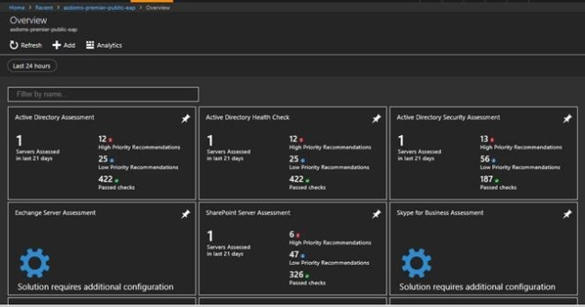
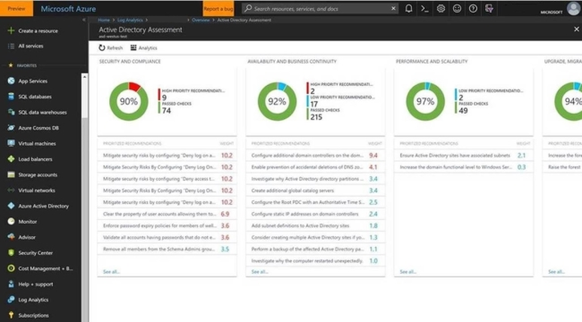
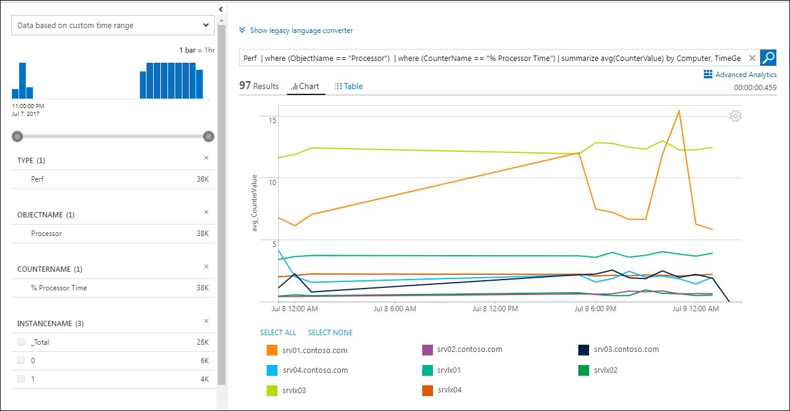
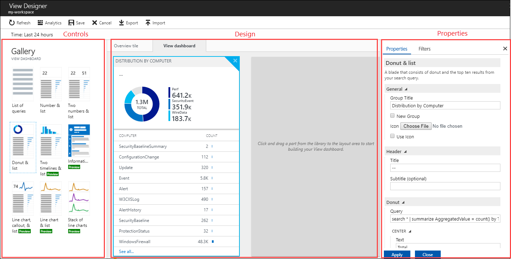
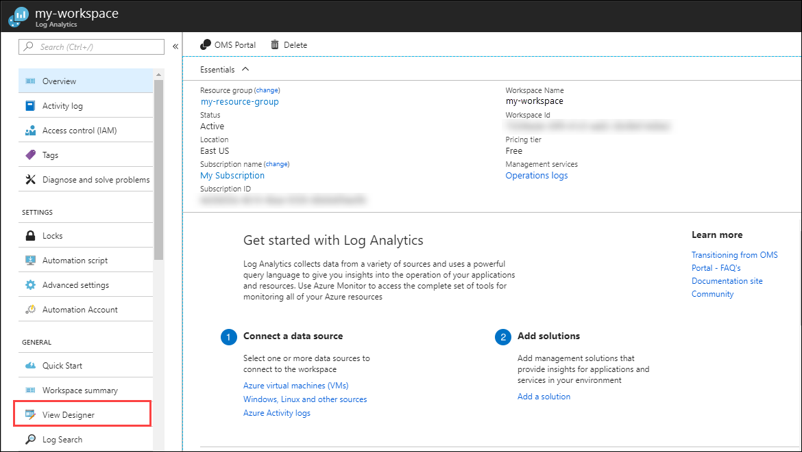

# Menjalankan Penilaian di Beberapa Lingkungan

Anda dapat menjalankan Penilaian di beberapa lingkungan (Pengembang, Uji, Prod) dan mengarah ke satu Ruang Kerja Analitik Log Azure.

Ada batas ketat 100 server pada jumlah server yang dapat dinilai atas penilaian yang diberikan per tugas terjadwal (Pada saat ini, hanya satu tugas terjadwal untuk jenis penilaian harus dibuat di komputer host). Jumlah server yang disarankan (jika ada - penilaian Windows Server, penilaian klien Windows, dan penilaian SQL) adalah 40 server per tugas terjadwal.

Hasil dari lingkungan berbeda tidak akan terpisah di Analitik Log Azure dan akan digabungkan bersama.

Misalnya, di layar ini (bukan daftar lengkap), ini akan digabungkan.

Pengguna dapat menggunakan layar <a href="https://docs.microsoft.com/en-us/azure/log-analytics/log-analytics-log-search-log-search-portal" target="_blank">Pencarian Log</a> dan kueri dan memfilternya ke lingkungan tertentu (dan mengekspornya ke peringatan Excel/PowerBI/pengaturan).

Tidak ada penimpaan seperti itu. Hasil dari lingkungan berbeda akan tercampur dan hasil dapat diisolasi melalui kueri berdasarkan AffectedObjectName, dll. (Penimpaan terjadi jika data berasal dari lingkungan sama (cth. tentang SQL Server yang sama) dikirim dua kali hanya dengan pengiriman terakhir yang tersedia untuk mengkueri).

Misalnya, di&nbsp; lingkungan AD, jika pelanggan memiliki hutan dengan beberapa domain, dia dapat menjalankan penilaian AD dari mesin berbeda di domain berbeda yang mengarah ke ruang kerja sama. Data dari domain berbeda akan diunggah ke ruang kerja sama. Rekomendasi akan tercampur di 2 layar pertama di atas, tetapi rekomendasi ini dapat terpisah di layar ‘Pencarian Log’ dan bertindak atas layar tersebut (misalnya, mengekspor ke Excel).
    
Ada fitur lain yang mengurangi masalah UI yang disebutkan di atas. Analitik Log Azure memiliki <a href="https://docs.microsoft.com/en-us/azure/log-analytics/log-analytics-view-designer">Tampilkan Desainer</a> tempat Pengguna dapat mengonfigurasi tampilan mereka dengan kueri mereka sendiri yang dapat memisahkan lingkungan mereka.
    

    
    
Klik <a href="mailto:SHub_Feedback_RC@Microsoft.com?subject=Resource%20Center%20Feedback%3A%20%3CInsert%20feedback%20topic%3E%3E&amp;body=%3C%3Cplease%20submit%20your%20feedback%20with%20enough%20detail%20on%20the%20problem%2C%20reproduction%20steps%20and%20what%20you%20desire%20to%20happen%3E%3E" target="_blank">di sini</a> untuk memberikan umpan balik.
