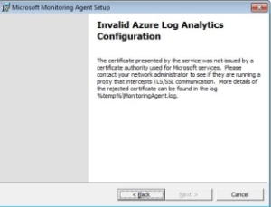

# Memecahkan Masalah Konfigurasi Agen MMA dengan Proksi SSL
 
## Deskripsi masalah

Anda mungkin menjumpai pesan kesalahan ini dalam panduan penyiapan Agen Pengawasan Microsoft.

Selain itu, file MonitoringAgent.log mungkin berisi pesan serupa

<pre>Rejecting certificate CN=YYYYY.azure.com since it did not chain to a trusted 
root, actual root was CN=XXXX, OU=XXXX, O=XXXX 2018-03-06T15:45:21.1858236-06:00 

Debug: Failed to trust remote certificate: The underlying connection was 
closed: Could not establish trust relationship for the SSL/TLS secure channel. </pre>
 
## Kemungkinan penyebab

Masalah ini kemungkinan disebabkan oleh adanya kehadiran dalam jaringan perangkat (atau proksi yang mengganggu) yang melakukan pemeriksaan HTTP pada lalu lintas web.

Untuk informasi tambahan: <a href="https://blogs.technet.microsoft.com/crypto/2016/01/27/https-inspection-and-your-pki-2/" target="_blank">Pemeriksaan HTTPS dan PKI Anda</a> 

  
## Resolusi

Untuk menyelesaikan masalah, lewati pemeriksaan HTTP pada perangkat untuk URL berikut

| Sumber daya                   | Nomor port | Lewati Pemeriksaan HTTP |
|----------------------------|-------------|------------------------|
| Agen                      |             |                        |
| *.ods.opinsights.azure.com | 443         | Ya                    |
| *.oms.opinsights.azure.com | 443         | Ya                    |
| *.blob.core.windows.net    | 443         | Ya                    |
| *.azure-automation.net     | 443         | Ya                    |

Seperti yang dijelaskan sebagai persyaratan Analitik Log Azure dalam artikel berikut

<a href="https://docs.microsoft.com/en-us/azure/log-analytics/log-analytics-om-agents#system-requirements" target="_blank">Sambungkan Manajer Operasi ke Analitik Log – Persyaratan sistem</a>

Klik <a href="mailto:SHub_Feedback_RC@Microsoft.com?subject=Resource%20Center%20Feedback%3A%20%3CInsert%20feedback%20topic%3E%3E&amp;body=%3C%3Cplease%20submit%20your%20feedback%20with%20enough%20detail%20on%20the%20problem%2C%20reproduction%20steps%20and%20what%20you%20desire%20to%20happen%3E%3E" target="_blank">di sini</a> untuk memberikan umpan balik.
