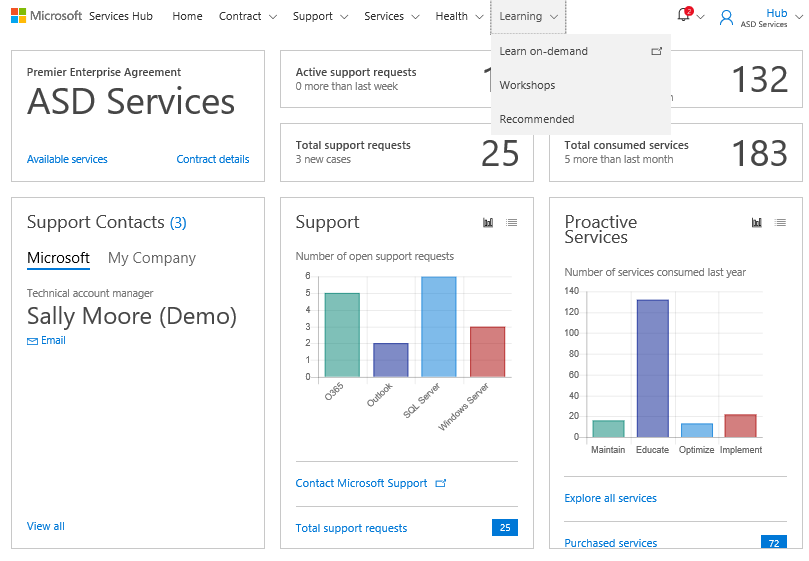
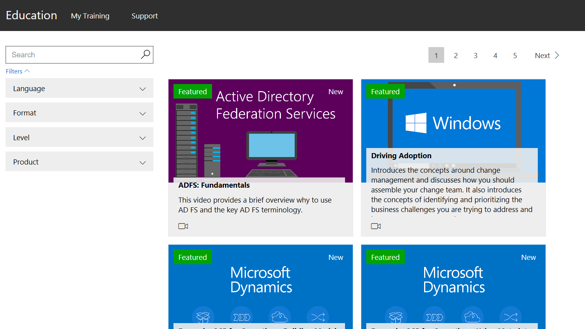
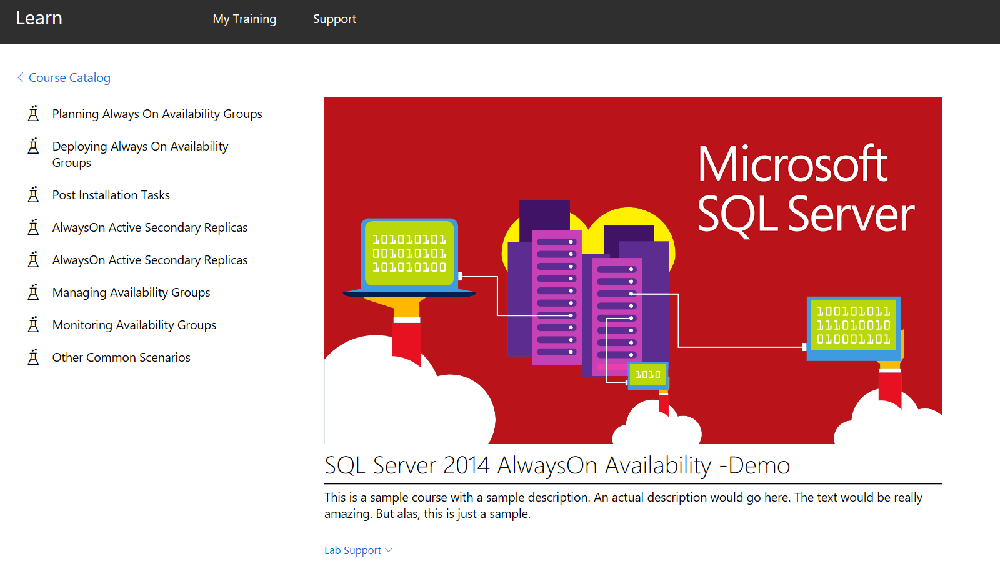
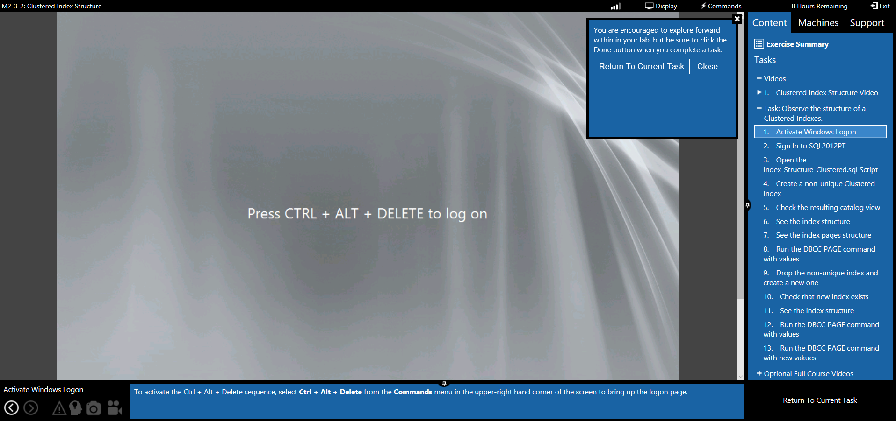
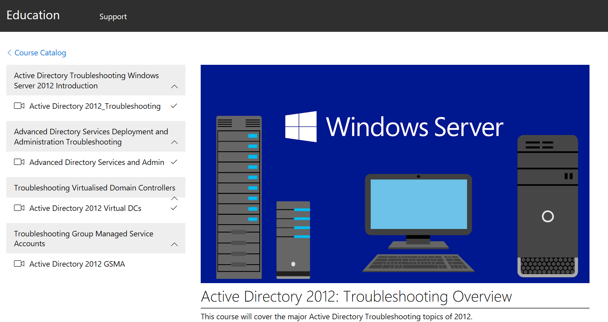

# Memulai Pembelajaran  

## Jelajahi Konten Pelatihan   

Bagian Pembelajaran di Services Hub menyediakan sumber daya untuk meningkatkan pemahaman Anda tentang teknologi Microsoft.   

## Cara Memutar Konten Lab dan Video Anda  

Untuk mengakses kelas atas permintaan, pilih **Belajar atas permintaan** dari **tab** Pembelajaran. Cari dan saring konten yang Anda cari berdasarkan bahasa, format (baik kursus lengkap, lab, atau modul tertentu), level, atau produk. Setelah membuat pilihan, konten ditampilkan dalam ubin, setiap ubin menunjukkan apakah kursus tersedia sebagai lab, video, atau keduanya.   

*Catatan: Kursus dan lab ini dapat dilihat kapan saja dan sesering yang Anda suka.* 

*Catatan: Jika meninggalkan lab lebih awal, Anda harus membatalkan lab lalu keluar dari tutorial sebelum dapat memulai lab lain. Jika tidak, Anda harus menunggu sekitar 15 menit agar lab secara otomatis berhenti sebelum dapat memulai kursus lain.* 

Anda dapat memulai lab dengan mengekliknya setelah tutorial yang menyertainya selesai.  

*Catatan: Setelah menyelesaikan lab, penting untuk keluar dari lab dengan mengeklik ikon keluar. Menutup browser tidak berarti keluar dari lab.*  

Untuk memulai kursus video, klik tautan di sisi kiri halaman. 

Klik <a href="mailto:SHub_Feedback_RC@Microsoft.com?subject=Resource%20Center%20Feedback%3A%20%3CInsert%20feedback%20topic%3E%3E&amp;body=%3C%3Cplease%20submit%20your%20feedback%20with%20enough%20detail%20on%20the%20problem%2C%20reproduction%20steps%20and%20what%20you%20desire%20to%20happen%3E%3E" target="_blank">di sini</a> untuk memberikan umpan balik.
