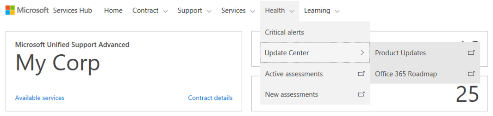
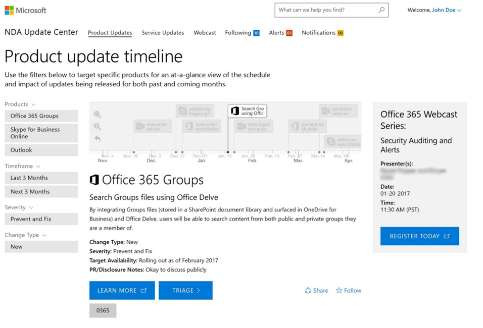
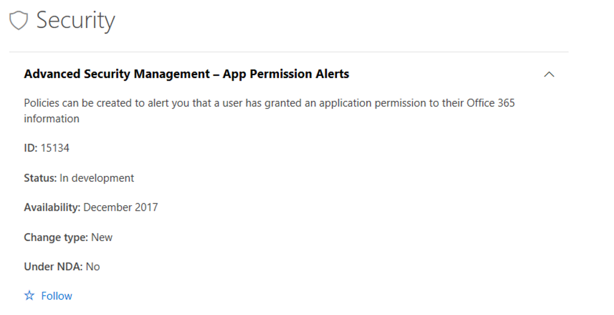
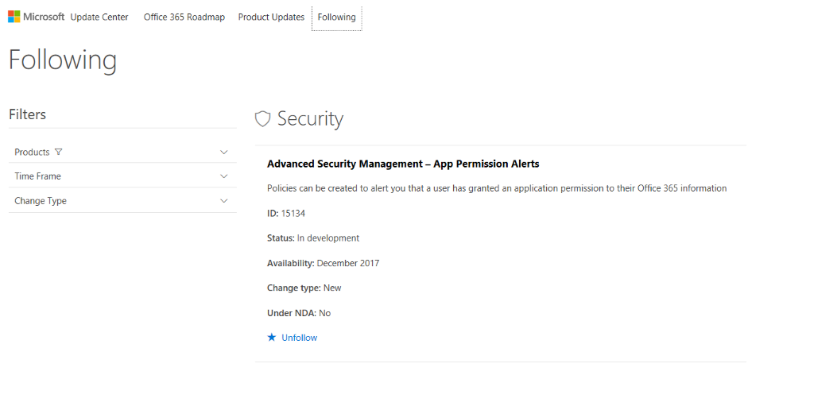
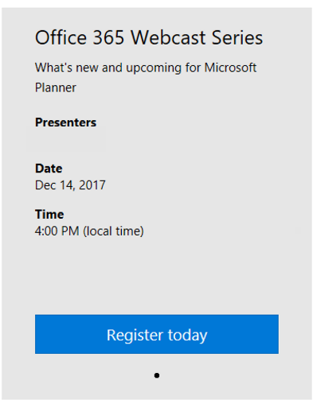
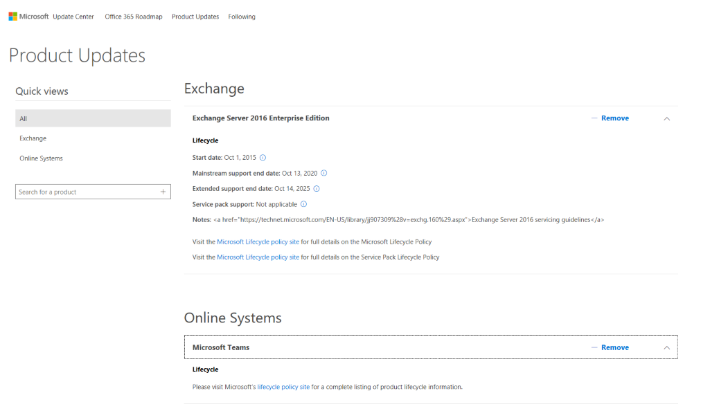

# Mulai Menggunakan Pembaruan O365

Pusat Pembaruan memberikan informasi tentang produk baru dan yang diperbarui serta memungkinkan Anda mengikuti produk yang paling diminati. Di Pusat Pembaruan, Anda juga dapat mendaftar ke acara untuk mempelajari selengkapnya tentang produk dan siklus hidup produk monitor Microsoft.

Anda dapat mengakses Pusat Pembaruan dengan mengklik **Kesehatan** di bilah menu.

## Peta Rencana Office 365

Ikuti pembaruan Microsoft Office 365 tertentu untuk mendapatkan pemberitahuan yang memudahkan Anda melacak hal-hal yang paling penting.

*Catatan: Untuk mengikuti pembaruan, klik bintang di bawah detail pembaruan.*

Untuk melihat pembaruan yang Anda ikuti di Pusat Pembaruan, pilih **Mengikuti**.

## Daftar ke Webcast Office 365

Untuk mempelajari tentang hal-hal baru dan yang akan datang, daftar ke webcast.

*Catatan: Produk tambahan akan ditambahkan ke peta rencana seiring waktu.*

## Pembaruan Produk

Untuk memudahkan pelacakan pembaruan dan informasi siklus hidup produk, gunakan fitur Pembaruan Produk. Produk yang Anda tandai dalam profil akan muncul di sini.

Klik <a href="mailto:SHub_Feedback_RC@Microsoft.com?subject=Resource%20Center%20Feedback%3A%20%3CInsert%20feedback%20topic%3E%3E&amp;body=%3C%3Cplease%20submit%20your%20feedback%20with%20enough%20detail%20on%20the%20problem%2C%20reproduction%20steps%20and%20what%20you%20desire%20to%20happen%3E%3E" target="_blank">di sini</a> untuk memberikan umpan balik.
