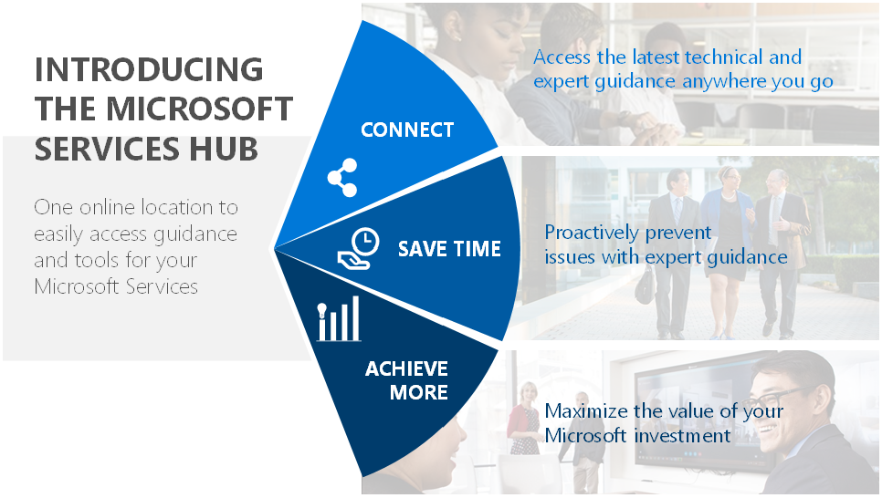

# Memulai Microsoft Services Hub

Microsoft [Service Hub](https://serviceshub.microsoft.com/home) adalah portal dukungan yang memberikan visibilitas ke semua produk dan layanan Microsoft Anda, pelatihan dan sumber daya dukungan yang disesuaikan, dan pemantauan solusi untuk membantu mencegah dan menyelesaikan masalah secara efisien.

Setiap fitur Services Hub telah dibuat dengan tiga prinsip utama sebagai landasan:
>   Menghubungkan

>   Menghemat waktu

>   Meraih lebih

## Menghubungkan

### **Mengakses panduan teknis terbaru ke mana pun Anda pergi**

-   Mengakses layanan Microsoft terbaru dan acara terjadwal yang tersedia di wilayah Anda.

-   Penggunaan pendidikan atas permintaan tanpa batas untuk meningkatkan pengetahuan staf TI Anda

-   Merencanakan pembaruan produk menggunakan Pusat Pembaruan Services Hub dan siap memanfaatkan kemampuan baru

-   Menggunakan kemampuan layanan mandiri untuk mempercepat dan menyelesaikan tugas administratif sesuai persyaratan Anda

## Menghemat waktu

### **Mencegah masalah dengan panduan ahli secara proaktif**

-   Mencegah dan mengelola risiko menggunakan seperangkat alat penilaian swalayan baru, menyediakan analisis berkelanjutan terhadap beban kerja penting Anda

-   mendapatkan pemberitahuan tentang risiko terkait sehingga Anda dapat mencegahnya menjadi masalah

-   Menerima rekomendasi yang disesuaikan\* dengan kebutuhan spesifik Anda agar lebih mudah untuk memprioritaskan dan merencanakan peningkatan

## Meraih lebih

### **Memaksimalkan nilai investasi Microsoft Anda**

-   Satu lokasi untuk mengakses semua alat dan sumber daya dukungan Anda

-   Berkolaborasi dengan para ahli Microsoft untuk memaksimalkan nilai investasi Microsoft Anda

-   Mendapatkan informasi penting tentang kasus dukungan, kontrak, dan rekomendasi layanan pribadi Anda

-   Cara teraman dan efisien untuk berbagi data dengan Staf Teknis Microsoft Support Anda untuk menyelesaikan masalah dengan lebih cepat

## Sekilas fitur Services Hub

### Dasbor Layanan dan Dukungan

> Dasbor Anda memungkinkan Anda mengamati masalah sehingga dapat diselesaikan lebih cepat dengan mengumpulkan titik data utama dan mendukung informasi dan dengan mudah menampilkannya untuk mengakses lokasi. Anda dapat melihat hal-hal berikut...

-   Lihat data kasus Anda dan lihat bagaimana Anda menggunakan layanan dan teknologi melalui tren dukungan

-   Mencegah masalah secara proaktif, dan melihat saran untuk membantu Anda meraih lebih di Pusat Tindakan

-   Referensikan kontak dukungan Anda

-   Temukan layanan terdekat dengan kota atau kode pos Anda untuk melihat apa yang ada di dekat Anda

-   Meninjau data kontrak dan penggunaan manfaat, kasus dukungan, dan data pembelian tersedia untuk peran tertentu

### Manfaat Kontrak

> Meninjau rincian kontrak Anda secara online di Services Hub untuk pertama kalinya. Anda akan dapat meninjau informasi berikut...

-   Akses ke dukungan dan manfaat kontrak Anda ditambah rincian konsumsi terkini

-   Tambahkan anggota dari tim atau organisasi Anda untuk bergabung dengan ruang kerja Services Hub Anda

-   Lihat file yang dibagikan oleh manajer akun teknis Microsoft Anda seperti rencana Tanggapan Insiden Utama

-   Tinjau insiden dukungan terbuka atau tertutup

-   Untuk informasi lebih lanjut, lihat [Memulai Manfaat Kontrak](https://serviceshub.uservoice.com/knowledgebase/articles/1130293-getting-started-with-contract-benefits). 

### Penilaian Atas Permintaan

> Secara proaktif mengelola kesehatan lingkungan TI Anda dengan penilaian atas permintaan yang dapat Anda konfigurasikan untuk kebutuhan tertentu lingkungan Anda.

-   Memprediksi dan menentukan langkah selanjutnya yang membantu memperbaiki lingkungan Anda

-   Secara proaktif memberi tahu Anda tentang masalah yang sangat penting sebelum berdampak negatif

-   Memberikan rekomendasi prioritas berdasarkan pengaruh bisnis, peluang, dan ruang lingkup pekerjaan yang terlibat

-   Selalu aktif untuk membantu Anda tetap aman dan teroptimalkan

-   Menjalankan jadwal Anda

-   Untuk informasi lebih lanjut, baca artikel [basis pengetahuan penilaian kami](https://serviceshub.uservoice.com/knowledgebase/topics/135193-health).

### Pembelajaran Tanpa Batas

> Services Hub membantu Anda mengikuti perkembangan dan meningkatkan keahlian Anda dengan merekomendasikan lokakarya, lab, dan webcast. Seluruh opsi pembelajaran Anda terletak di lokasi pusat untuk memastikan Anda tidak melewatkan kesempatan pendidikan terbaru.

-   Menyediakan penggunaan semua pembelajaran tanpa batas bagi pengguna

-   Lihat konten baru yang ditambahkan setiap bulan dari Microsoft dan konferensi industri

-   Ikuti Lab virtual saat bepergian untuk belajar atas permintaan

-   Untuk informasi lebih lanjut, baca artikel [basis pengetahuan pembelajaran kami](https://serviceshub.uservoice.com/knowledgebase/topics/142633-learning).

### Katalog Microsoft Services

> Services Hub menghubungkan Anda ke layanan yang Anda butuhkan dengan memberikan wawasan tentang layanan yang tersedia untuk Anda. Anda dapat melihat layanan yang disarankan dan disertakan serta seluruh katalog dan semua pelatihan yang Anda ikuti akan tercatat sehingga Anda dapat menemukannya kembali dengan mudah.

-   Lihat layanan prioritas berdasarkan preferensi profil Anda, termasuk peran dan minat teknologi Anda

-   Cari Katalog Online Microsoft dengan pembaruan terbaru

-   Periksa kursi yang tersisa dan layanan setempat di dekat Anda

-   Lihat rekomendasi tim pelaksanaan atau pakar Microsoft Anda untuk setiap pengguna Anda

-   Menyaring layanan berdasarkan minat Anda

-   Terhubung dengan perwakilan Microsoft Anda untuk info lebih lanjut atau untuk menjadwalkan layanan

-   Untuk informasi lebih lanjut, baca artikel [basis pengetahuan kami](https://serviceshub.uservoice.com/knowledgebase/topics/142939-services).

### Pusat Pembaruan Service Hub

> Tetap terhubung dan mengikuti pembaruan pribadi tentang produk Microsoft Anda.

-   Temukan informasi produk baru dan yang diperbarui, dan ikuti produk yang paling menarik bagi Anda

-   Ikuti produk untuk perubahan informasi rilis

-   Mendaftar acara untuk mempelajari lebih lanjut tentang produk Microsoft

-   Memantau siklus hidup produk dengan mudah

-   Atur preferensi untuk memastikan Anda menerima info yang relevan dengan minat Anda

 \*Rekomendasi didasarkan pada informasi yang diberikan pelanggan di profil pengguna Services Hub mereka.

Klik <a href="mailto:SHub_Feedback_RC@Microsoft.com?subject=Resource%20Center%20Feedback%3A%20%3CInsert%20feedback%20topic%3E%3E&amp;body=%3C%3Cplease%20submit%20your%20feedback%20with%20enough%20detail%20on%20the%20problem%2C%20reproduction%20steps%20and%20what%20you%20desire%20to%20happen%3E%3E" target="_blank">di sini</a> untuk memberikan umpan balik.
