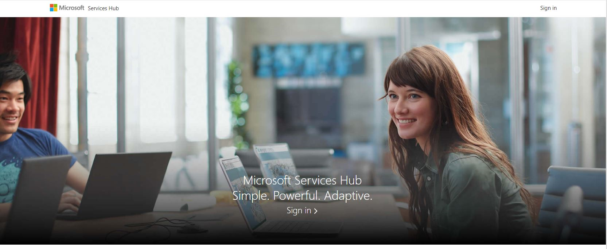
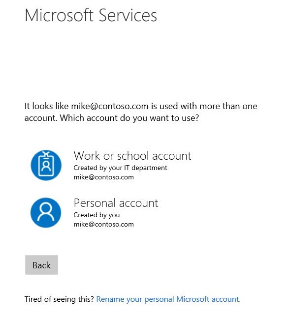
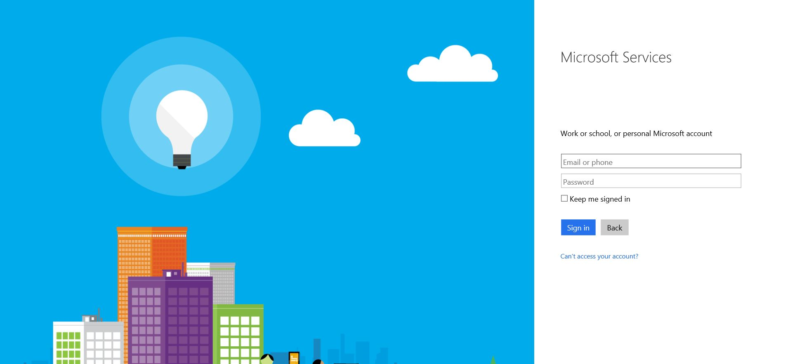

# Mendaftar dengan Services Hub

Mendaftar dengan Services Hub dan gambaran umum tentang bagaimana Services Hub mengelola akun

Services Hub mengenali dua jenis akun pengguna Microsoft yang berbeda
 
#### Akun kerja atau sekolah

(juga dikenal sebagai akun Azure Active Directory (AAD), akun Office 365 atau akun Org ID)

Semuanya diatur oleh departemen TI organisasi Anda untuk digunakan baik untuk aplikasi di tempat dan cloud. Jika organisasi Anda menggunakan akun Kerja atau Sekolah, Anda akan dapat menggunakan akun ini untuk masuk ke Services Hub.

#### Akun pribadi 

(juga dikenal sebagai Akun Microsoft atau MSA)

Ini diatur oleh pengguna individu dan digunakan untuk masuk ke beberapa layanan Microsoft seperti OneDrive dan toko Microsoft. Services Hub tidak mendukung masuk melalui akun pribadi.  Pelanggan yang tidak dapat masuk melalui akun kerja harus menghubungi tim dukungan kami untuk meminta bantuan. 

## Langkah-langkah Cepat Pendaftaran Administrator Layanan  

1. Selesaikan pendaftaran di email khusus Anda (tidak dapat diteruskan)

2. Lengkapi profil Anda

3. Undang Pengguna untuk bergabung dengan Services Hub. 
   - Klik Services Hub> Kontrak> tautan Kelola Akses, masukkan satu alamat email atau lebih lalu klik undang. Anda dapat menggunakan         file yang dipisahkan koma untuk mengundang sekaligus.

4. Setelah Pengguna Layanan mendaftar, Anda dapat menentukan siapa yang akan menjadi Kontak Dukungan.   
   - Untuk melakukan ini, klik Services Hub> Kontrak> Kelola Akses, dan temukan pengguna yang ingin Anda jadikan kontak dukungan; keistimewaan khusus dapat     diatur:
     * Aktif untuk mengaktifkan 
     * Nonaktif untuk menonaktifkan  

## Pendaftaran

Saat menavigasi ke Services Hub, Anda akan diminta untuk masuk.

Saat mengeklik tautan \"Masuk\", Anda akan dibawa ke halaman berikut.

Masukkan alamat email atau nomor telepon yang dikaitkan dengan akun Anda, masukkan kata sandi untuk akun itu, lalu klik **Masuk**.

Halaman Microsoft Services akan secara otomatis menentukan apakah akun yang Anda tentukan adalah akun Kerja atau Sekolah atau akun pribadi. Jika alamat email yang sama dikaitkan dengan kedua jenis akun, Anda akan diperlihatkan halaman berikut untuk memungkinkan Anda menentukan akun mana yang ingin Anda gunakan.

Setelah masuk, Anda akan dibawa ke halaman utama untuk ruang kerja Anda. Jika alamat email yang digunakan untuk masuk ke akun Anda bukan alamat email yang Anda inginkan untuk menerima pemberitahuan dari Services Hub, pastikan untuk memperbarui alamat email untuk profil Anda dengan mengeklik nama Anda di kiri atas, lalu memilih **Sunting Profil**.

Klik <a href="mailto:SHub_Feedback_RC@Microsoft.com?subject=Resource%20Center%20Feedback%3A%20%3CInsert%20feedback%20topic%3E%3E&amp;body=%3C%3Cplease%20submit%20your%20feedback%20with%20enough%20detail%20on%20the%20problem%2C%20reproduction%20steps%20and%20what%20you%20desire%20to%20happen%3E%3E" target="_blank">di sini</a> untuk memberikan umpan balik.
