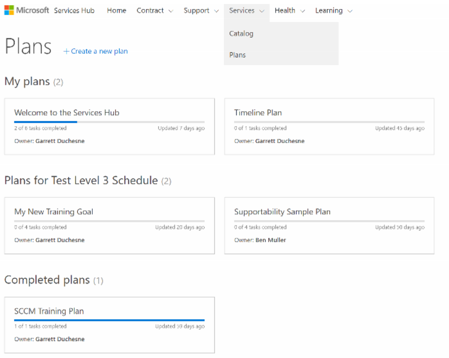

# Rencana Hub Layanan 

Rencana Hub Layanan merupakan cara mudah untuk berbagi dan melacak informasi dengan organisasi atau perwakilan Microsoft Anda tentang hasil yang ingin dicapai. Rencana dapat disusun oleh Anda sendiri, anggota organisasi, atau perwakilan Microsoft dan hanya dapat dilihat oleh anggota rencana secara default. Rencana dapat dikelola dalam Detail Rencana. 
 
Rencana dapat dibagikan menggunakan tautan edit di bagian atas halaman rencana. Anda juga dapat mengakses daftar anggota pada halaman detail rencana. Setelah pengguna ditambahkan, mereka akan menerima pemberitahuan email secara otomatis. Hanya anggota ruang kerja Anda yang dapat ditambahkan ke rencana dan hanya pengguna dengan akses edit ke rencana yang dapat melakukan perubahan pada rencana. 
 

Bagian catatan Rencana menyediakan cara mudah untuk berbagi file yang disertai detail tambahan tentang suatu rencana dengan perwakilan Microsoft. 

Klik <a href="mailto:SHub_Feedback_RC@Microsoft.com?subject=Resource%20Center%20Feedback%3A%20%3CInsert%20feedback%20topic%3E%3E&amp;body=%3C%3Cplease%20submit%20your%20feedback%20with%20enough%20detail%20on%20the%20problem%2C%20reproduction%20steps%20and%20what%20you%20desire%20to%20happen%3E%3E" target="_blank">di sini</a> untuk memberikan umpan balik.
