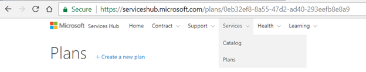
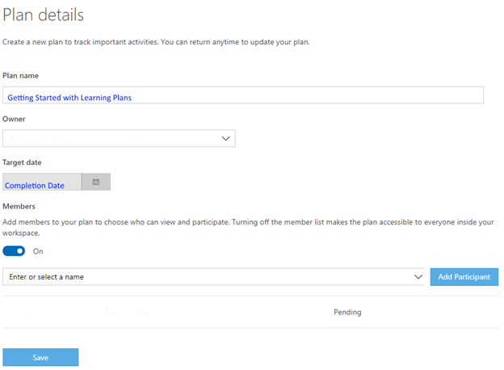
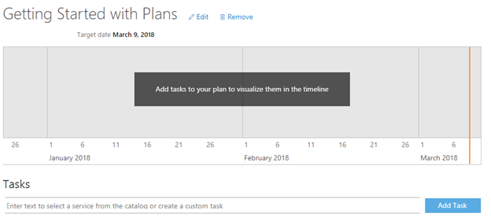
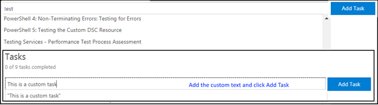
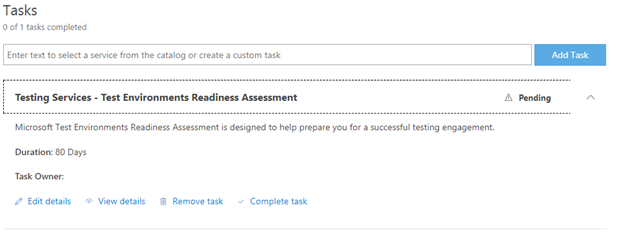
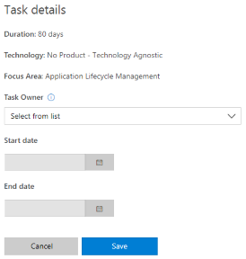
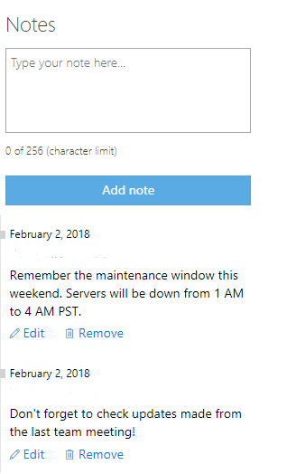

# Memulai Rencana 
  
1. Buka **lokasi** Rencana Service Hub: https://serviceshub.microsoft.com/plans/.  
 
*Catatan:  Anda dapat masuk ke bagian Rencana kapan saja di dalam Services Hub dengan mengeklik daftar menurun Layanan dan kemudian Rencana.*

  
2. Klik **Buat Rencana Baru**. 
 

 
3. Beri nama rencana Anda yang memudahkan untuk memahami rencana tersebut. 
4. Atur tanggal penyelesaian Anda, karena akan diperlukan untuk mengisi lini waktu.  
5. Putuskan apakah ingin rencana Anda dipublikasikan (terbuka untuk semua pengguna di dalam ruang kerja Anda) atau pribadi (hanya orang yang Anda undang). 
6. Jika memutuskan untuk membuat rencana Anda tetap pribadi, tambahkan orang dari ruang kerja ke rencana Anda dengan mengeklik panah daftar menurun. 
 

 
7. Klik **Simpan**. 
  
*Catatan:  Anda hanya dapat menambahkan orang ke rencana Anda yang telah diundang ke Service Hub dan telah ditambahkan ke ruang kerja Anda.*  
 
8. Buat **Tugas**.  
 

 
*Catatan: Lini waktu akan terisi secara otomatis saat Anda menetapkan tanggal mulai & berakhir ke tugas.*

*Catatan: Membuat tugas dari katalog memiliki keuntungan memperbarui secara otomatis saat konten digunakan.*   
 
9. Mulai ketikkan nama item katalog yang Anda inginkan atau Anda dapat mengetikkan tugas khusus.  
 

 
*Catatan:  Anda dapat memilih dari katalog item belajar atas permintaan atau membuat sendiri*
 
10. Klik panah untuk menyunting rincian. Rincian tugas harus ditambahkan setelah menyimpan tugas.  
  

 
*Catatan: Setelah menyimpan tugas, klik pada tugas dan Anda akan diberikan opsi.*
 
11. Klik **Sunting rincian**. 
12. Pilih seseorang yang Anda tambahkan sebelumnya untuk ditugaskan ke tugas.  
13. Atur tanggal Mulai dan Berakhir untuk tugas. 
 

 
*Catatan:  Jika Anda tidak memasukkan tanggal mulai dan berakhir untuk tugas, tugas tidak akan mengisi lini waktu.* 
 
14. Tambahkan catatan untuk rencana Anda.  
 

 
Klik <a href="mailto:SHub_Feedback_RC@Microsoft.com?subject=Resource%20Center%20Feedback%3A%20%3CInsert%20feedback%20topic%3E%3E&amp;body=%3C%3Cplease%20submit%20your%20feedback%20with%20enough%20detail%20on%20the%20problem%2C%20reproduction%20steps%20and%20what%20you%20desire%20to%20happen%3E%3E" target="_blank">di sini</a> untuk memberikan umpan balik.
