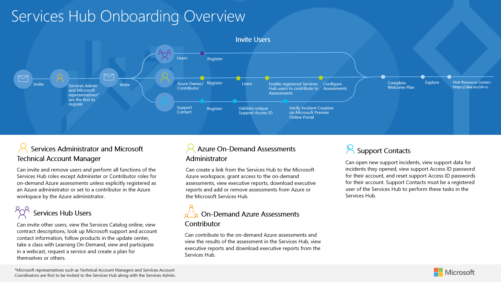

#  Pendaftaran dan Peran Services Hub

## Tonton video singkat tentang beragam hak istimewa dan kegiatan dari peran pengguna Services Hub...SEGERA

<!-- <iframe width="420" height="600" src="https://www.youtube.com/embed/s-WwA-IDqyU?rel=0" frameborder="0" allowfullscreen></iframe> -->

## Arus Kerja Peran Services Hub

Klik <a href="images/roles-overview.png" target="_blank">di sini</a> untuk gambar penuh.

### Gunakan menu Daftar Isi di panel kiri halaman ini untuk mempelajari lebih lanjut tentang berbagai jenis peran Services Hub dan hak istimewa serta tanggung jawab dari peran-peran berikut:

> Administrator Layanan

> Kontak Dukungan

> Administrator Penilaian Atas Permintaan Azure

> Pengguna Services Hub

Klik <a href="mailto:SHub_Feedback_RC@Microsoft.com?subject=Resource%20Center%20Feedback%3A%20%3CInsert%20feedback%20topic%3E%3E&amp;body=%3C%3Cplease%20submit%20your%20feedback%20with%20enough%20detail%20on%20the%20problem%2C%20reproduction%20steps%20and%20what%20you%20desire%20to%20happen%3E%3E" target="_blank">di sini</a> untuk memberikan umpan balik.
