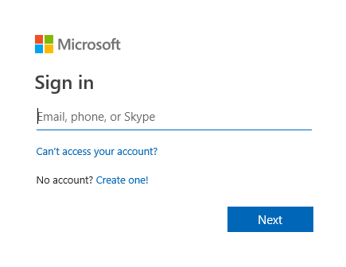
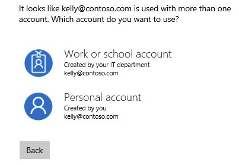

# Masuk ke Services Hub

Services Hub saat ini terbatas untuk pelanggan Microsoft Premier atau Unified Support. Pelanggan ini menerima undangan untuk masuk dan daftar di Services Hub.

Karyawan Microsoft dapat masuk ke Services Hub, namun mereka hanya dapat mengakses akun pelanggan yang memiliki hubungan khusus dengan mereka.

## Bagaimana Anda menerima undangan?

Undangan otomatis dikirim kepada perwakilan akun Admin Layanan and Microsoft yang terkait dengan perjanjian Premier atau Unified Support. Setelah mendaftar, mereka dapat mengundang orang lain. Selain itu, undangan juga dapat dikirim secara otomatis kepada karyawan pelanggan yang ditunjuk yang dapat menghubungi Microsoft untuk mendapat dukungan.

Undangan diperlukan per ruang kerja Services Hub. Undangan hanya dapat digunakan sekali.

## Apa yang Anda perlukan untuk masuk?

Services Hub memerlukan undangan yang valid dan Anda masuk dengan **akun kerja atau sekolah yang terkait dengan penyewa Direktori Aktif Azure (DAA) atau Office 365.**

Akun yang tidak terkait dengan DAA atau Office 365 tidak boleh masuk ke Services Hub. Ini mencakup akun pribadi seperti yang terkait dengan hotmail.com, outlook.com, gmail.com, atau sejenisnya. Jika perusahaan Anda tidak dapat masuk dengan akun kerja atau sekolah, Anda harus menghubungi tim Services Hub untuk memperoleh bantuan.

## Bagaimana cara Anda masuk?

Jika ini pertama kalinya Anda masuk, klik tautan Daftar dalam email undangan. Browser web akan terbuka dan Anda akan diarahkan ke situs web Services Hub.

Jika Anda sudah terdaftar sebelumnya, telusuri <a href="https://serviceshub.microsoft.com" target="_blank">https://serviceshub.microsoft.com</a> dan klik tautan Masuk.

Setelah itu, Anda dapat melihat prompt masuk yang sama seperti ini:

Ketikkan nama akun kerja atau sekolah.

Akun kerja atau sekolah harus terkait dengan Direktori Aktif Azure (DAA) atau Office 365 untuk masuk ke Services Hub. Akun yang tidak terkait dengan DAA atau Office 365, dan akun pribadi tidak boleh masuk ke Services Hub. Jika perusahaan Anda tidak dapat masuk dengan akun kerja atau sekolah, Anda harus menghubungi tim Services Hub untuk memperoleh bantuan.

Masukkan kata sandi Anda dan ikuti prompt yang tersisa.

Organisasi Anda yang mengendalikan pengalaman masuk ini, jadi UI akan terlihat berbeda.  Autentikasi multifaktor juga diperlukan.

## Tanya jawab umum

T: Perusahaan saya tidak memiliki akun yang terkait dengan Direktori Aktif Azure atau Office 365. Apakah kita masih dapat menggunakan Services Hub?

J: Anda harus menghubungi tim Services Hub untuk menentukan pilihan alternatif untuk masuk.

T: Saya mencoba masuk dengan akun yang diakhiri dengan nama domain perusahaan, tetapi Services Hub menolak akun dan menyatakan saya harus menggunakan “akun kerja”. Bagaimana cara mengatasi masalah ini?

J: Akun kerja juga harus terkait dengan penyewa Direktori Aktif Azure atau Office 365. Jika sistem kami mendeteksi kedua akun tersebut tidak benar, akun itu tidak boleh masuk. Identifikasi akun lain yang dapat digunakan atau hubungi tim Services Hub untuk menentukan pilihan alternatif untuk masuk.

T: Saya mencantumkan akun kerja, tetapi prompt masuk menampilkan prompt yang sama di tempat di mana saya harus memilih di antara dua pilihan. Apa yang harus saya lakukan?

J: Ini berarti Anda memiliki “akun kerja atau sekolah” dan “akun pribadi” yang terkait dengan alamat email yang sama. Untuk Services Hub, Anda harus memilih opsi “akun kerja atau pribadi”.

T: Saya menerima pesan nama pengguna atau kata sandi tidak ditemukan atau tidak valid. Apa yang harus saya lakukan?

J: Akun kerja dibuat dan dikelola perusahaan Anda. Anda harus menghubungi staf dukungan perusahaan untuk memperoleh bantuan, sama seperti cara Anda mencoba mengakses sumber daya perusahaan lainnya. Microsoft tidak dapat menentukan kata sandi Anda atau mengaturnya ulang. Anda harus bekerja di dalam perusahaan Anda untuk memperoleh bantuan.

Klik <a href="mailto:SHub_Feedback_RC@Microsoft.com?subject=Resource%20Center%20Feedback%3A%20%3CInsert%20feedback%20topic%3E%3E&amp;body=%3C%3Cplease%20submit%20your%20feedback%20with%20enough%20detail%20on%20the%20problem%2C%20reproduction%20steps%20and%20what%20you%20desire%20to%20happen%3E%3E" target="_blank">di sini</a> untuk memberikan umpan balik.
