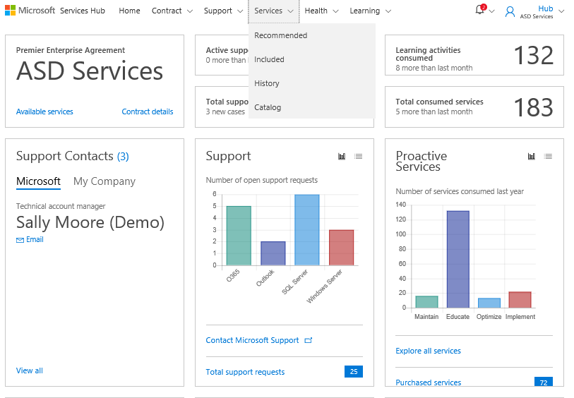
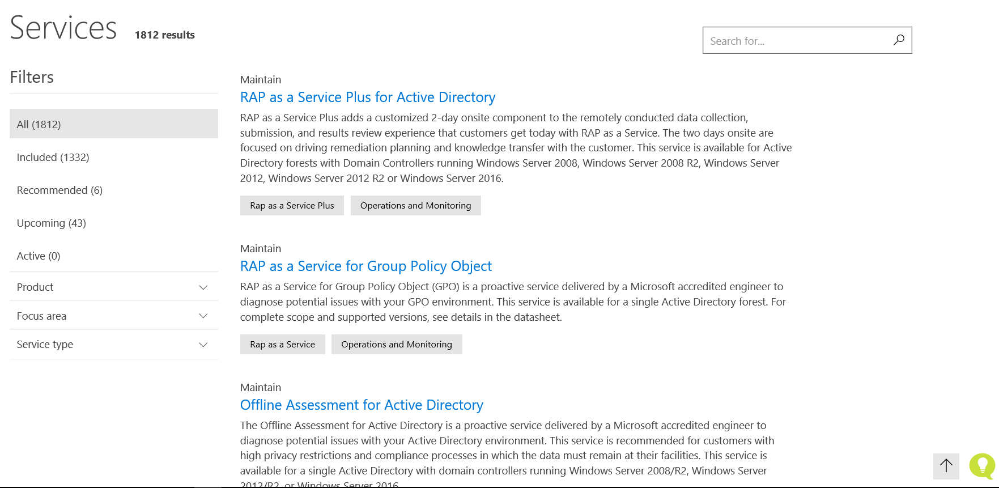

# Katalog Layanan di Services Hub

Services Hub memudahkan Anda mengakses Katalog Layanan lengkap.  

Dengan adanya satu lokasi untuk semua Microsoft Sevices (Layanan Microsoft), kini Anda dapat dengan mudah mencari layanan yang diperlukan untuk memenuhi kebutuhan unik Anda.

## Untuk menemukan Katalog Layanan:

1.  Klik **Layanan**, lalu **Katalog**.

2.  Anda kemudian akan melihat semua layanan yang ditawarkan dalam katalog Microsoft.

 

 

Klik <a href="mailto:SHub_Feedback_RC@Microsoft.com?subject=Resource%20Center%20Feedback%3A%20%3CInsert%20feedback%20topic%3E%3E&amp;body=%3C%3Cplease%20submit%20your%20feedback%20with%20enough%20detail%20on%20the%20problem%2C%20reproduction%20steps%20and%20what%20you%20desire%20to%20happen%3E%3E" target="_blank">di sini</a> untuk memberikan umpan balik.
