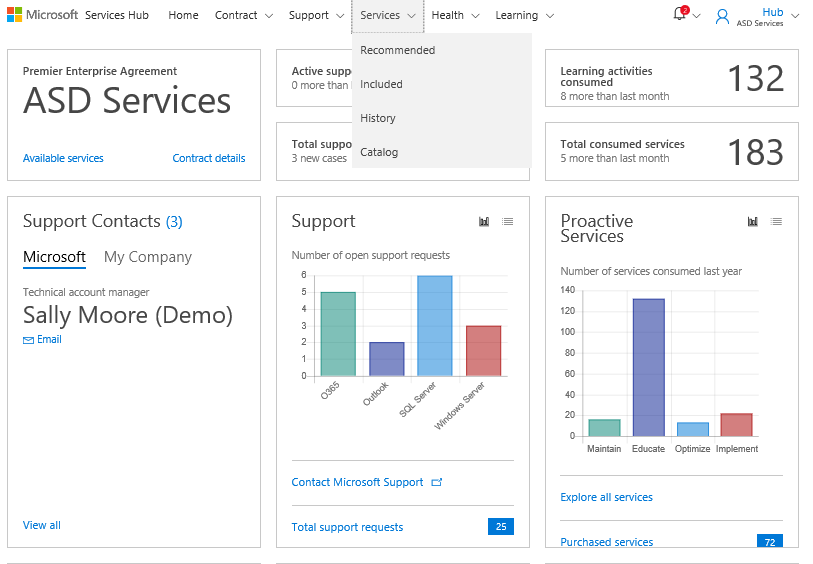

# Riwayat Layanan 

Services Hub memudahkan Anda menemukan Layanan yang telah atau sedang Anda gunakan. 

Riwayat Layanan membantu Anda dengan cepat menemukan Layanan yang telah atau sedang Anda gunakan dengan menggabungkan semuanya di satu tempat. Hal ini memudahkan Anda melacak Layanan yang telah Anda gunakan atau layanan terakhir Anda. 

### Untuk menemukan Riwayat Layanan Anda: 

1. Klik **Layanan**, lalau **Riwayat**. 

2. Anda kemudian akan melihat halaman Layanan, filter berdasarkan Riwayat. 

Klik <a href="mailto:SHub_Feedback_RC@Microsoft.com?subject=Resource%20Center%20Feedback%3A%20%3CInsert%20feedback%20topic%3E%3E&amp;body=%3C%3Cplease%20submit%20your%20feedback%20with%20enough%20detail%20on%20the%20problem%2C%20reproduction%20steps%20and%20what%20you%20desire%20to%20happen%3E%3E" target="_blank">di sini</a> untuk memberikan umpan balik.
