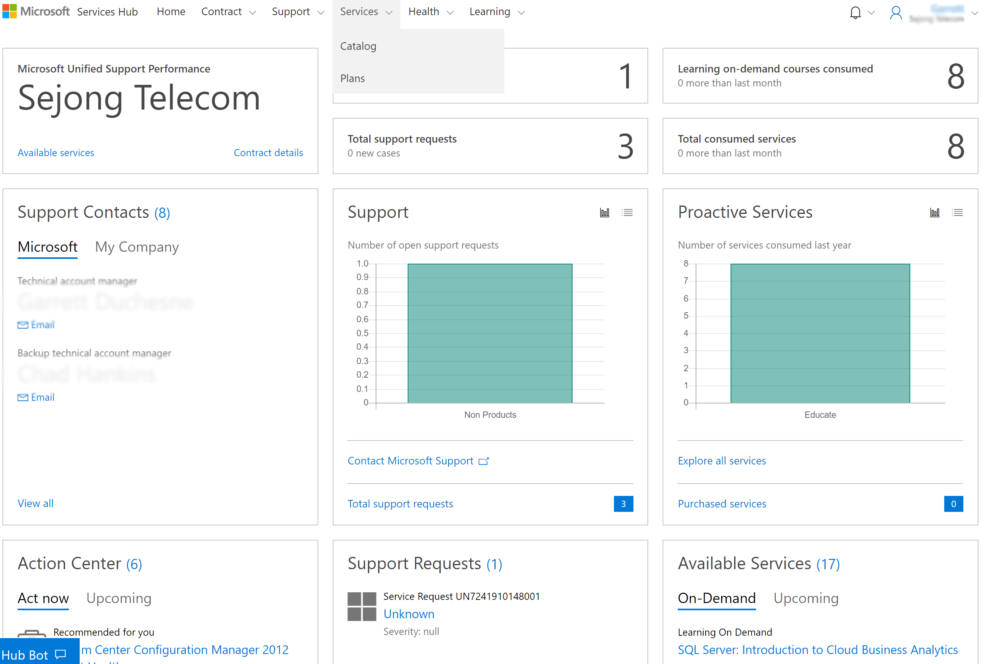

# Memulai Layanan

Service Hub menyediakan lokasi pusat di Services Hub untuk banyak manfaat dan sumber daya khusus yang disediakan melalui kontrak dukungan Anda. 

Tab layanan menyediakan akses ke halaman Katalog dan Rencana.   

## Katalog

Semua layanan tersedia melalui Services Hub, termasuk layanan yang tercakup di dalam kontrak Anda dan yang dapat Anda beli. 

## Rencana

Rencana Services Hub adalah cara mudah berbagi dan melacak informasi dengan organisasi Anda atau perwakilan Microsoft Anda tentang hasil yang ingin Anda capai. Rencana dapat dibuat oleh Anda, anggota organisasi Anda, atau perwakilan Microsoft dan visibilitas rencana dibatasi secara default bagi anggota rencana. Hal ini dikelola dalam Rincian Rencana. 

Klik <a href="mailto:SHub_Feedback_RC@Microsoft.com?subject=Resource%20Center%20Feedback%3A%20%3CInsert%20feedback%20topic%3E%3E&amp;body=%3C%3Cplease%20submit%20your%20feedback%20with%20enough%20detail%20on%20the%20problem%2C%20reproduction%20steps%20and%20what%20you%20desire%20to%20happen%3E%3E" target="_blank">di sini</a> untuk memberikan umpan balik.
