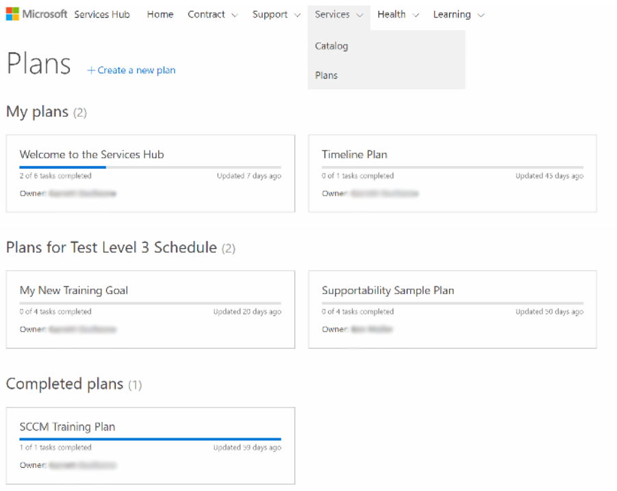

# Rencana Services Hub 

Rencana Services Hub adalah cara mudah berbagi dan melacak informasi dengan organisasi Anda atau perwakilan Microsoft Anda tentang hasil yang ingin Anda capai. Rencana dapat dibuat oleh Anda, anggota organisasi Anda, atau perwakilan Microsoft dan visibilitas rencana dibatasi secara default bagi anggota rencana. Hal ini dikelola dalam rincian rencana. 
 
Rencana dapat dibagikan dengan menggunakan tautan sunting di bagian atas halaman rencana. Anda juga dapat mengakses daftar anggota di halaman rincian rencana. Setelah pengguna ditambahkan, mereka akan secara otomatis menerima pemberitahuan email. Hanya anggota ruang kerja Anda yang dapat ditambahkan ke rencana dan hanya pengguna dengan akses sunting menyunting rencana yang dapat melakukan perubahan. 
 

Bagian catatan dari Rencana menyediakan cara mudah untuk berbagi file dengan rincian tambahan tentang rencana dengan perwakilan Microsoft Anda. 

Klik <a href="mailto:SHub_Feedback_RC@Microsoft.com?subject=Resource%20Center%20Feedback%3A%20%3CInsert%20feedback%20topic%3E%3E&amp;body=%3C%3Cplease%20submit%20your%20feedback%20with%20enough%20detail%20on%20the%20problem%2C%20reproduction%20steps%20and%20what%20you%20desire%20to%20happen%3E%3E" target="_blank">di sini</a> untuk memberikan umpan balik.
