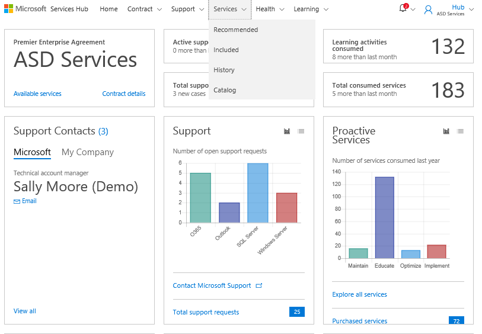
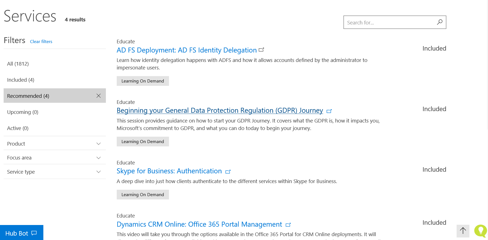

# Layanan Rekomendasi

Services Hub dirancang untuk memberi Anda rekomendasi pribadi untuk membantu mendapatkan hasil maksimal dari investasi Microsoft Anda. Salah satu cara utama Services Hub melakukan hal ini adalah melalui Layanan Rekomendasi yang merupakan saran layanan pribadi yang disesuaikan dengan kontrak dukungan spesifik Anda. Informasi yang Anda berikan dalam profil Anda memungkinkan Services Hub untuk membuat rekomendasinya. 

Dengan memanfaatkan Layanan Rekomendasi, Anda akan segera menemukan layanan yang relevan dengan kebutuhan Anda, sehingga tidak perlu menghabiskan waktu menjelajahi katalog.  

### Untuk menemukan Layanan Rekomendasi: 

Klik **Layanan**, lalu **Rekomendasi**. 

 
Anda kemudian akan melihat halaman Layanan, filter berdasarkan Rekomendasi. 
 

Klik <a href="mailto:SHub_Feedback_RC@Microsoft.com?subject=Resource%20Center%20Feedback%3A%20%3CInsert%20feedback%20topic%3E%3E&amp;body=%3C%3Cplease%20submit%20your%20feedback%20with%20enough%20detail%20on%20the%20problem%2C%20reproduction%20steps%20and%20what%20you%20desire%20to%20happen%3E%3E" target="_blank">di sini</a> untuk memberikan umpan balik.
