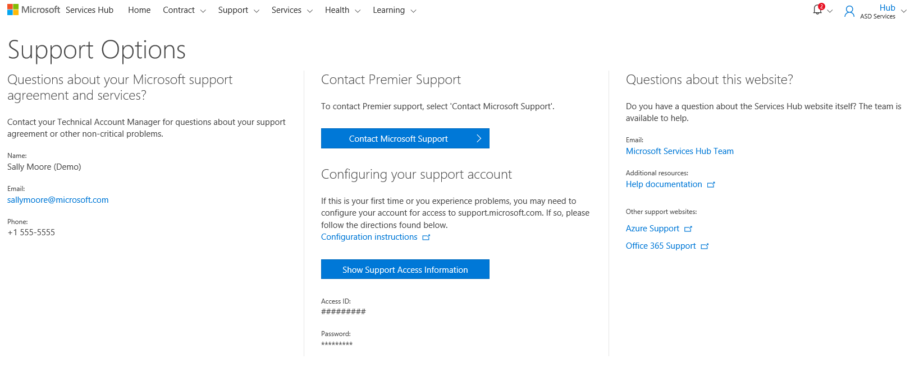

# Menghubungi Microsoft untuk Bantuan dan Dukungan 

Halaman Dukungan Services Hub menyediakan kontak Microsoft untuk bantuan. Anda juga dapat melihat status permintaan dukungan Anda dari dasbor Services Hub. 

Anda dapat mengakses **Dukungan** dari navigasi utama atau dengan mengeklik **Dapatkan Dukungan** dari dasbor. 

Perwakilan Microsoft tersedia jika Anda memiliki pertanyaan atau butuh bantuan terkait perjanjian dan layanan dukungan Microsoft Anda; informasi kontak tersedia di halaman Opsi Dukungan.  

Untuk mendapatkan bantuan terkait produk Microsoft, klik **tombol Hubungi Microsoft Support** atau kunjungi situs web Microsoft Support, https://www.support.microsoft.com. 

Klik <a href="mailto:SHub_Feedback_RC@Microsoft.com?subject=Resource%20Center%20Feedback%3A%20%3CInsert%20feedback%20topic%3E%3E&amp;body=%3C%3Cplease%20submit%20your%20feedback%20with%20enough%20detail%20on%20the%20problem%2C%20reproduction%20steps%20and%20what%20you%20desire%20to%20happen%3E%3E" target="_blank">di sini</a> untuk memberikan umpan balik.
