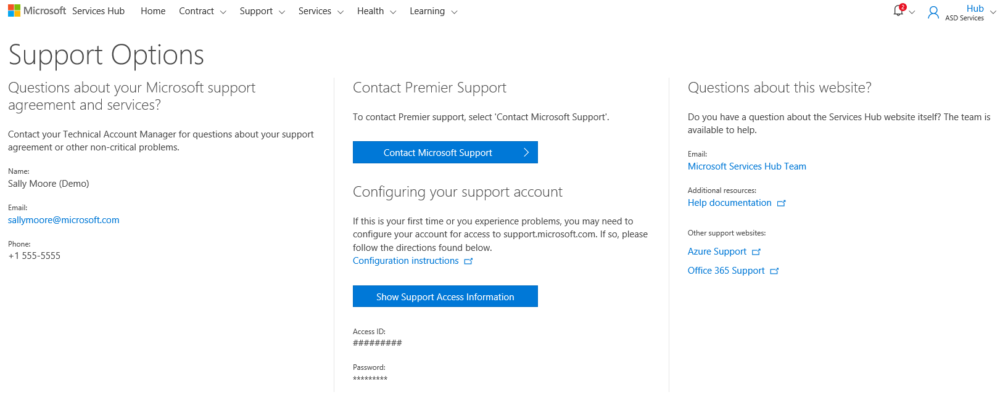
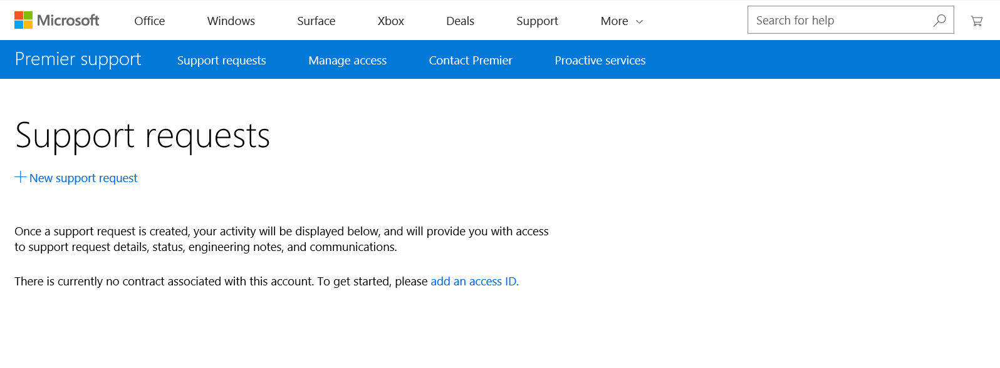
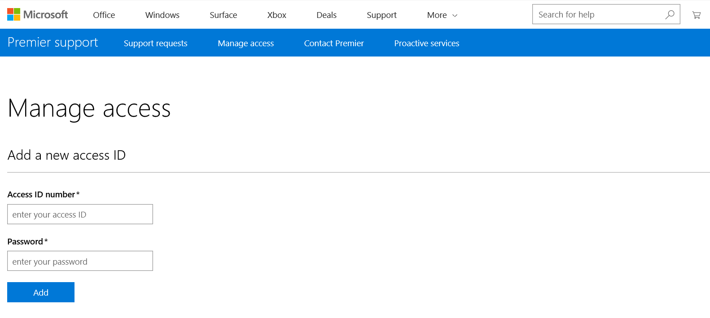

# Menghubungi Microsoft untuk Bantuan dan Dukungan
 
Halaman Opsi Dukungan Services Hub menyediakan kontak Microsoft untuk bantuan.  Akses Dukungan dari navigasi utama atau dengan mengeklik **Dapatkan Dukungan** dari dasbor.  

Perwakilan Microsoft tersedia jika Anda memiliki pertanyaan atau butuh bantuan terkait perjanjian dan layanan dukungan Microsoft Anda; informasi kontak tersedia di halaman Opsi Dukungan.  

Untuk mendapatkan bantuan terkait produk Microsoft, klik **tombol Hubungi Microsoft Support** atau kunjungi situs web Microsoft Support, https://www.support.microsoft.com. 

Jika diminta, masuk dengan akun Microsoft yang valid. 

> *Catatan: Jika Anda memiliki beberapa akun email, akun yang ditampilkan dapat berbeda dari yang biasa Anda gunakan untuk masuk ke Services Hub.* 

Setelah masuk ke Microsoft Support, Anda akan melihat layar ini: 

Jika melihat pesan ,“Saat ini tidak ada kontrak yang terkait dengan akun ini,” klik **Tambahkan ID Akses**. Ini akan meminta nomor ID akses dan kata sandi Anda. Anda dapat menemukan informasi ini di halaman Opsi Dukungan Services Hub.  

Selanjutnya, klik tombol **Tampilkan Informasi Akses Dukungan** pada halaman Opsi Dukungan. Tambahkan informasi ini lalu kembali ke situs Microsoft Support. 

Masukkan nomor ID akses dan kata sandi Anda pada Microsoft Support untuk membuka permintaan dukungan. 

Setelah memasukkan nomor ID Akses dan Kata Sandi Anda di halaman Microsoft Support, klik **Permintaan Dukungan** di spanduk atas kemudian klik **Permintaan Dukungan Baru** untuk memulai permintaan dukungan baru.  

Klik <a href="mailto:SHub_Feedback_RC@Microsoft.com?subject=Resource%20Center%20Feedback%3A%20%3CInsert%20feedback%20topic%3E%3E&amp;body=%3C%3Cplease%20submit%20your%20feedback%20with%20enough%20detail%20on%20the%20problem%2C%20reproduction%20steps%20and%20what%20you%20desire%20to%20happen%3E%3E" target="_blank">di sini</a> untuk memberikan umpan balik.
