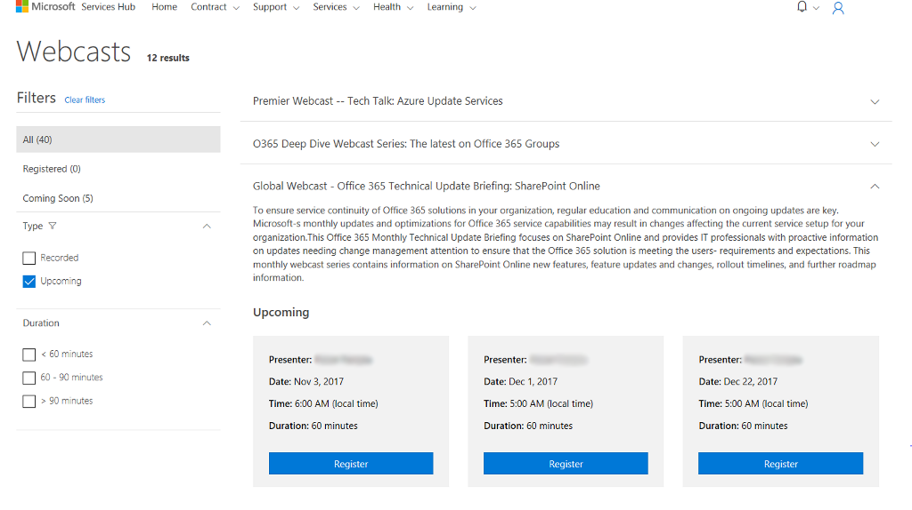

# Webcast Pembelajaran Services Hub

Webcast adalah kursus virtual arahan Microsoft yang diajarkan oleh para ahli yang dapat Anda lihat dari sebagian besar perangkat. Gunakan filter pada **Services** **Hub** untuk menemukan webcast yang relevan dengan Anda sehingga dapat memaksimalkan investasi Microsoft Anda. 

## Memilih dan Melihat Webcast 

Untuk melihat daftar webcast yang tersedia, masuk ke Services Hub, klik **Pembelajaran**, lalu **Webcast**. 

 

Pemfilteran memungkinkan Anda mempersempit daftar topik webcast ke minat Anda. Opsi filter berikut tersedia: 

1.  Semua - Melihat semua webcast yang tersedia. 

2.  Terdaftar - Melihat webcast di mana Anda telah mendaftar untuk hadir. 

3.  Segera Hadir - Melihat webcast yang dijadwalkan untuk 30 hari ke depan. 

4.  Jenis 

    -   Rekaman - Rekaman webcast yang dapat Anda saksikan. 

    -   Mendatang - Webcast berikutnya terbuka untuk pendaftaran. 

5.  Durasi - Webcast kurang dari 60 menit, 60-90 menit, atau hingga 90 menit. 

 

## Untuk Mendaftar Webcast 

Untuk mendaftar Webcast yang ingin Anda hadiri, klik **Daftar**. 

 

## Konfirmasi dan Undangan 

Setelah mendaftar webcast, layar konfirmasi akan muncul diikuti oleh email berisi rincian undangan dan undangan kalender Anda. Undangan email akan dikirim dari Microsoft berisi rincian jadwal webcast. 

## Menghadiri Webcast 

Pada hari dan waktu acara, masuk ke acara tersebut dengan tautan yang tersedia di email dari tim Microsoft. 

Tautan ini akan membuka sesi pembuat acara di mana Anda dapat berpartisipasi langsung dengan instruktur.  Pertemuan akan berbentuk lingkungan pembelajaran digital virtual.

Klik <a href="mailto:SHub_Feedback_RC@Microsoft.com?subject=Resource%20Center%20Feedback%3A%20%3CInsert%20feedback%20topic%3E%3E&amp;body=%3C%3Cplease%20submit%20your%20feedback%20with%20enough%20detail%20on%20the%20problem%2C%20reproduction%20steps%20and%20what%20you%20desire%20to%20happen%3E%3E" target="_blank">di sini</a> untuk memberikan umpan balik.
