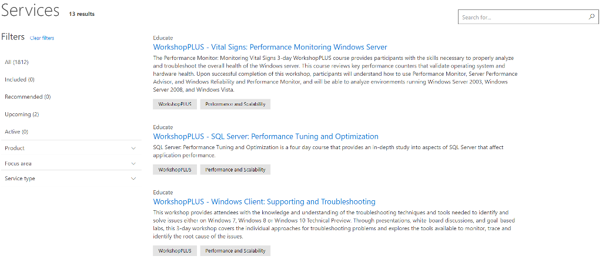

# Lokakarya Pembelajaran

Sering diadakan di organisasi Anda, lokakarya adalah kursus arahan Microsoft virtual yang diajarkan oleh para ahli. Gunakan filter pada **Services Hub** untuk menemukan lokakarya yang relevan dengan Anda sehingga dapat memaksimalkan investasi Microsoft Anda. 

Setiap lokakarya diatur oleh skenario dan dirancang untuk memberikan keahlian mendalam, alat, dan pengalaman langsung kepada peserta untuk membantu memahami dan memecahkan skenario tertentu.  

Gambaran umum lokakarya di Services Hub juga menyediakan lembar data untuk membantu memutuskan apakah kurikulum sesuai dengan organisasi Anda. 

Klik <a href="mailto:SHub_Feedback_RC@Microsoft.com?subject=Resource%20Center%20Feedback%3A%20%3CInsert%20feedback%20topic%3E%3E&amp;body=%3C%3Cplease%20submit%20your%20feedback%20with%20enough%20detail%20on%20the%20problem%2C%20reproduction%20steps%20and%20what%20you%20desire%20to%20happen%3E%3E" target="_blank">di sini</a> untuk memberikan umpan balik.
